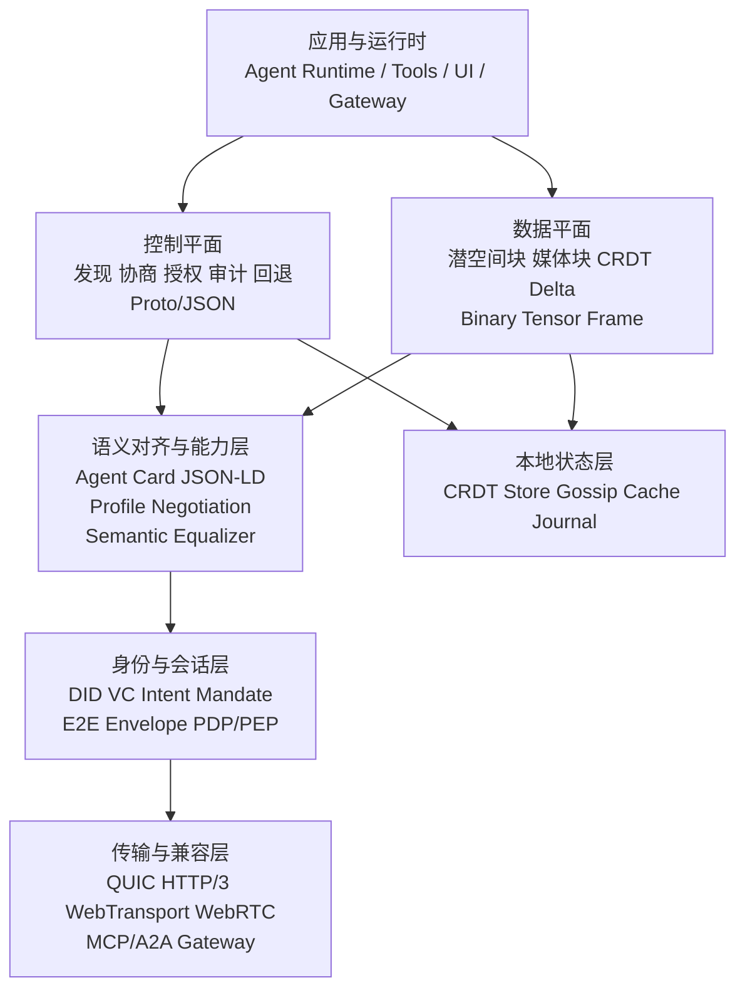
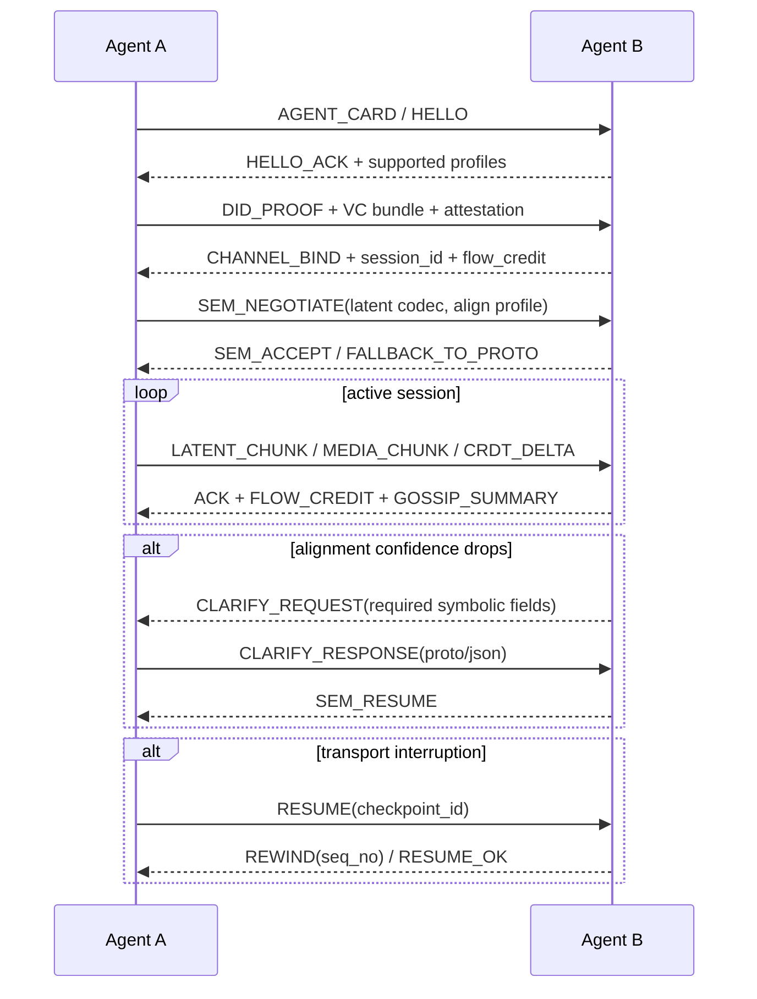
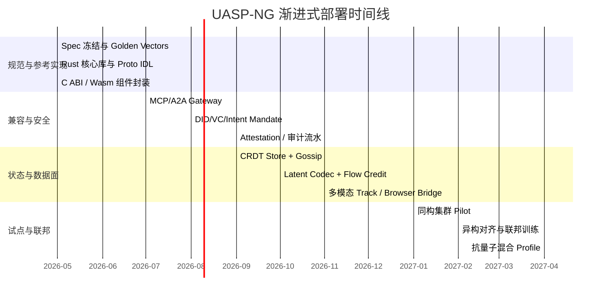

# 新一代 AI 原生通信协议落地设计方案

## 执行摘要
本文的结论是：**UASP-NG 应被设计成“显式可治理控制平面 + AI 原生高吞吐数据平面”的混合协议，而不是单一的全局 latent-only 协议。** 这既保留了潜空间通信在延迟与带宽上的潜在收益，也解决了审计、兼容、协商、跨语言和渐进部署的现实问题。潜空间压缩在研究中已经展示出“压缩到 8 个 token 级长度、并显著降低通信端到端延迟”的可行性，但真正大规模落地仍然依赖语义对齐、会话治理与版本协商机制的完善。

## 设计输入与总体原则

本文采用的设计输入不是“从零发明一套新协议”，而是把三份用户文稿中的强假设拆出来、再用现有主流标准与原始论文去约束可实施边界。用户文稿中的有效骨架主要有三部分：**五层混合栈、潜空间二进制帧、双向适配器与轨迹指标**；需要强化的部分则是：**标准化的语义对齐元协议、清晰的控制/数据分层、对现有 MCP/A2A 生态的可迁移性、以及对零信任与可验证执行的工程化裁剪**

在“无特定约束”的前提下，本文把部署参数视为配置画像，而不是单一固定指标。推荐从以下范围建模：

| 参数项 | 推荐可选范围 | 工程说明 |
|---|---:|---|
| 节点规模 | 10² ～ 10⁶ | 从单组织集群到跨组织开放联邦 |
| 控制面 RTT 目标 | 同机 `<1ms`；同城 `5–20ms`；跨区 `20–80ms`；跨洲 `80–200ms` | 用于协商、授权、发现、回退 |
| 数据面载荷 | 1KB ～ 4MB/帧 | 控制消息、CRDT 增量、潜空间块、多模态块 |
| 支持模型 | Decoder-only LLM、Encoder-Decoder、VLM、ASR/TTS、策略模型 | 潜空间高速通道仅在对齐成功时启用 |
| 网络环境 | 数据中心、广域网、边缘蜂窝/无线、弱网与分区 | 同一会话通过 profile 选择传输模式 |
| 一致性需求 | 局部协作强最终一致；财务/配额类强一致 | 后者不走 CRDT 快路径，交由账务子系统 |

UASP-NG 的**正式支持技术清单**如下，均被视为协议一等能力而不是“可有可无的插件”：

| 技术项 | 在协议中的位置 | 落地方式 |
|---|---|---|
| 潜空间语义通信 | 数据平面 | `LATENT_CHUNK`、`LATENT_DESC`、可协商 latent codec |
| 神经语义对齐算法 | 对齐层 | profile 协商 + federated semantic equalizer + 澄清回退 |
| CRDTs | 状态层 | Yjs/Automerge 类文档结构，Delta/State 两种同步模式 |
| Gossip | 发现与摘要层 | push-pull anti-entropy、摘要传播、分区愈合 |
| DID / VC | 身份与授权层 | DID 解析、VC 校验、Intent Mandate 签发与验证 |
| 联邦学习 | 对齐训练层 | 训练 semantic equalizer，而非训练整个基础模型 |
| 零信任 | 会话与策略层 | PDP/PEP、每请求授权、持续风险评估 |
| 多模态流媒体 | 数据平面 | 视频/音频/传感器 track、关键帧与 delta 混传 |

这里最重要的原则只有一句：**潜空间通道必须是“经协商启用的高性能模式”，而不是“唯一合法模式”。** 原因很直接：现有研究已经指出，协议生态的主要赤字不只是传输效率不足，还包括协议级的意图澄清、上下文对齐与动作验证支持不足；而跨模型潜空间互通本身又会遭遇 latent space misalignment。把显式语义通道保留为控制面，本质上不是“保守”，而是对可治理性、可审计性与跨模型互操作性的最低尊重。citeturn16view19turn17view4

## 完整协议架构

三份用户文稿都在推动“从文本协议走向 AI 原生栈”，但真正可落地的版本必须多一步：把“可解释的控制”与“高吞吐的语义数据”拆开。下图给出 UASP-NG 的正式分层架构；其骨架继承自用户文件中的 ASLP / UASP / NACP-2030 思路，但传输与兼容面明确对接 QUIC、HTTP/3、MCP 与 A2A。fileciteturn0file0L71-L106 fileciteturn0file1L25-L47 fileciteturn0file2L131-L179 citeturn16view5turn16view0turn16view2



UASP-NG 建议采用五层实现，每层都同时写清**功能、接口、容错与扩展点**：

| 层 | 主要功能 | 北向接口 | 南向接口 | 核心消息 | 容错机制 | 扩展点 |
|---|---|---|---|---|---|---|
| 兼容与传输层 | QUIC/HTTP/3 会话、WebTransport/WebRTC 接入、MCP/A2A 网关 | `open_session()` `open_gateway_channel()` | QUIC stream / datagram、HTTP/3、browser bridge | `TRANSPORT_HELLO` `RESUME` `PING` | 连接迁移、0-RTT 恢复、分流重试、弱网降级 | 传输插件、ALPN、browser adapter |
| 身份与会话层 | DID 解析、VC 校验、Intent Mandate、PDP/PEP、E2EE | `verify_peer()` `authorize()` | key agreement、policy engine | `DID_PROOF` `MANDATE` `CHANNEL_BIND` | fail-closed、会话 TTL、撤销列表、重放防护 | DID method、policy provider、attestation provider |
| 语义对齐与能力层 | Agent Card 发布、profile 协商、语义等化、澄清与回退 | `discover()` `negotiate_profile()` `clarify()` | registry / cache / equalizer | `AGENT_CARD` `SEM_NEGOTIATE` `CLARIFY_REQUEST` | profile 不兼容即退回显式控制面 | codec registry、equalizer registry、clarifier |
| 状态与发现层 | CRDT 文档、Gossip 摘要、主题订阅、去中心化发现 | `apply_delta()` `subscribe_topic()` | local store / anti-entropy | `CRDT_DELTA` `STATE_SNAPSHOT` `GOSSIP_SUMMARY` | 分区后自愈、摘要补洞、幂等 delta | CRDT 类型、topic vector、retention policy |
| 神经与多模态层 | latent chunk、视频/音频/传感器流、语义流控 | `stream_latents()` `stream_media()` | tensor codec / media codec | `LATENT_CHUNK` `MEDIA_CHUNK` `FLOW_CREDIT` | 丢包切换、关键帧重传、可信降采样、OOM 保护 | latent codec、media track、semantic FEC |

UASP-NG 的关键设计权衡如下。它们不是“抽象原则”，而是决定协议能否落地的分界点：

| 设计决策 | 选择 | 替代方案 | 取舍结论 |
|---|---|---|---|
| 协议范式 | 控制平面显式 + 数据平面潜空间 | pure latent-only | 选混合：pure latent 在审计、调试、兼容与语义澄清上风险过高 |
| 传输基座 | QUIC/HTTP/3 为主 | WebSocket/TCP only | 选 QUIC：天然支持多流、流控、迁移与低延迟建联 |
| 状态同步 | CRDT + Gossip | Raft/Paxos 全面覆盖 | 选分层：协作状态走 CRDT，账务/配额等少量关键状态另行强一致 |
| 北向生态 | 包裹 MCP/A2A | 另起炉灶 | 选兼容：保留现有工具与 Agent Card 生态，降低迁移成本 |
| 控制消息编码 | Protobuf 为主、JSON 为辅 | JSON-only / FlatBuffers-only | 选 Protobuf：语言与版本兼容最好；JSON 只作调试镜像 |

上述取舍与现有标准的能力边界是一致的：QUIC 提供多流、流控、路径迁移与低延迟建联；MCP 适合工具互连；A2A 适合 agent discovery 和任务交换；但它们都没有直接给出“跨模型潜空间 + 去中心化状态 + 零信任意图授权”的完整组合，因此需要 UASP-NG 在其下方再补一层 AI-native 数据平面。citeturn19view0turn16view0turn16view2turn27view2

## 数据帧格式规范

用户第三份文稿强调“原生二进制帧 + 双向潜空间适配器”的路线，这一方向是对的；但真正的规范不宜把所有字段都固化在超长定长头里。UASP-NG 采用 **固定基头 + TLV 扩展 + 分段载荷** 的三段式帧结构：固定基头保证快路径解析，TLV 保证版本演进，分段载荷保证同一帧可同时承载控制元数据、CRDT patch、tensor 块和媒体块。控制面默认序列化为 Protobuf；JSON 仅保留为调试镜像与网关降级输出。fileciteturn0file2L131-L179 citeturn23view1turn16view10turn18view1turn18view0

**固定基头**建议为 32 字节，网络字节序如下：

| 偏移 | 字段 | 长度 | 说明 |
|---:|---|---:|---|
| 0 | `magic` | 2B | 固定值 `0x5541`，表示 `UA` |
| 2 | `wire_version` | 1B | 线级版本；`1` 表示本文规范 |
| 3 | `base_header_len` | 1B | 固定基头长度，当前为 `32` |
| 4 | `flags` | 2B | `encrypted`/`ack_required`/`critical_ext_present`/`compressed` 等 |
| 6 | `frame_type` | 1B | 如 `HELLO`、`CRDT_DELTA`、`LATENT_CHUNK` |
| 7 | `plane` | 1B | `0=control`，`1=data` |
| 8 | `stream_id` | 4B | 逻辑流 ID |
| 12 | `session_id` | 8B | 会话 ID |
| 20 | `seq_no` | 8B | 单流递增序号 |
| 28 | `payload_len` | 4B | 后续全部 TLV + payload 总长度 |

**TLV 扩展区**采用 `type(1B) + len(2B) + value(nB)`。`type` 最高位为 `1` 表示 critical；接收方遇到未知 critical 扩展必须拒绝该帧，遇到未知 non-critical 扩展必须跳过。建议预留以下标准 TLV：

| Type | 字段 | 典型长度 | 说明 |
|---|---|---:|---|
| `0x81` | `semantic_profile_id` | 2B | 协议级语义对齐 profile |
| `0x82` | `security_suite` | 1B | 如 `did-e2ee-v1`、`hybrid-pq-v1` |
| `0x83` | `codec_id` | 1B | `proto`/`json`/`latent-bf16`/`latent-pq8`/`media-av1f` |
| `0x01` | `sender_did_hash` | 16B | 截断哈希，用于路由与缓存索引 |
| `0x02` | `receiver_did_hash` | 16B | 同上 |
| `0x03` | `intent_ref` | 16B | Intent Mandate 引用 ID |
| `0x04` | `ack_base` | 8B | 选择性确认的起始序号 |
| `0x05` | `checkpoint_id` | 8B | 会话恢复点 |
| `0x06` | `timestamp_us` | 8B | 发送时间戳 |
| `0x07` | `media_track` | 4B | 视频/音频/传感器 track |
| `0x08` | `qos_class` | 1B | `realtime`, `interactive`, `bulk` |

**载荷分段区**允许一个帧中放多段数据；每段格式为 `segment_type(1B) + codec(1B) + len(4B) + bytes(nB)`。标准段类型建议为：`0x01=PROTO_CONTROL`、`0x02=JSON_DEBUG`、`0x10=CRDT_PATCH`、`0x20=LATENT_BLOCK`、`0x30=MEDIA_BLOCK`、`0x40=ATTESTATION`、`0x50=EXEC_RECEIPT`。这样设计的好处是：即便同一会话从潜空间高速通道回退到显式协商，仍无需切换到另一种完全不同的帧壳。citeturn23view1turn16view10

版本兼容规则建议写死在规范里，而不交给实现自行发挥。规则如下：**Major 版本不兼容；Minor 版本只允许追加字段与扩展；字段号永不复用；critical TLV 未识别即拒绝；non-critical TLV 未识别即跳过；JSON 从不作为仲裁真相，只作镜像与诊断；Protobuf 的 wire-safe 变更才允许进入 Minor 升级。** 这与 Protobuf 官方对向后/向前兼容、unknown field 与 wire-safe changes 的约束一致。citeturn23view1turn16view10

下表给出 UASP-NG 在序列化层的正式选择。它综合了 Protobuf、FlatBuffers 与 Cap’n Proto 的官方文档能力边界。citeturn23view1turn18view1turn18view0turn24view0

| 格式 | 定位 | 优点 | 局限 | 结论 |
|---|---|---|---|---|
| JSON | 调试/网关回退 | 人可读、生态成熟 | 体积大、解析慢、字段约束弱 | 仅用于调试与兼容镜像 |
| Protobuf | 控制面默认 | 跨语言、IDL/代码生成成熟、版本演进稳健 | 需编译 schema，非零拷贝 | **网络控制面首选** |
| FlatBuffers | 本地高速 IPC | 直接访问序列化数据、前后兼容好 | 调试与 schema 演化复杂度高于 Protobuf | 适合作为本地共享内存/设备 IPC |
| Cap’n Proto | 极致零拷贝 IPC/RPC | 编码即内存布局、随机访问快 | 指针/对齐语义更强，广域网审计与治理成本高 | 适合作为机内快路径，不作默认联邦线协议 |

下面给出三个**规范示例**。第一段是二进制头的十六进制示意，第二段是 JSON 调试镜像，第三段是 Protobuf 片段。它们是说明性示例，不包含真实签名与密钥材料。

```text
55 41 01 20 00 12 21 01 00 00 00 03
11 22 33 44 55 66 77 88 00 00 00 00
00 00 00 2A 00 00 01 60
81 00 02 00 07
01 00 10 A4 7C 9E 8B 3D 1F 4A 66 C1 BE 77 A0 21 0F 9D 44
02 00 10 B8 AA 70 11 C2 9E 49 45 BB 2C F2 E0 06 11 C8 EF
82 00 01 02
83 00 01 11
```

上例表示一个 `LATENT_CHUNK` 数据面帧：`frame_type=0x21`、`plane=0x01`、`stream_id=3`、`session_id=0x1122334455667788`、`seq_no=42`、`payload_len=352`，并携带 `semantic_profile_id=7`、标准安全套件 `2` 与 latent codec `0x11`。

```json
{
  "wire_version": 1,
  "frame_type": "SEM_NEGOTIATE",
  "plane": "control",
  "session_id": "1122334455667788",
  "semantic_profile": "uasp.sp.v1.qwen_llama.bridge",
  "supported_codecs": ["proto", "latent-bf16", "latent-pq8"],
  "fallback_order": ["latent", "proto", "json"],
  "clarify_policy": {
    "max_auto_rounds": 2,
    "confidence_floor": 0.82
  }
}
```

```proto
syntax = "proto3";
package uasp.v1;

message Envelope {
  uint32 wire_version = 1;
  uint64 session_id   = 2;
  uint32 stream_id    = 3;
  uint64 seq_no       = 4;
  string frame_type   = 5;
  map<string,string> meta = 6;
  bytes payload       = 7;
}

message Hello {
  string did = 1;
  repeated string transports = 2;      // quic, webtransport, webrtc
  repeated string codecs = 3;          // proto, latent-bf16, latent-pq8
  repeated string semantic_profiles = 4;
  repeated string attestation_types = 5;
}

message FlowCredit {
  uint64 max_bytes = 1;
  uint32 max_inflight_frames = 2;
  uint32 gpu_decode_slots = 3;
  float  max_semantic_loss = 4;
}
```

## 通信机制

UASP-NG 的通信机制由五部分组成：连接管理、会话语义、潜空间压缩与对齐、CRDT/Gossip 状态同步，以及多模态流控。之所以这样拆，是因为现有标准各自只覆盖其中一部分：QUIC 强于传输，MCP/A2A 强于互操作， semantic communication 论文强于“怎样压 meaning”，而分布式系统论文强于“怎样收敛状态”。落地协议必须把这些能力补齐。citeturn19view0turn16view0turn16view2turn26view0

**连接管理**推荐采用“服务端直连 QUIC，浏览器侧 WebTransport/WebRTC 适配”的二层策略。QUIC 本身就是面向连接的安全通用传输，提供流控流、多路复用、低延迟建联和路径迁移；RFC 9221 进一步提供不可靠 datagram 扩展，适合对时延敏感而允许少量丢失的媒体和低价值语义提示。WebTransport 则让浏览器能够以安全多路复用方式接入服务器；WebRTC 则继续承担浏览器/设备间的近实时媒体与数据交换。工程上，控制流走可靠有序 stream，latent/CRDT 流按语义价值决定走 reliable stream 还是 datagram，关键媒体帧走 reliable stream，非关键 delta 走 datagram。citeturn16view5turn16view6turn16view7turn18view9turn19view3

**会话语义**不应等同于“传输层连接”。本文建议把 `session_id` 视为跨连接连续存在的语义会话，额外引入 `epoch`、`checkpoint_id` 与 `idempotency_key`。这样一来，底层 QUIC 连接变化、浏览器重连、边缘迁移、甚至网关热升级，都不会导致上层任务语义断裂。所有具有副作用的动作帧都必须带 `idempotency_key`，接收方必须做重放检测；所有长会话都必须定期下发 checkpoint，允许在 `checkpoint_id` 基础上局部重传。这个模型与零信任下“先授权后建通路”的思路也是一致的。citeturn27view2turn27view3

**潜空间通信**是数据平面的性能核心，但必须分三档启用。第一档是同构模型直通：同一模型家族、同一隐藏维度、同一 latent codec，可直接发送压缩后的 hidden states。第二档是异构模型桥接：通过 semantic pre-equalizer / local semantic equalizer 把 latent 投影到共享 profile 空间，并以联邦优化持续调优等化器，而不是训练整个基础模型。第三档是澄清回退：当 profile 不兼容、语义置信度低于阈值、或关键动作需要高可审计性时，协议自动切回显式 Protobuf/JSON 控制消息。这个渐进机制直接吸收了 Interlat 对“8-token 级压缩与显著降时延”的结果，也吸收了 federated latent alignment 对“semantic equalizer + federated optimization”的思路。citeturn21view3turn21view4turn17view4

**状态同步**建议明确分成“局部共享状态”和“全网发现摘要”两类。局部共享状态使用 CRDT 文档；CRDT 的核心价值在于允许各副本无远程同步先接收更新，并保证最终收敛。对协作编辑、共享计划树、临时上下文图，这比全局加锁或共识复制更适合。全网发现与摘要同步则交给 Gossip/anti-entropy：节点周期性交换摘要、补洞和主题向量，而不是持续依赖中心目录。Yjs/Automerge 这类实践进一步说明，CRDT 已经适合并发共享数据结构与自动冲突合并，但本文不建议把“语义模型参与冲突裁决”放到强制路径中，默认裁决仍应是可证明的确定性 CRDT 规则，语义辅助只做旁路优化。citeturn16view16turn18view2turn18view3turn16view17

**流控**必须同时存在传输级和语义级两层。传输级遵循 QUIC 的 `MAX_DATA` / `MAX_STREAM_DATA` 思想，解决字节与 inflight frame 的背压；语义级则由 `FLOW_CREDIT` 帧显式表达 `gpu_decode_slots`、`max_semantic_loss`、`media_priority`、`max_inflight_latents` 等预算。这样，发送端不会简单地“尽可能多发”，而会根据接收端 GPU 解码槽位、媒体优先级与语义误差容忍度自适应选择压缩率、重传等级与降采样策略。对多模态长流，本文建议采用“关键帧可靠、delta 帧可丢、attention anchor 长留存”的组合，以避免长上下文导致显存与缓存失控。citeturn19view1turn16view7turn18view9

下图给出一条推荐的端到端消息流。可以看到，澄清机制不是异常处理，而是正常协议分支。其存在原因正是当前协议研究所指出的“语义对齐缺口”。citeturn16view19



同步策略上，本文建议把不同一致性模型用在不同对象上，而不是一刀切：

| 对象类型 | 推荐策略 | 原因 |
|---|---|---|
| 共享计划树、上下文图、协作草稿 | CRDT | 高可用、无锁、并发友好 |
| 邻居表、能力摘要、topic 向量缓存 | Gossip + anti-entropy | 去中心化传播、分区后易恢复 |
| 配额、账务、法务审计主账 | 外部强一致账务系统 | 这些对象不应走 CRDT 快路径 |
| 纯文本协作文档 | 可选 OT 或 CRDT | 若已有编辑器生态，可保留 OT |
| 一次性任务结果 | 幂等事件日志 | 便于重放、追踪与回溯 |

## 安全认证与可验证执行

UASP-NG 的安全基线应该严格按照零信任来设计，而不是“先连上、再相信”。根据零信任架构的定义，信任不因网络位置自动获得；认证与授权是会话建立前的离散职能；访问决策应尽可能细粒度，并由 PDP/PEP 与分开的控制平面持续执行。这意味着协议规范本身就要定义：每个会话如何绑定身份、如何表达最小权限、何时重新鉴权、哪些操作必须附带可验证意图。citeturn27view0turn27view2turn27view3

身份与授权建议采用 `DID + VC + Intent Mandate` 三件套。entity["organization","W3C","web standards body"] DID Core 定义了 DID 语法、通用数据模型与解析过程；VC Data Model 2.0 定义了可验证声明、发行者、持有者与验证者生态。因此，UASP-NG 不再用静态 API Key 作为内部联邦根身份，而是用 DID 作为节点身份根、用 VC 表达角色与能力、再用 Intent Mandate 表达一次具体的授权边界，例如“可调用哪些工具、预算上限是多少、TTL 多长、是否允许外部副作用”。高风险动作帧必须同时带上 `intent_ref` 和脱离载荷的执行摘要签名。citeturn16view3turn16view4

下表给出认证与授权方案的对比。它综合了 MCP 当前 OAuth 要求与 DID/VC 路线的能力边界。citeturn16view1turn16view3turn16view4turn27view0

| 方案 | 优点 | 局限 | 结论 |
|---|---|---|---|
| API Key | 简单、低门槛 | 难撤销、难归因、横向移动风险大 | 禁作联邦根身份 |
| OAuth/OIDC 风格 | 适合标准 Web 资源访问 | 更偏中心化资源授权，不天然适合去中心 M2M 联邦 | 适合作为 MCP 北向兼容面 |
| DID + VC + Intent Mandate | 去中心身份、细粒度授权、可审计、可绑定非人实体 | 实现复杂度更高，需要解析、吊销与策略基础设施 | **UASP-NG 内部联邦首选** |

端到端加密建议采用“**传输层保密 + 应用层保密**”双层策略。底层传输由 QUIC/TLS 保护链路机密性和完整性；应用层则借鉴 DIDComm 的语义，用 sender-authenticated encryption（authcrypt）保护真正的消息载荷。DIDComm 明确区分 authcrypt 与 anoncrypt，并以 `ECDH-1PU` 等方案提供带发送方认证的加密语义；因此，UASP-NG 应复用这一思路，但不复用其 JSON 线格式，而是在二进制帧的 payload 段上做加密信封封装。对需要不可抵赖性的动作，再叠加独立签名。普通 latent/media 数据不应默认携带可第三方验证的独立签名，以免把高吞吐流量强行变成审计档案。citeturn20view0turn9search2turn16view6

**可验证计算**不应“一上来就证明整个大模型前向传播”。当前更现实的做法是双层：第一层是 **TEE/remote attestation**，用 RATS 架构证明“谁在跑、在哪跑、跑的是哪份测量值环境”；第二层才是 **可选的 zk receipt**，用于证明关键策略执行、关键工具调用、关键聚合结果，而不是证明所有 token 或所有 latent。ZKML 与 zkVM 的进展已经说明，带有可验证性的机器学习推理是可行的，但成本仍然敏感，因此适合先用于高价值、低频、法务敏感的路径。citeturn16view12turn18view5turn18view6

抗量子建议也应采用“**混合迁移**”而不是“一步到位替换”。当前的实际建议是：短中期继续保留成熟经典算法以保证生态互通，同时对新建会话引入基于 ML-KEM 的密钥协商与基于 ML-DSA 的签名能力；策略上至少支持“纯经典、混合、纯后量子”三档 profile，由部署策略决定何时强制升级。对浏览器与轻终端，允许先从混合 profile 起步。citeturn16view13turn16view14

## 跨语言兼容与性能验证

跨语言兼容的关键不是“有很多 SDK”，而是**有唯一的语义真相、唯一的 IDL、可验证的 Golden Vectors，以及可落到多语言运行时的 ABI 约束**。UASP-NG 建议以 Protobuf 作为网络控制面的规范 IDL，以 gRPC/streaming RPC 作为北向服务生成机制，再以稳定 C ABI 暴露核心编解码与安全库；对浏览器插件和多语言组件侧，则引入 WebAssembly Component Model 的 canonical ABI，保证不同语言编译出的组件能够在类型上稳定互通。citeturn23view1turn24view0turn16view8

本地高性能路径应与联邦线协议分离。也就是说：**线协议只认 UASP Envelope；机内快路径可以各显神通。** 例如，GPU 编解码器、共享内存缓冲区和本机插件宿主可以内部采用 FlatBuffers 或 Cap’n Proto 获得更低拷贝开销，但一旦跨进程、跨主机、跨组织发包，必须回到 UASP Envelope 的固定壳与 Protobuf/二进制段语义。这能避免“每个语言绑定各用一套私有零拷贝格式”所带来的联邦碎片化。citeturn18view1turn18view0

性能验证则不能只测“每秒多少消息”。semantic communication 的研究已经明确指出，统一指标仍然缺失，尤其传统统计指标并不适合 reasoning-heavy 任务。本文建议采用“**物理指标 + 语义指标 + 互操作指标**”三层方法。物理指标包括冷启动握手延迟、会话恢复延迟、单流与多流吞吐、字节级带宽占用、重传率与 tail latency；语义指标包括任务成功保持率、澄清回退率、动作轨迹精度、语义保真度与副作用正确率；互操作指标则包括跨模型 profile 成功率、跨版本兼容率与 gateway 降级成功率。潜空间压缩研究已经展示出显著的时延下降潜力，但工程验收必须反过来证明：节省下来的字节与时间没有把关键意图丢掉。citeturn26view0turn21view3turn21view4turn17view4

建议将 SDK 与兼容验证做成明确矩阵：

| 语言/运行时 | 推荐实现层 | 验证重点 |
|---|---|---|
| Rust | 核心协议栈、加密、编解码、网关内核 | 内存安全、零拷贝边界、C ABI |
| Go | 网关、服务端控制面、运维组件 | 高并发 stream、观察性 |
| Java/Kotlin | 企业侧 agent、任务控制器 | 长连稳定性、类型映射 |
| Python | 编排器、研究实验、对齐训练器 | schema 一致性、回退逻辑 |
| TypeScript/Web | 浏览器 SDK、WebTransport/WebRTC 适配器 | 受限环境连接恢复、媒体 track |
| C/C++ | 嵌入式/边缘设备适配器 | 二进制兼容、资源占用 |

**测试用例**至少要覆盖以下六类，且每类都应有 golden expected behavior：

| 用例 | 场景 | 通过条件 |
|---|---|---|
| 版本偏斜 | `v1.2` 客户端连 `v1.0` 服务端 | non-critical 扩展被跳过；critical 扩展被明确拒绝 |
| 语义失配 | 异构模型 latent profile 不兼容 | 自动触发 `CLARIFY_REQUEST` 并回退到控制面 |
| 状态冲突 | 两端并发改写共享计划树后恢复网络 | CRDT 文档在规定时间内收敛且无人工 merge |
| 断链恢复 | 传输中断后从 checkpoint 恢复 | 副作用不重复、幂等键生效、会话连续 |
| 安全拒绝 | VC 过期、attestation 失效、Intent 超界 | 会话 fail-closed，且审计日志完整 |
| 多模态背压 | GPU 解码槽位不足、媒体暴涨 | `FLOW_CREDIT` 生效，系统降采样不断会话 |

**基准测试方法**建议固定成四个 profile：`symbolic-only`、`latent-same-family`、`latent-cross-family-aligned`、`gateway-fallback`。每个 profile 都在相同拓扑、相同工具集、相同任务集下比较以下指标：控制面延迟、数据面吞吐、带宽、澄清率、任务成功保持率、轨迹精度、故障恢复时间。特别建议新增两项验收门槛：其一，**语义保真度下降不能快于带宽节省收益**；其二，**跨模型 profile 一旦回退到符号面，不得出现未被审计的隐式副作用。** 这两项是大规模 agent 协议真正容易“看起来很快、实际不可用”的地方。citeturn26view0

## 渐进式部署与开发里程碑

部署策略上，本文不建议“切换日”式上线，而建议 **网关先行、双栈运行、影子流量验证、局部 latent 试点、再逐步去中心化**。第二份用户文件提出的“UASP-Gateway”方向是对的，第三份用户文件提出的“双向潜空间适配器”也非常关键：它们共同说明，向后兼容不是附属需求，而是协议成败的前提。fileciteturn0file1L63-L71 fileciteturn0file2L175-L179

建议的部署阶段如下：

| 阶段 | 目标 | 对外形态 | 内部能力 | 退出条件 |
|---|---|---|---|---|
| Phase A | 网关影子部署 | 继续暴露 MCP/A2A | 收集 Agent Card、工具调用、负载画像 | 影子流量观测稳定 |
| Phase B | 控制面替换 | 兼容 MCP/A2A，内部改为 UASP control plane | DID/VC、Proto IDL、会话恢复 | 无功能回归、版本验证通过 |
| Phase C | 状态层去中心化 | 对外接口不变 | CRDT 文档与 Gossip 摘要上线 | 分区恢复与冲突收敛达标 |
| Phase D | 同构 latent 试点 | 高价值内网集群开启 latent profile | 同模型高速数据面 | 语义指标优于 symbolic-only |
| Phase E | 异构 latent 联邦 | 跨模型引入 equalizer 与 federated alignment | 自动澄清回退成熟 | 跨模型成功率稳定 |
| Phase F | 开放联邦 | 组织间 DID 联邦与混合抗量子 profile | 审计、撤销、attestation、PQC 混合 | 合规与运维体系成熟 |

下面是一个在“无特定约束”条件下的**可执行开发时间线**。它不是产品承诺，而是工程排期模板。



对应的**开发里程碑**建议如下：

| 里程碑 | 必交付件 | 验收要点 |
|---|---|---|
| M1 | 规范文档、Protobuf schema、Golden Vectors | 任一语言实现都能通过线级回放 |
| M2 | Rust 参考实现、Go/Python SDK、网关原型 | MCP/A2A 兼容跑通 |
| M3 | DID/VC/Intent 授权链、审计流水 | 高危动作可拒绝、可追溯 |
| M4 | CRDT/Gossip 子系统 | 并发冲突与网络分区可恢复 |
| M5 | Latent codec、flow credit、多模态 track | 同构 latent profile 性能优于控制面对照组 |
| M6 | 异构 equalizer、federated 训练与回退机制 | 跨模型 profile 在阈值内稳定运行 |
| M7 | Browser bridge、PQC 混合 profile、完整 conformance suite | 面向生产试点可审计上线 |

最后给出本文认为仍需保持谨慎的几个**开放问题**。第一，异构模型 latent 对齐仍是协议最大技术不确定性，尤其是在隐藏维度、训练分布和工具世界模型差异较大时，自动 equalizer 的收益与稳定性需要真实业务验证。第二，可验证计算的成本仍然较高，因此本文明确建议先验证策略执行、工具调用和高价值聚合，不把“证明整个模型推理”设成首发强制项。第三，后量子混合栈的浏览器与边缘端支持度还会经历一段并存期，所以部署上必须允许 classical / hybrid / pq 三档 profile 共存。citeturn17view4turn18view5turn16view13turn16view14