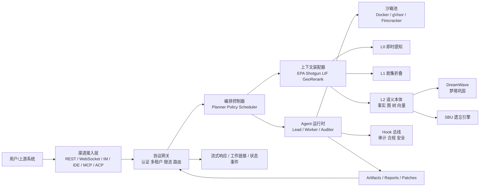
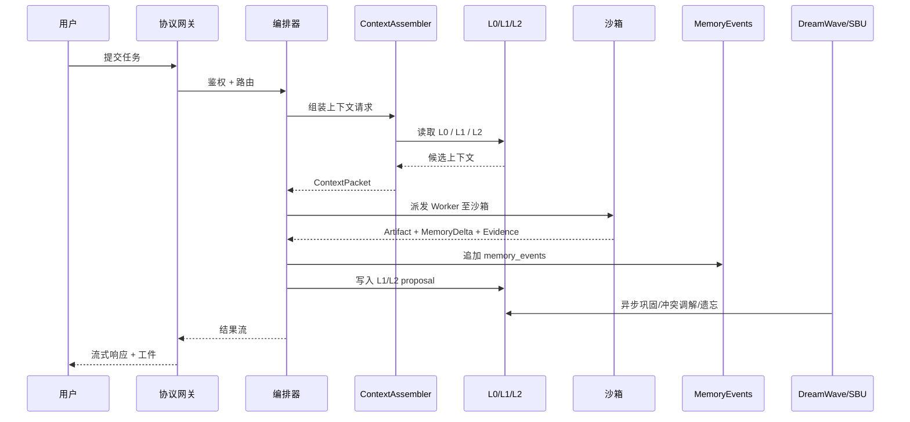
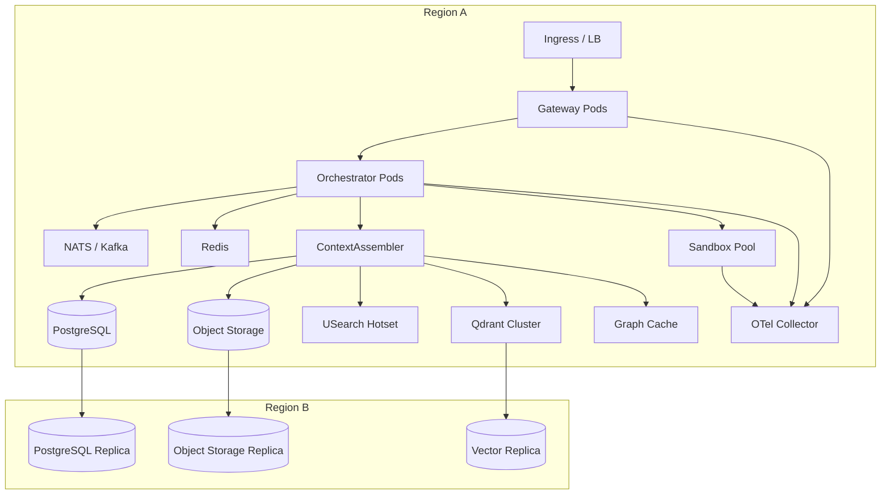

# 企业级多智能体系统的上下文管理与编排架构实施方案

## 执行摘要

本报告以《05.多智能体编排和上下文管理.md》与《03.记忆系统设计方案.md》为内部规范基础，结合 VCPToolBox、DeerFlow、OpenCode、Goose 的官方工程资料与相关学术来源，给出一份可直接落地的企业级多智能体上下文管理与编排方案。需要先说明的是：本会话中**未看到单独上传的《ocms总体设计.md》**，因此本文默认将《03.记忆系统设计方案.md》视为当前可见的 OCMS 规范来源；凡原文未明确给出、或图片公式在文本中不可完整转写的内容，统一标注为“未指定”，并给出工程建议值。fileciteturn0file0 fileciteturn0file1

综合两份内部文档，OCMS 的核心不是“再堆一个向量库”，而是把记忆拆成 **L0 即时感知、L1 剧集折叠、L2 语义本体、潜意识处理** 四层，并以图—树—向量异构存储、霰弹枪查询、LIF 脉冲扩散、测地线重排、梦境巩固与 SBU 机器遗忘作为记忆主干。05 文档则把企业级多智能体系统所需的外部能力归纳为四类：VCPToolBox 的认知拓扑网络、DeerFlow 的沙箱隔离与长周期编排、OpenCode 的无损状态治理与 compaction hook、Goose 的协议化扩展与高性能客户端/服务端连接。官方资料进一步确认：TagMemo 使用共现图、霰弹枪查询与 LIF 扩散；DeerFlow 提供隔离式子智能体、Gateway API、可配置 summarization 和本地 memory.json 注入；OpenCode 提供配置合并、受限/只读 agent、以及 `experimental.session.compacting` hook；Goose 则把 MCP/ACP 作为扩展与客户端互联的主协议。fileciteturn0file0 fileciteturn0file1 citeturn15view0turn15view1turn11search2turn12search1turn12search2turn13view0turn13view1turn13view3turn6view1turn6view3turn7search1

因此，本文建议落地为“三平面一后台”的分层体系：**协议与治理控制平面**负责 REST/gRPC/WebSocket/MCP/ACP 接入、调度、权限与审计；**执行平面**负责 Lead/Worker Agent 生命周期与沙箱池；**认知平面**承载 OCMS 的 L0/L1/L2 和记忆检索；**潜意识后台**负责 DreamWave 巩固、冲突调解、SBU 强制遗忘、索引重建与异步回写。这个结构既保留了 03 文档定义的 OCMS 记忆分层，也吸收了 05 文档对四个框架能力拼装的结论。fileciteturn0file0 fileciteturn0file1

从实施路线看，建议按四阶段建设：先做 **MVP 编排与基础记忆**，再上线 **增强检索与多 Agent 共享治理**，随后加入 **潜意识梦境与遗忘**，最后补齐 **企业级多租户、合规、跨语言插件与高可用扩展**。如果团队已有较强 Go/Python 经验，可在 MVP 阶段以 Go 网关 + Python 编排快速起步；若追求稳定的长线控制面与协议路由性能，生产级建议落到 Rust 网关/协议层、事件驱动同步总线、Kubernetes 沙箱池、PostgreSQL 事实库、对象存储、Qdrant 或同类分布式向量库，并用 OpenTelemetry 建立端到端追踪。SQLite WAL 的并发读写语义、Qdrant 的分片复制、Kubernetes 的自动扩缩容、OpenTelemetry 的 trace/metric/log 三信号模型，都适合作为生产形态的基础设施依据。citeturn8search0turn8search1turn8search3turn8search10turn8search18turn8search22

## 设计边界与总体架构

本方案遵循六条硬约束。第一，**租户隔离优先于上下文共享**，共享只能发生在同租户、同工作区、同策略域下。第二，**L0 绝不跨 Agent 直接共享原始工作记忆**；可共享的是经过裁剪的 handoff packet。第三，**L1 永远可追溯到原文 span**，避免压缩漂移。第四，**L2 永远版本化**，不允许“直接覆盖式事实更新”。第五，**任何高风险工具执行都必须在沙箱与 Hook 审计链上完成**。第六，**遗忘必须双路径执行**，既删外部记忆，也阻断参数/提示路径回流，这一点与 SBU 研究结论一致。fileciteturn0file1 citeturn16search1turn11search2turn13view0

内部方案与官方资料共同指向一个结论：05 文档更像“最佳实践总谱”，03 文档更像“记忆内核规范”，而最新官方文档则提供了必须对齐的现实接口边界。因此，本文采用“**内部规范定目标，官方工程定接口，未指定项由平台约束补齐**”的方法。比如 05 文档把 Goose 抽象为“高性能协议标准”，但官方资料同时明确 Goose 也提供持久会话、API、扩展与 ACP 客户端集成；所以落地时应借鉴的是其**协议优先与扩展治理**，而不是把 Goose 简化成完全无状态网关。类似地，05 文档对 OpenCode 的“无损状态治理”总结很有价值，但生产实现要以官方 compaction hook、配置合并与 agent/mode 权限边界为准。fileciteturn0file0 citeturn6view1turn6view2turn7search1turn13view0turn13view1turn13view2turn13view3

| 来源框架 | 可直接吸收的能力 | 映射到 OCMS 的模块 | 关键接口 | 关键数据结构 | 关键交互流 |
|---|---|---|---|---|---|
| VCPToolBox | 标签共现拓扑、EPA、霰弹枪查询、LIF 扩散、TagMemo 调优 | `ocms-tagmemory`、`ocms-context-assembler`、`ocms-graph-cache` | `POST /v1/memory/retrieve`、`SearchMemory()` | `CooccurrenceMap`、`EnergyField`、`TagVectorMix` | Query → EPA → Shotgun → LIF → GeoRerank |
| DeerFlow | 隔离子智能体、沙箱、Gateway API、线程/工件/上传、可配置 summarization | `ocms-orchestrator`、`sandbox-manager`、`artifact-gateway` | `/v1/runs/*`、`StreamRun()`、`/v1/artifacts/*` | `TaskSpec`、`SandboxLease`、`RunState` | Lead → Spawn Worker → Sandbox → Artifact → Merge |
| OpenCode | 配置分层合并、plan/explore/general 权限模型、compaction hook、非破坏性上下文治理 | `ocms-policy-engine`、`ocms-episodic-fold`、`hook-bus` | `pre_compaction`、`post_compaction`、`pre_tool_execute` | `SummaryNode`、`CompactionMark`、`ReplayPointer` | Prune Mark → Summarize → Replay Intent → Expand on Demand |
| Goose | MCP/ACP 协议化接入、扩展 allowlist、API/CLI/Desktop 统一、会话持久化 | `protocol-gateway`、`plugin-registry`、`acp-adapter` | MCP/ACP、WebSocket、gRPC | `ToolManifest`、`ResourceURI`、`SessionEnvelope` | Register Extension → Discover → Route → Stream |

表中“来源框架能力”来自内部文档与对应官方资料，“映射到 OCMS 的模块”与“关键接口/结构”是本文的实施设计。fileciteturn0file0 fileciteturn0file1 citeturn15view0turn11search4turn13view0turn13view1turn6view3turn6view4turn7search1



该图体现的是“三平面一后台”：协议网关与编排器属于控制平面，Agent 与沙箱属于执行平面，L0/L1/L2 属于认知平面，DreamWave 与 SBU 属于潜意识后台。它同时符合 03 文档的 OCMS 分层，也吸收了 05 文档对四个框架的整合方向。fileciteturn0file0 fileciteturn0file1

| 组件 | MVP 建议 | 生产级建议 | 说明 |
|---|---|---|---|
| 协议网关 | Go + Fiber/Gin | Rust + Axum + tonic | MVP 图快，生产看重协议路由延迟与稳定性 |
| 编排器 | LangGraph 或等价图式编排 | Temporal + Agent Runtime | 用 Temporal 承载重试、补偿、长任务状态 |
| L0/L1 | 进程内 ring buffer + Redis + Postgres | 相同思路，增加 lease/fencing 与多副本 | L0 不需要重数据库，重在时序与低延迟 |
| L2 事实库 | PostgreSQL | PostgreSQL 分片/逻辑复制 | 事实版本与审计天然适合关系模型 |
| 图谱骨架 | Postgres 边表 + 内存稀疏矩阵 | 同上；边数超大时再引入图引擎 | 先避免过早引入专用图库 |
| 向量层 | pgvector / Qdrant 单节点 | USearch 热集 + Qdrant 分布式冷全集 | 兼顾 hot path 与复制治理 |
| 文档树 | Postgres 元数据 + MinIO | 对象存储 + 独立索引服务 | 目录树比纯向量更适合长文档 |
| 沙箱 | rootless Docker | Kubernetes + gVisor / Firecracker | 高风险任务需更强隔离 |
| 消息总线 | NATS JetStream | Kafka + NATS | 控制流轻、审计流重 |
| 可观测 | OTel + Grafana 基础栈 | OTel Collector + Prometheus + Tempo + Loki | 统一 trace/metric/log |

上表是实施建议，不是文档原文；其依据是内部 OCMS 规范对 Go/Rust、WAL、USearch、Hook 与观测性的要求，以及官方资料对 DeerFlow、OpenCode、Goose 在 API、协议与扩展形态上的现实边界。fileciteturn0file1 citeturn11search4turn13view3turn6view3turn8search0turn8search1turn8search10

| 未指定项 | 文档状态 | 本文建议 |
|---|---|---|
| `ocms总体设计.md` 原文 | 未提供 | 以《03.记忆系统设计方案.md》为 OCMS 规范来源 |
| L0 在多 Agent 并发下的 owner 规则 | 未指定 | 单线程单写租约，默认 lease 30 秒，fencing token 防越权 |
| 测地线与向量的混合权重 | 文档图片未完整转写 | `score = 0.65 * semantic + 0.35 * geodesic` 起步 |
| DreamWave 调度时刻 | 未指定 | 每租户 01:30–05:00 低负载窗口执行 |
| SBU 参数路径策略强度 | 未指定 | 先做提示/检索路径阻断，再按审批升级为参数对齐作业 |

这一组“未指定 → 建议值”的补齐，是为了把内部研究稿变成可部署方案。fileciteturn0file0 fileciteturn0file1

## 上下文管理与多智能体编排机制

03 文档把 OCMS 明确成四层：L0 保留当前会话最近 5–10 轮原始交互；L1 在 token 压力下执行可回溯的剧集折叠；L2 将事实沉淀为世界、经验、观点、实体等长期语义本体；潜意识层则在后台执行梦境巩固与 SBU 遗忘。05 文档则强调企业多智能体系统必须把“共享”与“隔离”拆开设计，不能把一个线程上下文粗暴广播给所有 agent。官方上，DeerFlow 明确强调 isolated sub-agent context，OpenCode 将 plan/explore/general 做权限区分，说明多 Agent 协作的正确抽象不是“公共话筒”，而是“受治理的上下文包”。fileciteturn0file1 fileciteturn0file0 citeturn11search2turn13view1turn13view2

| Agent 类型 | L0 | L1 | L2 | Sandbox / FS | 默认权限 | 锁与冲突策略 |
|---|---|---|---|---|---|---|
| Lead Planner | 读写自身 L0 | 读写当前 branch root | 读共享、写 proposal | 可调度，不直接共享 FS | 可编排，不直接越权执行高危工具 | `session_lease` + `branch_version` CAS |
| Worker Research | 仅 own L0 | 读 handoff packet，写 worker summary | 读 project scope，写 delta proposal | own sandbox only | 不能直接提交 L2 canonical fact | `subtask_lease` + proposal merge |
| Worker Code | 仅 own L0 | 读最近决议和文件清单 | 读技术事实、禁读敏感领域 | own sandbox + repo mount | 文件写需 policy 与 hook 通过 | `artifact_lock` + patch review |
| Auditor / Compliance | 不读原始 L0 | 只读摘要与审计索引 | 只读事实元数据与策略标签 | 只读 artifact | 不得修改业务记忆 | 仅 append immutable audit log |
| Cross-workspace Federation | 默认拒绝 | 默认拒绝 | 只能以 MCP Resource 精选暴露 | 无 | deny-by-default | token + scope + data contract |

这张策略表吸收了 DeerFlow 的上下文隔离、OpenCode 的只读/受限 agent 思想，以及 OCMS 对 L0/L1/L2 的分层要求。落地规则是：**共享的是经过裁剪和标注的 packet，不是原始历史；提交的是 proposal，不是直接覆盖 canonical memory。** fileciteturn0file0 fileciteturn0file1 citeturn11search2turn13view1turn13view2

L0、L1、L2 在多 Agent 下的读写与同步可按下面方式实现。L0 使用**单写租约**与环形缓冲：每个 run 只允许一个 owner agent 写入，其他 agent 只能读取 handoff snapshot；这样可以避免“多个 worker 同时篡改工作记忆”。L1 使用**分支摘要树**：每次 compaction 产出 `SummaryNode(node_id, parent_id, source_span, basis_hash, summary, decisions, open_questions, version)`；不同 worker 可以生成 sibling summary，最终由 merge worker 合并。L2 使用**版本化事实头指针**：逻辑上每个 fact 有 head version，写入时必须带 `expected_version`，否则产生 `ConflictSet`，交给潜意识层或审核 agent 解决。这个设计与 03 文档的“摘要/事实物理剥离”一致，也吸收了 OpenCode “非破坏性标记 + 可恢复”思路。fileciteturn0file1 citeturn13view0turn14search0turn14search15

在编排机制上，建议采用“**Lead 负责意图拆解，Worker 只负责局部最优，Canonical commit 只能通过治理路径完成**”的原则。Lead 首先调用上下文装配器生成 `ContextPacket`，再按任务类型分发给 research/code/analysis/audit worker。Worker 结束后只回传 `Artifact + MemoryDelta + EvidenceSet`，由 `merge-judge` 统一判断哪些进入 L1，哪些进入 L2，哪些仅作为工件留存。这样既保留 DeerFlow 的并发子任务范式，也避免 VCP 风格的强联想网络在多 worker 并发写入时被噪声污染。fileciteturn0file0 fileciteturn0file1 citeturn11search2turn12search2

TagMemory 与 LIF 增强检索应当成为多 Agent 的统一 recall 服务，而不是某个 agent 的私有工具。VCP 官方文档说明其核心由共现图、EPA、霰弹枪查询、动态 Beta 与 LIF 扩散组成；03 文档又补充了 OCMS 的测地线重排、`minGeoSamples=4`、0.70 相似度分段与多跳游走。工程上建议把这些能力固化成一个单独的 `ContextAssembler` 服务，所有 agent 在拿上下文时都走同一条 recall 流水线。fileciteturn0file1 citeturn15view0turn15view1

```python
def assemble_context(query, thread_state, policy, budget):
    segments = semantic_segment(thread_state.l0_window, sim_threshold=0.70)
    shotgun = [embed(query)] + [embed(seg.intent) for seg in segments]

    epa = analyze_projection_entropy(query)  # logic_depth, resonance, worldview
    beta = calc_beta(
        logic_depth=epa.logic_depth,
        resonance=epa.resonance,
        noise_penalty=0.05,
        tag_weight_range=(0.05, 0.45),
        dynamic_boost_range=(0.3, 2.0),
        core_boost_range=(1.20, 1.40),
    )

    seeds = detect_tags_and_entities(query, segments)
    graph_hits = lif_spread(
        seeds=seeds,
        graph=load_cooccurrence_graph(policy.scope),
        leak=0.10,
        threshold=0.35,
        hops=3
    )

    l0_hits = recall_l0(thread_state, shotgun, topk=8)
    l1_hits = recall_l1(policy.scope, shotgun, topk=20)
    l2_hits = recall_l2(policy.scope, shotgun, graph_hits, topk=80)

    candidates = dedup_by_orthogonal_coverage(
        l0_hits + l1_hits + l2_hits,
        threshold=0.88,
        token_budget=budget.retrieve_tokens
    )

    reranked = geodesic_rerank(
        candidates,
        graph_hits.energy_field,
        alpha_semantic=0.65,   # 文档未指定，本文建议
        min_geo_samples=4
    )

    return build_context_packet(
        reranked=reranked,
        replay_user_intent=query,
        policy=policy,
        max_tokens=budget.final_context_tokens
    )
```

上面的伪代码把文档中的概念翻译成了可实现的服务逻辑。需要强调两点：其一，动态 Beta 的**精确图片公式在当前文本中未完整转写**，所以这里采用了工程可实现的参数化版本；其二，测地线与向量混合权重在当前可见文档中也未明确，故以 `0.65/0.35` 作为起始建议值。fileciteturn0file1 citeturn15view0turn15view1

一个典型协作场景可以这样落地：Lead 收到“分析本周生产事故、追溯上月变更，并输出修复路线”后，先从 L0 拿近期指令与代词绑定，从 L1 拿最近几轮决议/假设，从 L2 拿“上月部署调整”“历史事故规则”“相关服务实体画像”，再派生出 Research Worker、Infra Worker、Writer Worker 与 Auditor Worker。Research/Infra 只回传证据和 delta，Writer 只消费已批准 packet 生成面向用户的交付件，Auditor 则只有审计 append 权。决策规则非常简单：**需要原子性的即时指代，读 L0；需要最近阶段目标与已决策事项，读 L1；需要跨会话长期事实与经验规则，读 L2；涉及冲突调解、巩固、删除、漂白、重建，则交给潜意识后台。** fileciteturn0file0 fileciteturn0file1

## 数据流与存储检索实现

03 文档非常明确地把 OCMS 设计成图—树—向量的异构融合系统：短时会话流采用追加写入的环形内存与落盘日志，工作区事实库采用 SQLite/FTS5/WAL 思想，拓扑语义网络采用加权无向图，专业长文档采用目录树式的 Vectorless RAG，多模态潜空间采用稠密向量索引。学术上，“Memory as Ontology”也支持把长期记忆视作身份连续性的本体，而不是单纯的缓存，从而解释为什么 L2 必须做成版本化的语义本体层。fileciteturn0file1 citeturn16search0

建议把物理存储拆成五类。**事件日志**负责一切同步与回放；**事实表**负责 L2 canonical memory；**摘要树**负责 L1；**边增量表**负责共现图构建；**向量/目录树索引**负责召回加速。不要把“事实”“摘要”“工具日志”“工件”“向量点”混在一处，否则后续同步、回滚和遗忘几乎不可控。03 文档对“摘要/事实物理剥离”的强调非常关键，OpenCode 社区对 compaction 产生的信息损失讨论也说明，把结构化事实和折叠摘要混写是后续灾难根源。fileciteturn0file1 citeturn13view4turn14search15

```sql
CREATE TABLE memory_events (
  tenant_id        UUID NOT NULL,
  workspace_id     UUID NOT NULL,
  event_id         UUID PRIMARY KEY,
  stream_type      TEXT NOT NULL,      -- l0/l1/l2/vector/graph/unlearn/audit
  stream_key       TEXT NOT NULL,      -- thread_id / fact_id / edge_key
  event_type       TEXT NOT NULL,
  payload          JSONB NOT NULL,
  source_run_id    UUID,
  source_agent_id  TEXT,
  created_at       TIMESTAMPTZ NOT NULL DEFAULT now()
);

CREATE TABLE memory_facts (
  tenant_id        UUID NOT NULL,
  workspace_id     UUID NOT NULL,
  fact_id          UUID NOT NULL,
  head_version     BIGINT NOT NULL,
  fact_type        TEXT NOT NULL,      -- world / experience / opinion / entity
  subject_key      TEXT NOT NULL,
  predicate_key    TEXT NOT NULL,
  object_norm      TEXT NOT NULL,
  confidence       REAL NOT NULL,
  salience         REAL NOT NULL DEFAULT 0.0,
  tombstone        BOOLEAN NOT NULL DEFAULT false,
  policy_label     TEXT NOT NULL DEFAULT 'internal',
  created_at       TIMESTAMPTZ NOT NULL DEFAULT now(),
  updated_at       TIMESTAMPTZ NOT NULL DEFAULT now(),
  PRIMARY KEY (tenant_id, workspace_id, fact_id)
);

CREATE TABLE fact_versions (
  tenant_id        UUID NOT NULL,
  workspace_id     UUID NOT NULL,
  fact_id          UUID NOT NULL,
  version          BIGINT NOT NULL,
  content          JSONB NOT NULL,
  evidence_set     JSONB NOT NULL,
  expected_prev    BIGINT,
  created_by       TEXT NOT NULL,
  created_at       TIMESTAMPTZ NOT NULL DEFAULT now(),
  PRIMARY KEY (tenant_id, workspace_id, fact_id, version)
);

CREATE TABLE summary_nodes (
  tenant_id        UUID NOT NULL,
  workspace_id     UUID NOT NULL,
  node_id          UUID PRIMARY KEY,
  parent_id        UUID,
  branch_id        TEXT NOT NULL,
  basis_hash       TEXT NOT NULL,
  source_span      JSONB NOT NULL,     -- [{thread_id, turn_from, turn_to}]
  summary          JSONB NOT NULL,
  decisions        JSONB NOT NULL,
  open_questions   JSONB NOT NULL,
  version          BIGINT NOT NULL,
  created_at       TIMESTAMPTZ NOT NULL DEFAULT now()
);

CREATE TABLE edge_deltas (
  tenant_id        UUID NOT NULL,
  workspace_id     UUID NOT NULL,
  edge_key         TEXT NOT NULL,      -- hash(tag_a, tag_b)
  delta            REAL NOT NULL,
  ts               TIMESTAMPTZ NOT NULL DEFAULT now(),
  shard_id         INT NOT NULL,
  PRIMARY KEY (tenant_id, workspace_id, edge_key, ts, shard_id)
);
```

上面的 DDL 体现的是“事件源 + 头指针 + 版本表 + 增量图”的组织方式。L2 不直接覆盖，L1 不直接丢原文，图边不直接做全量重写，而是记录增量并在后台汇总。fileciteturn0file1



这个数据流有两个关键点。第一，**同步链路只做提取、派发、回传、proposal 写入**，不做重型图重算和索引重建。第二，**一切副作用先落事件日志，再异步写各类投影存储**。05 文档已经提醒过，VCP 式拓扑更新和高维检索如果放在同步请求内，会直接变成性能瓶颈；03 文档同样要求梦境巩固与衰减在后台进行。fileciteturn0file0 fileciteturn0file1

分布式一致性建议如下。向量索引同步采用**append-only embedding event log + shadow build + alias 切换**：embedding worker 消费 `memory_events`，在 shadow index 构建完成后原子切换 alias；查询只读最近一个 committed watermark。图边权重采用**事件增量 + 读时衰减**，避免在多分片环境中做“带衰减的全局原地更新”；其权重公式可写成 `w_e(t)=Σ delta_k * exp(-λ(t-t_k))`。摘要树合并采用**basis_hash + overlap span + semantic fingerprint** 判断同源节点，发生冲突时先产生 sibling，再由 merge worker 合并。事实版本控制采用**OCC + ConflictSet**：相同事实重复写入时合并置信度，冲突事实并存并等待裁决，不允许静默覆盖。fileciteturn0file1

SBU 在分布式环境里的建议状态机是：`REQUESTED → DEP_SCAN → FACT_TOMBSTONED → VECTOR_PURGED → GRAPH_PRUNED → CACHE_INVALIDATED → PARAM_STEERED → VERIFIED → CLOSED`。其中，`DEP_SCAN` 负责依赖闭包扫描；`FACT_TOMBSTONED` 并不立刻硬删，而是先逻辑封存并阻止召回；`VECTOR_PURGED` 执行 shadow index 删除并 alias 切换；`GRAPH_PRUNED` 仅裁剪独占边与孤立节点，共享边按引用计数减量；`PARAM_STEERED` 则调用对齐或拒答策略，避免参数残存信息通过提示回流。学术上，SBU 的价值恰恰在于“参数路径 + 记忆路径”的同步更新，不能只做一边。fileciteturn0file1 citeturn16search1

在存储引擎选择上，SQLite WAL 很适合作为单节点或边缘形态的事实库原型，因为官方文档明确说明 WAL 模式允许 reader/writer 并行、提供 snapshot isolation；但真正的企业级多租户协作仍建议把 canonical fact store 提升到 PostgreSQL，同时保留“事件日志先行、物化视图异步刷新”的组织方法。向量层若进入分布式生产，Qdrant 的分片复制能力是成熟选项；而热路径则可以沿 03 文档思路，把 USearch 或同类 mmap 索引作为 shard-local hot cache。fileciteturn0file1 citeturn8search0turn8search12turn8search1turn8search13

## 接口规范与可插拔扩展

协议层建议采取“**北向业务接口 + 南向流式接口 + 东西向系统接口 + 插件协议接口**”四分法。北向业务接口用 REST；南向交互用 WebSocket/SSE；东西向服务间调用用 gRPC；插件与知识外接优先走 MCP；IDE/桌面 client 优先走 ACP。MCP 官方规范已经把 tools/resources/prompts 与 stdio/Streamable HTTP 两种标准传输定义清楚；ACP 官方规范则定义了 JSON-RPC over stdio，并给出了远程 HTTP/WebSocket 方案。Goose 官方资料也表明，CLI provider 正在让位于 ACP provider，而 MCP 仍是扩展能力的核心协议。citeturn9search15turn9search16turn9search18turn10search0turn10search1turn10search4turn7search0turn7search1turn6view3

建议把 REST 端点收敛成以下核心集合：

| 方法 | 端点 | 用途 | 关键字段 |
|---|---|---|---|
| POST | `/v1/threads` | 创建线程 | `tenant_id`, `workspace_id`, `project_id`, `metadata` |
| POST | `/v1/threads/{thread_id}/messages` | 发送消息并启动 run | `agent_id`, `mode`, `input`, `context_policy`, `idempotency_key` |
| POST | `/v1/agents/dispatch` | 派发子任务 | `parent_run_id`, `task_spec`, `sandbox_profile`, `memory_scope` |
| POST | `/v1/memory/retrieve` | 统一检索入口 | `query`, `modes[l0,l1,l2]`, `max_tokens`, `need_provenance` |
| PUT | `/v1/memory/facts/{fact_id}` | 提交事实版本 | `expected_version`, `content`, `evidence_set`, `confidence` |
| POST | `/v1/memory/compact` | 手动触发 L1 compaction | `thread_id`, `strategy`, `keep_recent` |
| POST | `/v1/memory/unlearn` | 发起 SBU 作业 | `targets`, `scope`, `reason`, `approval_ticket` |
| GET | `/v1/artifacts/{artifact_id}` | 读取工件 | `range`, `signed_url` |
| GET/PUT | `/v1/mcp/servers` | 注册/变更 MCP server | `transport`, `command/url`, `allowlist_id`, `labels` |
| GET | `/v1/runs/{run_id}` | 查询运行状态 | `status`, `steps`, `usage`, `watermarks` |

这些 REST 形状借鉴了 DeerFlow 将线程、run、memory、uploads、artifacts 与 Gateway API 分开的接口思想，也借鉴了 Goose 把扩展能力外化为协议 server 的作法。citeturn11search4turn12search2turn6view3

请求示例如下：

```json
POST /v1/memory/retrieve
{
  "tenant_id": "t_demo",
  "workspace_id": "w_ops",
  "thread_id": "th_20260429_001",
  "agent_id": "lead-planner",
  "query": "比较本周生产事故与上月发布变更，找出最可能的共同根因",
  "modes": ["l0", "l1", "l2"],
  "constraints": {
    "max_tokens": 6000,
    "need_provenance": true,
    "allow_cross_project": false
  },
  "security": {
    "clearance": "internal",
    "deny_tags": ["sbu:tombstoned"]
  }
}
```

```json
200 OK
{
  "packet_id": "pkt_8f2...",
  "watermark": {
    "l1_version": 128,
    "l2_commit": 90421,
    "vector_index": "v2026_04_29_03"
  },
  "hits": {
    "l0": [{"turn_id": "87", "score": 0.94}],
    "l1": [{"node_id": "sum_221", "score": 0.88}],
    "l2": [{"fact_id": "fact_a12", "score": 0.91, "kind": "world"}]
  },
  "replay_intent": "比较本周生产事故与上月发布变更，找出最可能的共同根因",
  "token_usage": {
    "retrieval": 2140,
    "assembled": 5820
  }
}
```

gRPC 负责服务间高频调用，建议最少定义以下服务：

```proto
service OcmsControl {
  rpc DispatchRun(DispatchRunRequest) returns (RunAccepted);
  rpc AcquireLease(LeaseRequest) returns (LeaseReply);
  rpc SearchMemory(SearchRequest) returns (SearchReply);
  rpc CommitFactVersion(CommitFactRequest) returns (CommitFactReply);
  rpc ApplyUnlearn(UnlearnRequest) returns (JobAccepted);
  rpc StreamRun(StreamRunRequest) returns (stream RunEvent);
}
```

WebSocket 负责长任务回流事件，事件类型建议固定为：`run.accepted`、`context.packet.ready`、`agent.spawned`、`tool.approval.required`、`artifact.created`、`memory.commit.proposed`、`memory.commit.confirmed`、`run.delta`、`run.completed`、`run.failed`。这样既能服务 Web/IM，也能服务 ACP client 的中间代理层。

MCP 则作为插件与外部系统接入标准。建议暴露三类原语：  
其一是 **tools**，例如 `memory.search`、`memory.append_fact`、`memory.unlearn`、`agent.dispatch`；其二是 **resources**，例如 `ocms://tenant/{tid}/workspace/{wid}/facts/{fact_id}`、`ocms://.../summary/{node_id}`、`ocms://.../artifact/{artifact_id}`；其三是 **prompts**，例如 `recall-plan`、`handoff-packet`、`audit-explain`。这与 MCP 规范的工具、资源、提示词三原语完全一致。citeturn9search2turn9search5turn9search8turn9search19

认证与多租户字段必须对所有协议统一。最少应有 `tenant_id`、`workspace_id`、`project_id`、`actor_id`、`agent_id`、`run_id`、`traceparent`、`clearance`、`scopes[]`。REST 使用 OIDC/JWT，gRPC 走 mTLS + JWT，WebSocket 在握手时绑定 token，MCP/ACP adapter 使用短期签名 token。对于写接口，一律要求 `idempotency_key`；对于版本化提交接口，一律要求 `expected_version` 或 `If-Match`。

错误码建议按治理域定义，而不是只用 HTTP 状态码掩盖语义：

| 错误码 | 含义 | 处理建议 |
|---|---|---|
| `OCMS_AUTH_4010` | token 无效或租户不匹配 | 重新鉴权 |
| `OCMS_SCOPE_4031` | 跨工作区/清级越权 | 拒绝并记录审计 |
| `OCMS_LEASE_4091` | L0/L1 写租约冲突 | 重试或降级为只读 packet |
| `OCMS_FACT_4092` | `expected_version` 冲突 | 生成 `ConflictSet` |
| `OCMS_SANDBOX_4230` | 沙箱繁忙或冷启动失败 | 重排队或切换池 |
| `OCMS_RATE_4290` | 达到速率上限 | 退避 |
| `OCMS_UNLEARN_4120` | 遗忘审批或依赖条件不足 | 挂起 |
| `OCMS_INDEX_5032` | 检索索引不可用 | 回退到 FTS/树检索 |

速率限制建议对不同接口分层设置：消息发送按“用户席位”限流；memory retrieve 按“服务 token”限流；agent dispatch 按“工作区并发度”限流；unlearn 按“租户审批额度”限流；WebSocket 则按用户与租户并发连接数双限。

Hook 与插件设计建议吸收 OpenCode compaction hook、DeerFlow Gateway 中可动态修改配置、Goose allowlist三类思想：  
`pre_dispatch`、`pre_context_assemble`、`post_retrieval`、`pre_tool_execute`、`post_tool_execute`、`pre_compaction`、`post_compaction`、`pre_merge`、`post_merge`、`pre_unlearn`、`post_unlearn`。Hook 的 transport 必须协议化，而不是内嵌特定语言运行时。也就是说，Hook 可以是 HTTP、gRPC、MCP stdio、MCP Streamable HTTP，甚至消息队列订阅者；因此任意语言都能接入。OpenCode 的 hook 思路为 compaction 与自定义上下文保留提供了先例，Goose 的 allowlist 思路则可直接变成企业“允许挂载哪些 MCP server”的治理机制。citeturn13view0turn13view3turn6view4

```yaml
hooks:
  pre_context_assemble:
    - name: pii-redact
      transport: grpc
      endpoint: dns:///policy-hooks:50051
  pre_tool_execute:
    - name: sql-approval
      transport: mcp-http
      server: security-policy
  post_compaction:
    - name: audit-log
      transport: http
      url: http://audit-svc/v1/events
  pre_unlearn:
    - name: legal-check
      transport: grpc
      endpoint: dns:///legal-hooks:50052
```

这套协议优先的 Hook 架构，正是“可插拔、支持任意语言接入”的关键：语言不重要，协议与契约才重要。citeturn9search11turn9search15turn10search1

## 性能、扩展性、安全性与可观测性

性能目标建议一开始就量化，否则上下文系统很快会被“功能正确、体验崩坏”的现实拖垮。建议的初始 SLO 是：L0 命中 P95 小于 10ms，L1 命中 P95 小于 60ms，L2 混合召回 P95 小于 250ms，ContextAssembler 完成 P95 小于 400ms，首个流式 token 小于 1.2s，worker 调度确认小于 300ms，warm sandbox 启动小于 500ms，cold sandbox 小于 3s。需要注意的是，这些目标成立的前提是把 DreamWave、图边汇总、向量重建、摘要树合并、SBU 验证全部移出同步链路。05 文档对异步解耦的建议，在生产中必须升级成硬规则。fileciteturn0file0

缓存策略建议做成三层。第一层是 **L0/L1 hot cache**，按 `tenant/workspace/thread` 键控，TTL 很短，但必须带版本或 watermark。第二层是 **L2 entity neighborhood cache**，缓存一个实体相关的 fact heads、graph neighborhood 与 recent summary pointers。第三层是 **assembled context cache**，以 `query_fingerprint + policy + watermark` 做 key；一旦事件日志推进 watermark，缓存立即失效。只有这样，缓存才不会把“旧上下文”当成“快上下文”。fileciteturn0file1

分区与分片应按“租户硬隔离、工作区次级隔离、模型/模态独立索引”设计。事实库按 tenant 分库或 schema；图边按 `tenant_id + hash(tag_a, tag_b)` 分片；向量索引至少要按 tenant 和 embedding model 分 collection。Qdrant 官方文档明确强调分片与复制是其水平扩展基础；在集群化部署里，至少保证“每节点一个 shard 或 replica”的分布设计。citeturn8search1turn8search13

容错与回滚应采用事件源 + saga。Agent 成功执行但 L2 提交失败时，Artifact 不回滚，但 `memory.commit` 事件要补偿成 `proposal.orphaned`；SBU 执行到一半失败时，要保留中间态并回到 `RETRYABLE`，不能假装“删除已完成”。任何涉及数据库写、对象写、索引写的流程都必须幂等。对用户来说，最重要的不是“永不失败”，而是“失败后系统知道失败到了哪一步”。

安全与合规建议分成四层。其一是**执行隔离**：高风险工具只在沙箱内运行。其二是**数据隔离**：tenant 级硬隔离，workspace 级策略域隔离。其三是**外部能力治理**：企业必须维护 MCP allowlist，默认不允许任意第三方 server 接入，这一点 Goose 已提供了成熟先例。其四是**删除与遗忘**：普通 TTL/删除只处理存储，SBU 才处理回流污染。学术上，SBU 的依赖闭包和高熵先验机制正是为了解决“删了库但没删掉认知残影”的问题。citeturn6view4turn16search1

在可观测性上，建议采用 OpenTelemetry 统一三类信号：traces、metrics、logs。OTel 官方文档明确把 traces、metrics、logs 视为统一遥测模型的一部分；这正适合多智能体系统，因为一个用户请求往往会跨协议网关、编排器、检索、沙箱、回写和后台任务多个服务。DeerFlow 的官方资料也表明，LangSmith/Langfuse 这类 agent tracing 集成已经成为现代 agent harness 的基本配置。citeturn8search10turn8search18turn8search22turn12search4



生产部署建议跑在 Kubernetes 上，并借助 HPA 做水平扩缩容；对于 stateful 组件则分别用数据库复制、对象存储复制与向量库副本保障。Kubernetes 官方文档明确 HPA 会根据负载自动调整 Deployment/StatefulSet 副本数。citeturn8search3turn8search11turn8search23

一个建议的 trace 结构如下：`http.request` → `orchestration.plan` → `context.retrieve.l0` → `context.retrieve.l1` → `context.retrieve.l2` → `tagmemory.lif_spread` → `sandbox.exec` → `memory.commit` → `run.stream.finish`。所有 span 都带上 `tenant.id`、`workspace.id`、`thread.id`、`run.id`、`agent.id`、`memory.watermark`、`summary.version`、`policy.scope`、`sbu.job_id` 等属性。这样才能真正实现 03 文档要求的“白盒观测”。fileciteturn0file1 citeturn8search6turn8search18

## 部署路线、测试计划、风险与工时估算

实施建议分四个阶段，而不是一次把“梦境、遗忘、图谱、ACP、MCP、多租户、审计、沙箱”全部堆进首版。否则绝大概率会在接口、性能与治理三者之间同时失控。fileciteturn0file0 fileciteturn0file1

| 阶段 | 目标 | 里程碑 | 验收标准 | 示例测试 |
|---|---|---|---|---|
| MVP | 跑通线程、run、L0/L1、基础 L2、沙箱、流式执行 | `v1/threads`、`v1/messages`、`v1/memory/retrieve`、基础 worker | 单租户下完成 3 类 agent 协作；L1 可压缩可回溯；Artifact 与 delta 回写可追踪 | T01 8 轮内指代解析；T02 压缩后 `source_span` 可恢复 |
| 增强检索 | 上线 TagMemory、LIF、测地线重排、目录树检索 | `ContextAssembler` 独立服务化 | 复杂跨会话问题 top-5 recall 明显优于纯向量基线；LoCoMo 风格多 session 问答通过率提升 | T03 事故根因 2 跳召回；T04 财报章节树推理 |
| 潜意识系统 | 上线 DreamWave、冲突调解、SBU | `DreamWaveWorker`、`UnlearnWorkflow` | 规则提炼、置信度修正、冲突事实挂起与裁决可运行；隐私删除闭环可验证 | T05 删除后 memory/vector/graph/cache 全链路不可见 |
| 企业级扩展 | 多租户、MCP/ACP、allowlist、审计、HA、联邦接入 | OIDC、HPA、allowlist、跨语言 SDK | tenant 级隔离通过；IDE/IM/REST/WS 同时可用；高可用演练达标 | T06 跨租户穿透失败；T07 MCP 非 allowlist server 被拒绝；T08 故障切换 |

如果要把测试做对，建议同时覆盖功能、性能、隔离、安全、遗忘五类。功能上，重点测 L0 指代、L1 回溯、L2 事实版本、worker 协作、artifact 生命周期。性能上，重点测上下文装配时延、沙箱 cold/warm start、并发 recall、索引别名切换。隔离上，重点测 tenant/workspace/policy scope。安全上，重点测 Hook 审计、沙箱逃逸、MCP allowlist、恶意扩展。遗忘上，重点测事实 tombstone、向量 purge、图边修剪、缓存失效、参数路径拒答。LoCoMo 这类长周期对话记忆评测可以作为验收基准参考；其官方资料说明该 benchmark 旨在评估 very long-term conversational memory，包含多 session、长对话和事件总结。citeturn16search2turn16search8

| 风险 | 表现 | 缓解措施 |
|---|---|---|
| 过度工程化 | MVP 迟迟上线不了 | 先锁定四阶段边界，第一阶段不做 DreamWave/SBU 参数路径 |
| 图谱爆炸 | 边数暴涨、LIF 退化 | 边增量事件化、读时衰减、核心 tag 白名单、长尾剪枝 |
| 事实冲突不可收敛 | 多 worker 持续写出矛盾规则 | 引入 `ConflictSet`、证据必填、merge-judge 单独服务 |
| compaction 漂移 | L1 摘要把关键约束压没 | 保留 `source_span`、回放用户最新意图、hook 注入补充上下文 |
| 沙箱成本高 | 冷启动慢、集群费高 | 预热池 + 任务分级；低风险任务可用轻量隔离 |
| 遗忘不彻底 | 删除后仍能被召回/诱导恢复 | SBU 双路径闭环，先 tombstone 再 purge 再 verify |
| 协议泛滥 | REST/gRPC/WS/MCP/ACP 混乱 | 统一 schema registry、统一 auth claims、统一 trace id |

粗略工时建议按 28–34 人月估算，其中 8–10 周完成 MVP，6–8 周完成增强检索，6 周完成潜意识系统，10–12 周完成企业级扩展。一个比较稳妥的团队构成为：平台架构师 1 人、协议/网关工程师 2 人、编排/Agent 工程师 2 人、记忆与检索工程师 2 人、基础设施/SRE 1–2 人、安全合规工程师 1 人、前端/Console 工程师 1 人、QA/自动化测试 1 人、技术 PM 0.5–1 人。若使用已有工作流与观测平台，并在 MVP 阶段把向量存储简化为单节点，整体工期还能再压缩 10%–15%。这部分工时为本文估算，不属于原始文档内容。