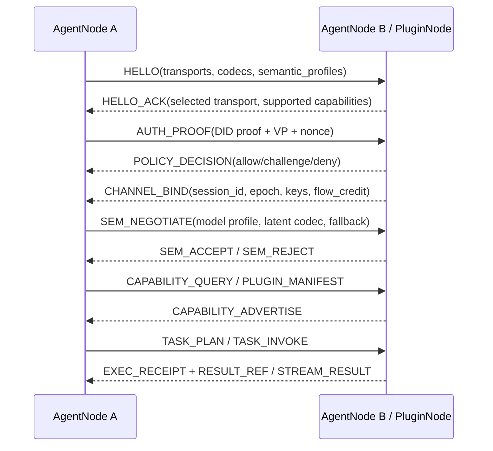

以下方案按“全新系统、无需兼容旧协议”的前提设计。建议协议命名为 **UASP-VCP NG：Universal Agent Semantic & Plugin Protocol - Next Generation**。核心定位是：

> **控制面显式、可验证、可治理；数据面 AI 原生、高吞吐、可流控；插件生态继承 VCP 的开放性、异步性和模型友好性。**

它不是把 VCP 原样升级，而是吸收 VCP 的三类优势：文本友好的意图表达、开放插件生态、异步并行和多模态文件链路。VCP 原文强调其以文本标记工具调用、插件化架构、AI 自主使用/创造工具、记忆共享和跨模型协同为核心优势；源码中也能看到 `TOOL_REQUEST` 标记解析、转义机制、`river`/`vref` 等上下文字段，以及插件管理器对 manifest、静态插件、预处理器、服务插件和定时任务的支持。([GitHub][1])

---

# 1. 总体设计原则

UASP-VCP NG 采用 **六层协议栈 + 双平面架构**。

`deep-research-report.md` 中已经明确指出，真正可落地的 AI 原生协议不应是 pure latent-only，而应是“显式可治理控制平面 + AI 原生高吞吐数据平面”；控制平面用于发现、协商、授权、审计和回退，数据平面用于潜空间块、媒体块、CRDT 增量和快速 ACK。 该判断是本方案的基础。

## 1.1 六层架构

```text
┌────────────────────────────────────────────────────────────┐
│ L6 应用与插件生态层                                         │
│ Agent Runtime / Plugin Runtime / Tool Graph / Memory Fabric │
├────────────────────────────────────────────────────────────┤
│ L5 语义与模型对齐层                                         │
│ Semantic Profile / Latent Codec / Equalizer / Clarifier     │
├────────────────────────────────────────────────────────────┤
│ L4 控制平面                                                 │
│ Discovery / Capability / Session / Policy / Audit / Receipt │
├────────────────────────────────────────────────────────────┤
│ L3 数据平面                                                 │
│ Latent Chunk / Media Stream / CRDT Delta / Object Transfer  │
├────────────────────────────────────────────────────────────┤
│ L2 身份、安全与可验证执行层                                 │
│ DID / VC / Intent Mandate / E2EE / TEE / zk Receipt         │
├────────────────────────────────────────────────────────────┤
│ L1 传输层                                                   │
│ QUIC / HTTP/3 / WebTransport / Datagram / Local SHM         │
└────────────────────────────────────────────────────────────┘
```

## 1.2 控制面与数据面职责

| 平面  | 核心职责                              | 编码                    | 可靠性         | 典型消息                                                                                    |
| --- | --------------------------------- | --------------------- | ----------- | --------------------------------------------------------------------------------------- |
| 控制面 | 发现、身份、协商、授权、插件声明、任务编排、审计、回退       | Protobuf 主格式，JSON 仅调试 | 必须可靠、有序、可审计 | `HELLO`、`AUTH_PROOF`、`CAPABILITY_ADVERTISE`、`TASK_PLAN`、`INTENT_MANDATE`、`EXEC_RECEIPT` |
| 数据面 | 潜空间传输、多模态流、文件分片、CRDT 状态、向量块、执行结果流 | 二进制帧 + TLV + Segment  | 按语义选择可靠/不可靠 | `LATENT_CHUNK`、`MEDIA_CHUNK`、`CRDT_DELTA`、`OBJECT_CHUNK`、`FLOW_CREDIT`                  |

传输层建议以 QUIC/HTTP/3 为主，因为 QUIC 提供多路复用流、流控、低延迟建联和路径迁移；HTTP/3 是 HTTP 语义在 QUIC 上的映射，也继承了 QUIC 的流复用、每流流控和低延迟建联能力。([RFC Editor][2]) 浏览器和受限客户端使用 WebTransport，因为 W3C WebTransport 工作草案定义了浏览器与服务器之间基于 WebIDL 的数据收发 API，并与 IETF WebTransport 协议工作协同演进。([W3C][3]) 实时低价值数据可走 QUIC DATAGRAM；RFC 9221 定义了 QUIC 的不可靠数据报扩展，适合音视频、实时状态和可丢弃语义提示。([IETF][4])

---

# 2. 协议架构设计

## 2.1 节点类型

| 节点                | 职责                                      |
| ----------------- | --------------------------------------- |
| `AgentNode`       | 运行 LLM/VLM/Agent Runtime，发起任务、接收任务、参与协作 |
| `PluginNode`      | 托管插件，可是本地进程、容器、WASM、远程服务、GPU 服务         |
| `MemoryNode`      | 提供长期记忆、向量索引、知识图谱、事件日志、CRDT 状态           |
| `CoordinatorNode` | 做任务分解、策略评估、会话协调，可多副本                    |
| `GatewayNode`     | 边界入口、浏览器接入、跨域代理、协议防火墙                   |
| `AuditNode`       | 存证、执行回执、策略判定记录、可验证审计                    |
| `SemanticRelay`   | 做 latent profile 转换、语义等化、多模型对齐          |

## 2.2 插件生态工程化

VCP 的插件生态优势应被提升为一等协议能力，而不是运行时私有实现。插件不是“函数”，而是 **具备身份、权限、资源边界、输入输出类型、执行模式和可验证回执的 Agent Capability**。

### Plugin Manifest v2

```yaml
apiVersion: uasp-vcp.io/v1
kind: PluginCapability
metadata:
  name: image.compose
  version: 1.4.2
  did: did:uasp:plugin:image-compose-001
  vendor: example.ai
spec:
  execution:
    mode: sandboxed-container        # wasm | process | container | remote | gpu-service
    concurrency: 32
    timeout_ms: 300000
    idempotent: false
    side_effect: true
  permissions:
    filesystem:
      read: ["object://session/*"]
      write: ["object://session/results/*"]
    network:
      egress: ["https://api.example.ai"]
    gpu:
      required: true
      memory_mb: 12000
  input_schema:
    type: protobuf
    message: uasp.plugin.ImageComposeRequest
  output_schema:
    type: protobuf
    message: uasp.plugin.ImageComposeResult
  modalities:
    input: ["text", "image", "latent-image"]
    output: ["image", "object-ref"]
  security:
    requires_intent_mandate: true
    requires_human_approval: conditional
    attestation: ["tee", "container-signature"]
  observability:
    emit_receipt: true
    emit_trace: true
```

## 2.3 VCP 优势的协议化映射

| VCP 优势      | 新协议中的工程化实现                                                     |
| ----------- | -------------------------------------------------------------- |
| 模型友好的文本工具调用 | `Intent DSL`，仅作为 Agent 思维层输入；进入网络前必须编译为 Protobuf Intent        |
| 开放插件生态      | `PluginCapability Manifest v2` + Capability Registry           |
| 异步并行任务      | `TASK_PLAN`、`TASK_FORK`、`TASK_JOIN`、`RESULT_REF`               |
| 多模态文件 API   | `ObjectStore` + `OBJECT_CHUNK` + 内容寻址 CID                      |
| 记忆/RAG/vref | `Memory Fabric` + `SEMANTIC_QUERY` + `MEMORY_REF`              |
| river 上下文注入 | `ContextPolicy`：`full`、`text`、`last:N`、`semantic:N`、`latent:N` |
| 插件预处理器      | `PreprocessorPipeline`，声明式、可审计、可回放                             |
| AI 自主创造工具   | `PLUGIN_PROPOSE`、`PLUGIN_BUILD`、`PLUGIN_ATTEST`、`PLUGIN_ADOPT` |

---

# 3. 数据格式规范

## 3.1 帧总体结构

UASP-VCP NG 使用三段式二进制帧：

```text
┌────────────────────┐
│ Fixed Header 40B   │  快速解析、路由、流控
├────────────────────┤
│ TLV Extensions     │  版本、安全、语义、QoS 扩展
├────────────────────┤
│ Segments           │  Protobuf、Latent、Media、CRDT、Object、Receipt
└────────────────────┘
```

Protobuf 适合作为控制面的主编码，因为它提供跨语言 IDL 和字段编号机制；官方文档也说明 proto3 定义字段、oneof、map 等结构，且二进制 proto 能保留未知字段，而 JSON 化会丢失未知字段，因此协议内部不应以 JSON 作为仲裁格式。([协议缓冲区][5])

## 3.2 固定帧头

固定头建议 40 字节，网络字节序：

| 偏移 | 字段            | 长度 | 说明                             |
| -: | ------------- | -: | ------------------------------ |
|  0 | `magic`       | 2B | 固定 `0x4150`，即 `AP`             |
|  2 | `wire_major`  | 1B | 主版本                            |
|  3 | `wire_minor`  | 1B | 次版本                            |
|  4 | `header_len`  | 1B | 固定头长度，当前 40                    |
|  5 | `plane`       | 1B | `0=control`，`1=data`，`2=audit` |
|  6 | `frame_type`  | 2B | 消息类型                           |
|  8 | `flags`       | 4B | 加密、压缩、ACK、critical、fragment 等  |
| 12 | `session_id`  | 8B | 语义会话 ID                        |
| 20 | `stream_id`   | 4B | 逻辑流 ID                         |
| 24 | `epoch`       | 4B | 会话密钥/权限 epoch                  |
| 28 | `seq_no`      | 8B | 单流序号                           |
| 36 | `payload_len` | 4B | TLV + Segments 总长度             |

## 3.3 标准 flags

```text
0x00000001 ENCRYPTED
0x00000002 COMPRESSED
0x00000004 ACK_REQUIRED
0x00000008 CRITICAL_EXT_PRESENT
0x00000010 FRAGMENTED
0x00000020 HAS_RECEIPT
0x00000040 HAS_INTENT
0x00000080 LATENT_PAYLOAD
0x00000100 ZERO_COPY_ELIGIBLE
0x00000200 DATAGRAM_SAFE
```

## 3.4 TLV 扩展区

格式：

```text
type: u16
len:  u16
value: bytes[len]
```

`type` 最高位为 `1` 表示 critical。未知 critical 扩展必须拒绝，未知 non-critical 扩展可跳过。

|     Type | 名称                    | 说明                              |
| -------: | --------------------- | ------------------------------- |
| `0x8001` | `semantic_profile_id` | 语义 profile                      |
| `0x8002` | `security_suite`      | 安全套件                            |
| `0x8003` | `codec_id`            | Protobuf、Latent、Media、CRDT 编码   |
| `0x8004` | `intent_ref`          | Intent Mandate 引用               |
| `0x8005` | `sender_did_hash`     | 发送方 DID 哈希                      |
| `0x8006` | `receiver_did_hash`   | 接收方 DID 哈希                      |
| `0x0007` | `trace_id`            | 分布式追踪 ID                        |
| `0x0008` | `span_id`             | 当前 span                         |
| `0x0009` | `ack_base`            | 选择性 ACK 起点                      |
| `0x000A` | `ack_bitmap`          | ACK bitmap                      |
| `0x000B` | `checkpoint_id`       | 恢复点                             |
| `0x000C` | `qos_class`           | `realtime`、`interactive`、`bulk` |
| `0x000D` | `object_cid`          | 内容寻址对象 ID                       |
| `0x000E` | `model_profile_hash`  | 模型语义 profile 摘要                 |
| `0x000F` | `attestation_ref`     | TEE/容器证明引用                      |

## 3.5 Segment 结构

```text
segment_type: u16
codec:        u16
len:          u32
bytes:        bytes[len]
```

|                 Segment | 用途                                            |
| ----------------------: | --------------------------------------------- |
|  `0x0001 PROTO_CONTROL` | 控制面 Protobuf                                  |
|     `0x0002 JSON_DEBUG` | 调试镜像，禁止作为仲裁真相                                 |
|     `0x0010 INTENT_DSL` | 模型友好 DSL 的原始记录                                |
|   `0x0020 LATENT_BLOCK` | hidden states、attention anchors、latent tokens |
|    `0x0021 LATENT_DESC` | latent 元数据                                    |
|    `0x0030 MEDIA_BLOCK` | 音频、视频、图像 chunk                                |
|     `0x0040 CRDT_PATCH` | CRDT delta                                    |
| `0x0041 STATE_SNAPSHOT` | 状态快照                                          |
|   `0x0050 OBJECT_CHUNK` | 文件/对象分片                                       |
|   `0x0060 EXEC_RECEIPT` | 执行回执                                          |
|    `0x0070 ATTESTATION` | TEE、容器、WASM 证明                                |
|   `0x0080 ERROR_DETAIL` | 错误详情                                          |

## 3.6 消息类型

### 控制面消息

|       类型 | 名称                     | 说明            |
| -------: | ---------------------- | ------------- |
| `0x0001` | `HELLO`                | 节点握手          |
| `0x0002` | `HELLO_ACK`            | 握手响应          |
| `0x0003` | `AUTH_PROOF`           | DID/VC 认证     |
| `0x0004` | `CHANNEL_BIND`         | 会话与密钥绑定       |
| `0x0005` | `CAPABILITY_ADVERTISE` | 能力声明          |
| `0x0006` | `PLUGIN_MANIFEST`      | 插件声明          |
| `0x0007` | `SEM_NEGOTIATE`        | 语义 profile 协商 |
| `0x0008` | `SEM_ACCEPT`           | 语义协商成功        |
| `0x0009` | `SEM_REJECT`           | 协商失败          |
| `0x000A` | `CLARIFY_REQUEST`      | 澄清请求          |
| `0x000B` | `CLARIFY_RESPONSE`     | 澄清响应          |
| `0x000C` | `TASK_PLAN`            | 任务 DAG        |
| `0x000D` | `TASK_INVOKE`          | 调用插件/Agent    |
| `0x000E` | `TASK_CANCEL`          | 取消            |
| `0x000F` | `TASK_STATUS`          | 状态            |
| `0x0010` | `INTENT_MANDATE`       | 授权凭证          |
| `0x0011` | `POLICY_DECISION`      | PDP 策略结果      |
| `0x0012` | `EXEC_RECEIPT`         | 执行回执          |
| `0x0013` | `RESUME`               | 会话恢复          |
| `0x0014` | `GOAWAY`               | 优雅关闭          |

### 数据面消息

|       类型 | 名称               | 说明        |
| -------: | ---------------- | --------- |
| `0x1001` | `LATENT_CHUNK`   | 潜空间块      |
| `0x1002` | `MEDIA_CHUNK`    | 媒体块       |
| `0x1003` | `OBJECT_CHUNK`   | 对象分片      |
| `0x1004` | `CRDT_DELTA`     | CRDT 增量   |
| `0x1005` | `GOSSIP_SUMMARY` | Gossip 摘要 |
| `0x1006` | `FLOW_CREDIT`    | 流控信用      |
| `0x1007` | `ACK`            | 确认        |
| `0x1008` | `NACK`           | 补发请求      |
| `0x1009` | `CHECKPOINT`     | 检查点       |
| `0x100A` | `HEARTBEAT`      | 心跳        |

## 3.7 Protobuf 核心 IDL

```proto
syntax = "proto3";

package uasp.vcp.ng.v1;

message Envelope {
  uint32 wire_major = 1;
  uint32 wire_minor = 2;
  uint64 session_id = 3;
  uint32 stream_id = 4;
  uint32 epoch = 5;
  uint64 seq_no = 6;
  FramePlane plane = 7;
  FrameType frame_type = 8;
  map<string, bytes> tlv = 9;
  bytes payload = 10;
}

enum FramePlane {
  PLANE_UNSPECIFIED = 0;
  PLANE_CONTROL = 1;
  PLANE_DATA = 2;
  PLANE_AUDIT = 3;
}

enum FrameType {
  FRAME_UNSPECIFIED = 0;
  HELLO = 1;
  AUTH_PROOF = 3;
  SEM_NEGOTIATE = 7;
  TASK_INVOKE = 13;
  LATENT_CHUNK = 4097;
  MEDIA_CHUNK = 4098;
  CRDT_DELTA = 4100;
  FLOW_CREDIT = 4102;
}

message Hello {
  string node_did = 1;
  repeated string transports = 2;
  repeated string security_suites = 3;
  repeated string semantic_profiles = 4;
  repeated string codecs = 5;
  repeated CapabilitySummary capabilities = 6;
}

message CapabilitySummary {
  string name = 1;
  string version = 2;
  string did = 3;
  repeated string modalities_in = 4;
  repeated string modalities_out = 5;
  bool side_effect = 6;
  bool requires_mandate = 7;
}

message Intent {
  string intent_id = 1;
  string actor_did = 2;
  string target_capability = 3;
  map<string, Value> args = 4;
  ContextPolicy context_policy = 5;
  string idempotency_key = 6;
  bool side_effect_allowed = 7;
  uint64 budget_microunits = 8;
  uint64 ttl_ms = 9;
}

message ContextPolicy {
  enum Mode {
    MODE_UNSPECIFIED = 0;
    FULL = 1;
    TEXT = 2;
    LAST_N = 3;
    SEMANTIC_TOP_N = 4;
    LATENT_TOP_N = 5;
  }
  Mode mode = 1;
  uint32 n = 2;
  repeated string memory_scopes = 3;
  float min_relevance = 4;
}

message FlowCredit {
  uint64 max_bytes = 1;
  uint32 max_inflight_frames = 2;
  uint32 max_inflight_tasks = 3;
  uint32 gpu_decode_slots = 4;
  float max_semantic_loss = 5;
  repeated uint32 allowed_qos_classes = 6;
}

message ExecReceipt {
  string receipt_id = 1;
  string intent_id = 2;
  string executor_did = 3;
  bytes input_hash = 4;
  bytes output_hash = 5;
  bytes environment_hash = 6;
  string policy_decision_id = 7;
  uint64 started_at_unix_ms = 8;
  uint64 ended_at_unix_ms = 9;
  repeated string object_refs = 10;
  bytes signature = 11;
}

message LatentDescriptor {
  string model_family = 1;
  string model_hash = 2;
  string semantic_profile = 3;
  uint32 hidden_dim = 4;
  uint32 layer = 5;
  string dtype = 6;          // bf16, fp16, int8, pq8
  string quantizer = 7;      // none, per-channel, product-quantization
  float semantic_loss_bound = 8;
  bytes calibration_hash = 9;
}

message Value {
  oneof kind {
    string string_value = 1;
    int64 int_value = 2;
    double double_value = 3;
    bool bool_value = 4;
    bytes bytes_value = 5;
    string object_ref = 6;
    string latent_ref = 7;
  }
}
```

---

# 4. 通信机制

## 4.1 连接生命周期



## 4.2 会话语义

协议区分三种 ID：

| ID              | 含义                          |
| --------------- | --------------------------- |
| `connection_id` | QUIC/WebTransport 连接，由传输层管理 |
| `session_id`    | AI 任务/协作语义会话，可跨连接恢复         |
| `intent_id`     | 单次授权动作或工具调用                 |
| `task_id`       | 长任务实例                       |
| `trace_id`      | 跨节点可观测链路                    |
| `object_cid`    | 内容寻址对象                      |

会话必须支持：

1. **连接迁移**：底层 QUIC 连接变化不影响 `session_id`。
2. **断点恢复**：通过 `checkpoint_id + seq_no` 恢复。
3. **幂等执行**：所有副作用任务必须携带 `idempotency_key`。
4. **epoch 更新**：授权变化、密钥轮换、模型 profile 变化时递增 `epoch`。
5. **会话降级**：latent 失败时回退到 Protobuf 显式语义，不中断任务。

## 4.3 流模型

| Stream      | 可靠性          | 用途                          |
| ----------- | ------------ | --------------------------- |
| `control/0` | 可靠、有序        | 握手、协商、授权                    |
| `audit/1`   | 可靠、有序        | 执行回执、策略日志                   |
| `task/N`    | 可靠、有序        | 任务编排、插件调用                   |
| `object/N`  | 可靠、可分片       | 文件、模型输出、大结果                 |
| `crdt/N`    | 可靠或 datagram | CRDT 增量、状态修复                |
| `latent/N`  | 可靠或 datagram | hidden states、latent tokens |
| `media/N`   | 混合           | 关键帧可靠，delta 可丢              |
| `gossip/N`  | datagram 优先  | 节点摘要、能力摘要、心跳                |

## 4.4 流控制

协议采用两层流控：

### 传输级流控

由 QUIC/WebTransport 管理字节级、连接级、stream 级窗口。

### 语义级流控

通过 `FLOW_CREDIT` 表达 AI 运行时资源：

```json
{
  "max_bytes": 67108864,
  "max_inflight_frames": 256,
  "max_inflight_tasks": 16,
  "gpu_decode_slots": 4,
  "max_semantic_loss": 0.03,
  "allowed_qos_classes": ["realtime", "interactive"]
}
```

发送端必须根据 `FLOW_CREDIT` 调整：

* latent 压缩率；
* 媒体降采样；
* chunk 大小；
* 并发工具数量；
* 重传策略；
* 是否启用澄清回退。

## 4.5 状态同步：CRDT + Gossip

`deep-research-report.md` 中建议把局部共享状态和全网发现摘要拆开：共享计划树、上下文图、协作草稿走 CRDT；邻居表、能力摘要、topic 向量缓存走 Gossip/anti-entropy。 这也是本方案的推荐做法。

### CRDT 对象

| 对象           | CRDT 类型               |
| ------------ | --------------------- |
| Agent 任务 DAG | OR-Map + LWW-Register |
| 共享上下文树       | RGA / Tree-CRDT       |
| 多 Agent 草稿   | Text CRDT             |
| 工具结果索引       | OR-Set                |
| 记忆引用图        | Add-Wins Graph CRDT   |
| 插件状态         | Map CRDT              |
| 策略缓存         | LWW-Register，带 TTL    |

### Gossip 摘要

```proto
message GossipSummary {
  string node_did = 1;
  uint64 incarnation = 2;
  repeated CapabilityDigest capabilities = 3;
  repeated TopicDigest topics = 4;
  repeated StateDigest states = 5;
  uint64 observed_at_unix_ms = 6;
  bytes signature = 7;
}
```

SWIM 类成员协议适合作为大规模弱一致成员发现基础；SWIM 的论文摘要中强调它将故障检测与成员更新传播解耦，并使用周期性随机探测与 gossip/epidemic-style 传播来降低传统全量心跳的扩展性问题。([Illinois Experts][6])

---

# 5. 安全认证体系

## 5.1 零信任原则

NIST SP 800-207 将零信任描述为从静态网络边界转向保护用户、资产和资源，并强调不因物理或网络位置自动授予隐式信任，认证与授权应在会话建立前执行。([NIST计算机安全资源中心][7]) 因此 UASP-VCP NG 不使用“内网可信”“共享 API Key 可信”作为安全基础。

## 5.2 身份模型：DID + VC + VP

DID Core 是 W3C Recommendation，定义了去中心化标识符的语法、数据模型、表示和解析过程；DID 文档可表达验证材料、验证方法和服务端点。([W3C][8]) VC Data Model 2.0 是 W3C Recommendation，用于表达 issuer 对 subject 的 claims，并定义 issuer、holder、verifier 的三方生态。([W3C][9])

### 身份对象

| 对象                 | 说明         |
| ------------------ | ---------- |
| `Agent DID`        | Agent 实例身份 |
| `Plugin DID`       | 插件身份       |
| `Runtime DID`      | 执行环境身份     |
| `Organization DID` | 组织身份       |
| `Model DID`        | 模型权重/服务身份  |
| `Memory DID`       | 记忆库/知识库身份  |

### VC 类型

| VC                             | 声明                 |
| ------------------------------ | ------------------ |
| `AgentRoleCredential`          | Agent 角色、组织、权限域    |
| `PluginCapabilityCredential`   | 插件能力、版本、审计级别       |
| `ModelCredential`              | 模型版本、权重 hash、安全等级  |
| `RuntimeAttestationCredential` | TEE/容器/WASM 执行环境证明 |
| `PolicyCredential`             | 可用策略集              |
| `HumanDelegationCredential`    | 人类用户授权给 Agent 的委托  |

## 5.3 Intent Mandate

`Intent Mandate` 是一次具体动作的最小权限授权。

```json
{
  "type": "IntentMandate",
  "mandate_id": "im_01H...",
  "issuer": "did:uasp:user:alice",
  "holder": "did:uasp:agent:planner-7",
  "audience": "did:uasp:plugin:image.compose",
  "allowed_action": "image.compose.invoke",
  "constraints": {
    "max_cost": "0.50 USD",
    "max_runtime_ms": 300000,
    "allowed_object_prefix": "object://session/abc/",
    "network_egress": ["https://api.example.ai"],
    "human_approval": "required_if_external_publish"
  },
  "valid_from": 1777550000000,
  "valid_until": 1777550300000,
  "nonce": "..."
}
```

每个高风险 `TASK_INVOKE` 必须引用 `intent_ref`。接收方必须验证：

1. DID proof；
2. VC chain；
3. Mandate 签名；
4. Mandate TTL；
5. audience 是否匹配；
6. 参数是否在约束范围内；
7. 策略引擎是否允许；
8. 是否需要人工审批。

## 5.4 端到端加密

安全分两层：

| 层                         | 作用                      |
| ------------------------- | ----------------------- |
| QUIC/TLS                  | 传输层机密性、完整性、对端认证         |
| Application E2EE Envelope | 跨网关、跨 relay、跨存储的端到端载荷保护 |

加密 envelope：

```proto
message SecureEnvelope {
  string sender_did = 1;
  string receiver_did = 2;
  string key_agreement = 3; // x25519, hybrid-mlkem-x25519
  bytes nonce = 4;
  bytes aad = 5;
  bytes ciphertext = 6;
  bytes signature = 7;
}
```

## 5.5 可验证执行

执行可信分三级：

| 等级 | 机制                                  | 适用场景            |
| -- | ----------------------------------- | --------------- |
| L1 | 签名回执                                | 普通工具调用          |
| L2 | TEE/容器/WASM attestation             | 处理敏感数据、企业工具     |
| L3 | zk receipt / verifiable computation | 高价值结算、合规、不可抵赖任务 |

建议不要在首版强制证明完整 LLM 推理。更现实的是证明：

* 哪个插件被调用；
* 输入输出 hash；
* 执行环境 hash；
* 策略判定；
* 是否有人工审批；
* 资源消耗；
* 外部副作用。

---

# 6. AI 原生特性

## 6.1 语义 Profile

每个 Agent 必须声明 `SemanticProfile`：

```yaml
semantic_profile:
  id: sp.llama-qwen.bridge.v1
  model_family: llama-compatible
  tokenizer_hash: sha256:...
  embedding_space: e5-large-v2
  hidden_dim: 4096
  supported_latent_codecs:
    - latent-bf16
    - latent-fp16
    - latent-pq8
  alignment:
    equalizer: se.llama-qwen.v1
    confidence_floor: 0.82
    clarify_on_below_floor: true
  fallback:
    - proto-symbolic
    - json-debug
```

## 6.2 潜空间通信

潜空间通信只作为 **协商后的高性能模式**，不是默认唯一模式。语义通信研究通常强调“传递意义而非精确传递符号”可以降低通信开销；2024 年的语义通信综述也指出该方向受到低延迟、高吞吐智能服务需求推动。([MDPI][10]) Interlat 这类 2025 年工作把 LLM last hidden states 作为 agent “mind” 表征直接传输，目标是减少把内部状态下采样为离散 token 的信息损失。([AIPOD][11])

### Latent Chunk 格式

```proto
message LatentChunk {
  string latent_id = 1;
  LatentDescriptor descriptor = 2;
  uint32 chunk_index = 3;
  uint32 total_chunks = 4;
  bytes tensor_payload = 5;
  bytes tensor_hash = 6;
  repeated AttentionAnchor anchors = 7;
}

message AttentionAnchor {
  uint32 token_pos = 1;
  string symbolic_hint = 2;
  float importance = 3;
}
```

### 启用条件

只有满足以下条件才允许走 `LATENT_CHUNK`：

1. 双方 `semantic_profile` 已协商；
2. equalizer 可用；
3. 置信度高于 `confidence_floor`；
4. 当前任务不是强审计动作；
5. 对方 flow credit 允许；
6. 已存在符号回退路径；
7. latent payload 已加密；
8. 采样验证通过。

## 6.3 神经语义对齐

异构模型不能直接假设 latent 可互解。2026 年关于 Federated Latent Space Alignment 的工作将 latent representation mismatch 视为多用户 AI-native semantic communication 的核心问题，并提出 semantic pre-equalizer、本地 semantic equalizer 和 federated optimization 来缓解语义不对齐。([ResearchGate][12])

### 对齐流程

```text
1. Profile Exchange
2. Calibration Prompt Set Exchange
3. Shared Probe Embedding
4. Equalizer Selection
5. Confidence Estimation
6. Latent Trial Frame
7. Semantic Check
8. Accept / Degrade / Clarify
```

### Equalizer 接口

```python
class SemanticEqualizer:
    def encode(self, hidden_state, source_profile, target_profile) -> bytes:
        ...

    def decode(self, payload, source_profile, target_profile):
        ...

    def estimate_confidence(self, source_sample, decoded_sample) -> float:
        ...

    def produce_symbolic_fallback(self, latent_payload) -> str:
        ...
```

## 6.4 澄清机制

`CLARIFY_REQUEST` 是协议正常分支，不是异常：

```proto
message ClarifyRequest {
  string reason = 1; // low_confidence, ambiguous_intent, unsafe_side_effect
  repeated string required_fields = 2;
  repeated string candidate_interpretations = 3;
  float confidence = 4;
}
```

触发条件：

* latent 解码置信度低；
* 工具参数不完整；
* 权限边界不清；
* 副作用风险高；
* 多 Agent 对任务状态出现冲突；
* 模型输出与策略不一致。

## 6.5 AI 插件生态的原生化

插件不只是外部工具，而是可被 Agent 发现、组合、验证、升级的能力单元。

### 插件生命周期

```text
PLUGIN_PROPOSE
  → PLUGIN_BUILD
  → PLUGIN_SCAN
  → PLUGIN_ATTEST
  → PLUGIN_REGISTER
  → PLUGIN_ADVERTISE
  → PLUGIN_INVOKE
  → PLUGIN_RECEIPT
  → PLUGIN_UPDATE / PLUGIN_REVOKE
```

### 插件组合图

```proto
message ToolGraph {
  string graph_id = 1;
  repeated ToolNode nodes = 2;
  repeated ToolEdge edges = 3;
}

message ToolNode {
  string node_id = 1;
  string capability = 2;
  Intent intent = 3;
}

message ToolEdge {
  string from_node = 1;
  string to_node = 2;
  string output_field = 3;
  string input_field = 4;
  string object_ref = 5;
}
```

这保留 VCP “跨工具、跨模态、数据驱动工作流”的优势，但消除旧式文本拼接和隐式文件传递的不确定性。

---

# 7. 性能优化策略

## 7.1 编码策略

| 数据类型   | 推荐编码                                       |
| ------ | ------------------------------------------ |
| 控制消息   | Protobuf binary                            |
| 调试消息   | JSON debug mirror                          |
| latent | bf16/fp16/int8/pq8                         |
| 图像     | AVIF/WebP/PNG，按任务选择                        |
| 视频     | AV1/H.265，关键帧可靠                            |
| 音频     | Opus/FLAC                                  |
| CRDT   | 自定义 delta binary                           |
| 大对象    | zstd chunk + CID                           |
| 本机 IPC | shared memory + FlatBuffers/Cap’n Proto 可选 |

## 7.2 多模态流媒体

### Track 设计

| Track              | QoS   | 传输              |
| ------------------ | ----- | --------------- |
| `video.keyframe`   | 可靠    | stream          |
| `video.delta`      | 可丢    | datagram        |
| `audio.realtime`   | 低延迟   | datagram        |
| `sensor.state`     | 最新值优先 | datagram        |
| `document.page`    | 可靠    | stream          |
| `attention.anchor` | 可靠    | stream          |
| `latent.delta`     | 混合    | stream/datagram |

## 7.3 延迟优化

| 场景         | 策略                                    |
| ---------- | ------------------------------------- |
| 首次建联       | QUIC 0-RTT，仅允许无副作用请求                  |
| 重连         | `RESUME(checkpoint_id, seq_no)`       |
| 插件冷启动      | WASM/容器池、按 capability 预热              |
| 大结果返回      | `RESULT_REF`，先回引用，后流式传输               |
| 多工具任务      | `TASK_PLAN` DAG 并行执行                  |
| RAG/Memory | 向量缓存 + 语义摘要 + CRDT 本地副本               |
| latent 通信  | 同构模型直接传 hidden states，异构模型经 equalizer |
| 观察性        | trace 采样，审计全量 hash 化                  |

## 7.4 带宽优化

1. 控制面 Protobuf，不使用 JSON 传输。
2. 大对象只传 CID/ref，不进模型上下文。
3. 媒体关键帧可靠，delta 可丢。
4. latent 使用 PQ8/int8/bf16 分档。
5. CRDT 先 delta，失败后 snapshot。
6. Gossip 只传摘要，缺口再补洞。
7. 工具结果默认摘要 + 对象引用。
8. 长上下文通过 `ContextPolicy` 按需注入。

---

# 8. 工程实现指南

## 8.1 推荐技术栈

| 层         | 首选                                   |
| --------- | ------------------------------------ |
| 核心协议库     | Rust                                 |
| 网关/控制面服务  | Go / Rust                            |
| Agent SDK | Python / TypeScript / Java / Go      |
| 浏览器 SDK   | TypeScript + WebTransport            |
| 插件沙箱      | WASM Component Model + OCI Container |
| 高性能本地 IPC | shared memory + Unix domain socket   |
| 对象存储      | S3-compatible / CAS                  |
| 状态存储      | RocksDB / SQLite / FoundationDB      |
| CRDT      | 自研核心结构或封装 Automerge/Yjs 思路           |
| 策略引擎      | OPA/Rego 或自研 PDP                     |
| 可观测性      | OpenTelemetry trace/log/metric       |

OpenTelemetry 规范覆盖 logs、traces、metrics 等遥测信号，适合协议栈做跨语言观测基线。([OpenTelemetry][13])

## 8.2 SDK 分层

```text
uasp-core
  frame codec
  protobuf schema
  crypto envelope
  session manager
  flow control

uasp-agent-sdk
  agent runtime API
  semantic profile
  context policy
  task graph
  memory fabric client

uasp-plugin-sdk
  manifest generator
  input/output schema
  sandbox adapter
  receipt signer
  object store client

uasp-node
  QUIC/WebTransport server
  gossip membership
  CRDT store
  policy enforcement point

uasp-conformance
  golden vectors
  fuzz tests
  interop tests
  security tests
```

## 8.3 跨语言 API

### Agent SDK

```python
session = await uasp.connect(
    peer="did:uasp:agent:researcher",
    semantic_profiles=["sp.qwen3.v1", "sp.symbolic.v1"],
)

result = await session.invoke(
    capability="web.research",
    args={"query": "AI-native protocol design"},
    context_policy=ContextPolicy.semantic_top_n(8),
    mandate=mandate,
)
```

### Plugin SDK

```python
@plugin.capability(
    name="image.compose",
    input=ImageComposeRequest,
    output=ImageComposeResult,
    side_effect=True,
    modalities_in=["text", "image"],
    modalities_out=["image", "object-ref"],
)
async def compose(req, ctx):
    ctx.require_permission("object.write")
    image_ref = await ctx.object_store.put(generate_image(req.prompt))
    return ImageComposeResult(object_ref=image_ref)
```

## 8.4 部署拓扑

### 单集群

```text
Agent Runtime Pods
Plugin Runtime Pods
Semantic Relay Pods
Memory Fabric Pods
Policy/Audit Pods
QUIC Gateway
Object Store
```

### 跨组织联邦

```text
Org A Trust Domain
  Agent / Plugin / Memory / Audit
        │ DID/VC + E2EE + Policy Federation
Org B Trust Domain
  Agent / Plugin / Memory / Audit
        │
Public Capability Registry / Optional Relay
```

## 8.5 测试验证

### Golden Vector

必须固定：

* 帧编码/解码；
* TLV unknown extension；
* Protobuf 版本演进；
* 加密 envelope；
* DID proof；
* VC 验证；
* Intent Mandate；
* CRDT merge；
* Gossip convergence；
* latent profile negotiation；
* clarify fallback；
* plugin receipt。

### Conformance Test

| 测试        | 通过标准                           |
| --------- | ------------------------------ |
| 版本偏斜      | minor 追加字段可跳过，critical 未识别必须拒绝 |
| 断链恢复      | checkpoint 后不重复副作用             |
| 权限越界      | fail-closed，审计完整               |
| 插件崩溃      | 任务状态可恢复，资源被回收                  |
| CRDT 冲突   | 多副本最终收敛                        |
| Gossip 分区 | 网络恢复后摘要补洞                      |
| latent 失配 | 自动回退显式控制面                      |
| 多模态背压     | flow credit 生效，不 OOM           |
| 重放攻击      | nonce/idempotency 检测拒绝         |
| 可验证执行     | receipt 可验签，hash 可复算           |

## 8.6 最小可实现版本

MVP 不应直接做跨模型 latent。建议先实现：

1. QUIC/WebTransport 传输；
2. 固定帧头 + TLV + Segment；
3. Protobuf 控制面；
4. DID/VC 基础认证；
5. Intent Mandate；
6. Plugin Manifest v2；
7. Object Store + `OBJECT_CHUNK`；
8. `TASK_PLAN` DAG；
9. `EXEC_RECEIPT`；
10. CRDT 任务状态；
11. Gossip capability summary；
12. symbolic semantic profile；
13. latent profile stub。

首个生产可用版本再加入：

* 同构模型 latent；
* 多模态 track；
* TEE attestation；
* 插件沙箱；
* 语义流控；
* 自动澄清；
* cross-agent memory fabric。

跨模型 latent equalizer、联邦语义对齐和 zkML receipt 应作为后续高级 profile，而不是首版强依赖。

---

# 9. 推荐落地路线

| 阶段         | 目标            | 交付件                                                        |
| ---------- | ------------- | ---------------------------------------------------------- |
| M1 规范冻结    | 协议基本稳定        | frame spec、proto schema、manifest spec、golden vectors       |
| M2 核心库     | 多语言可接入        | Rust core、Go gateway、Python/TS SDK                         |
| M3 安全基线    | 可进入企业试点       | DID/VC、Intent Mandate、E2EE、audit receipt                   |
| M4 插件生态    | 替代旧式工具调用      | Plugin SDK、sandbox、object store、task DAG                   |
| M5 分布式状态   | 多节点协作         | CRDT store、Gossip discovery、resume/checkpoint              |
| M6 多模态数据面  | 高吞吐场景         | media track、object chunk、flow credit                       |
| M7 AI 原生通道 | 降低 token/带宽开销 | same-family latent、semantic profile、clarify fallback       |
| M8 联邦语义对齐  | 未来能力          | equalizer registry、federated alignment、profile marketplace |

---

# 10. 最终架构判断

最合理的工程方案不是“让所有 Agent 都直接说 latent”，而是：

```text
Agent 思考层：允许自然语言 / VCP-style Intent DSL
协议控制层：必须 Protobuf + DID/VC + Intent Mandate
协议数据层：必须二进制帧 + 对象引用 + CRDT/媒体/latent 分流
执行生态层：必须插件 manifest + 沙箱 + 执行回执 + 可观测性
语义优化层：可选 latent profile + equalizer + 澄清回退
```

这个方案继承了 VCP 的关键洞察：**AI 更适合通过认知友好的意图表达来使用工具，插件生态必须开放、异步、可组合，多模态数据必须跨工具流动。** 同时它补上了 VCP 原始形态缺少的工程底座：**线级协议、强身份、零信任授权、二进制数据面、语义流控、状态同步、可验证执行和跨语言 conformance。**

[1]: https://raw.githubusercontent.com/lioensky/VCPToolBox/main/VCP.md "raw.githubusercontent.com"
[2]: https://www.rfc-editor.org/rfc/rfc9000.html?utm_source=chatgpt.com "RFC 9000: QUIC: A UDP-Based Multiplexed and Secure Transport"
[3]: https://www.w3.org/TR/webtransport/?utm_source=chatgpt.com "WebTransport"
[4]: https://www.ietf.org/rfc/rfc9221.html?utm_source=chatgpt.com "RFC 9221: An Unreliable Datagram Extension to QUIC"
[5]: https://protobuf.dev/reference/protobuf/proto3-spec/?utm_source=chatgpt.com "Protocol Buffers Language Specification (Proto3) | Protocol Buffers Documentation"
[6]: https://experts.illinois.edu/en/publications/swim-scalable-weakly-consistent-infection-style-process-group-mem/?utm_source=chatgpt.com "SWIM: Scalable Weakly-consistent Infection-style process group Membership protocol - Illinois Experts"
[7]: https://csrc.nist.gov/pubs/sp/800/207/final?utm_source=chatgpt.com "SP 800-207, Zero Trust Architecture | CSRC"
[8]: https://www.w3.org/TR/did-core/ "Decentralized Identifiers (DIDs) v1.0"
[9]: https://www.w3.org/TR/vc-data-model-2.0/ "Verifiable Credentials Data Model v2.0"
[10]: https://www.mdpi.com/1099-4300/26/2/102?utm_source=chatgpt.com "Semantic Communication: A Survey of Its Theoretical Development"
[11]: https://aipod.dev/papers/2511.09149v1?utm_source=chatgpt.com "Enabling Agents to Communicate Entirely in Latent Space | AIPOD - AI Tools Directory"
[12]: https://www.researchgate.net/publication/400971023_Federated_Latent_Space_Alignment_for_Multi-user_Semantic_Communications?utm_source=chatgpt.com "(PDF) Federated Latent Space Alignment for Multi-user Semantic Communications"
[13]: https://opentelemetry.io/docs/specs/otel/logs/?utm_source=chatgpt.com "OpenTelemetry Logging | OpenTelemetry"
