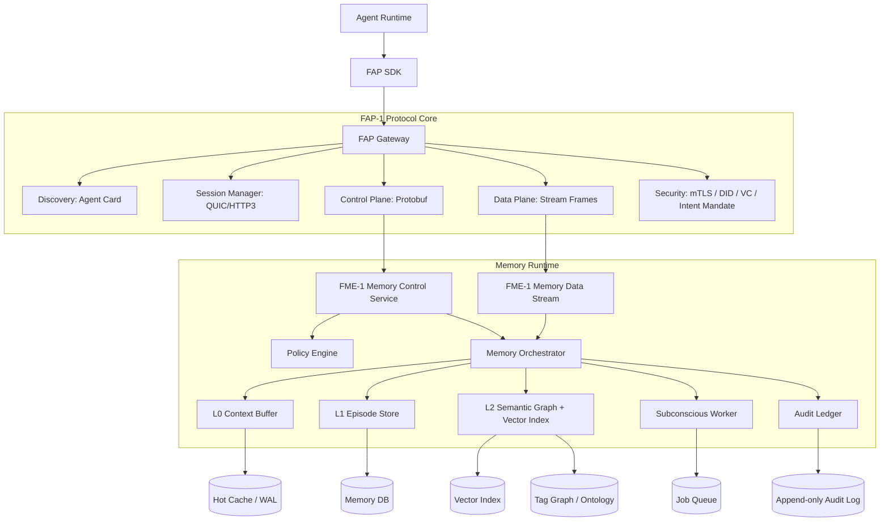
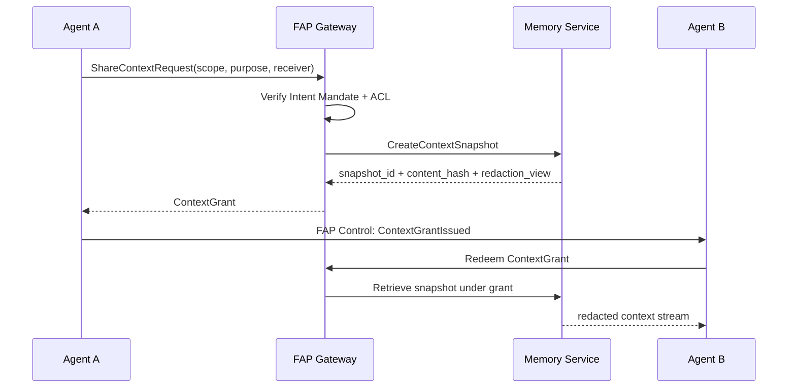
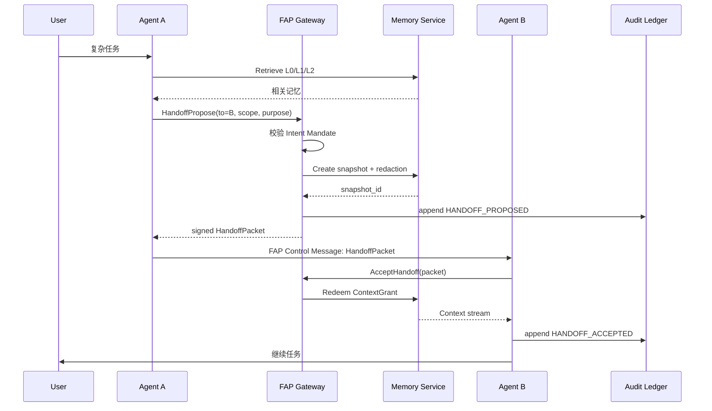
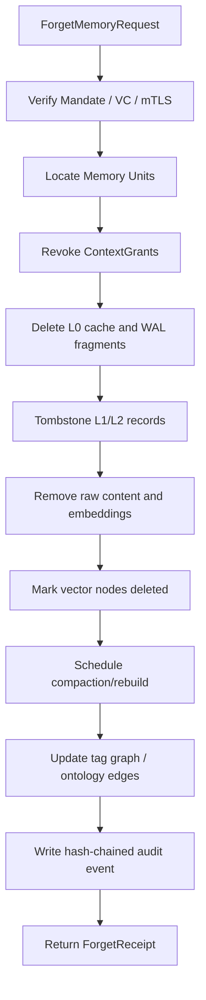
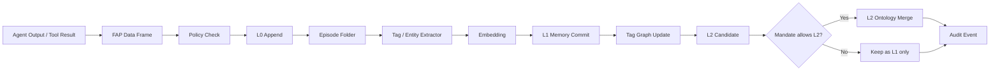
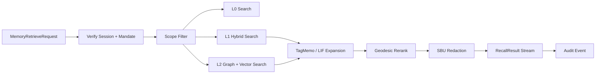

说明：我当前可访问的文件库里没有检索到你点名的 `03.记忆系统设计方案.md`、`future-agent协议设计.md`、`3.协议最终方案.md` 原文，因此下面方案基于你在问题中列出的设计要求、此前上下文中提到的 OCMS L0/L1/L2 记忆结构，以及可核查的 Seahorse/VCPToolBox 公开实现资料来合成。VCPToolBox 的公开 README 明确包含“记忆与认知系统”、TagMemo、公共/个体记忆库、多 Agent 协作等设计；其 TagMemo V8 方案强调多 Agent 打标、有向序列、测地线重排、L0-L2 降级保护等机制，可作为本方案的工程参考。([GitHub][1])

# 最终建议：实现 FAP-Memory Extension，作为 FAP-1 的记忆扩展层

不要把记忆系统做成一个普通 RAG 服务，也不要把协议做成单纯 RPC。最终落地应拆成：

```text
FAP-1 Protocol Core
├── Discovery Layer：Agent Card / Capability Discovery
├── Session Layer：QUIC / HTTP3 + mTLS / DID Auth
├── Control Plane：会话、授权、记忆操作、handoff、审计
└── Data Plane：上下文流、记忆块流、向量检索结果流、多模态附件流

FAP-Memory Extension, FME-1
├── L0 Immediate Context：会话内即时感知与短期上下文
├── L1 Episodic Memory：任务/对话/工作流级剧集记忆
├── L2 Semantic Ontology：长期事实、偏好、概念、Tag 拓扑
└── Subconscious Jobs：梦境整理、压缩、忘记、重索引、审计固化
```

协议负责**身份、授权、会话、消息、证据链**；记忆系统负责**写入、检索、压缩、版本、遗忘、索引**。二者通过 FME-1 的 Protobuf 消息和 HTTP/3 流式数据面连接。

---

# 1. L0/L1/L2 如何接入 FAP-1 控制面和数据面

## 1.1 分层映射

| 记忆层      | 职责                                   | FAP 控制面                                                      | FAP 数据面            | 存储建议                     |
| -------- | ------------------------------------ | ------------------------------------------------------------ | ------------------ | ------------------------ |
| L0 即时感知层 | 当前会话上下文、工具调用结果、临时推理状态、handoff 前的工作现场 | `OpenSession`、`AppendContext`、`CloseTurn`、`CreateSnapshot`   | 实时上下文流、工具事件流、临时文件流 | Redis/内存环形缓冲 + WAL       |
| L1 剧集折叠层 | 将多轮对话、任务步骤、代码修改、工具结果折叠成 Episode      | `StoreMemory`、`FoldEpisode`、`CommitEpisode`、`ShareContext`   | 记忆块流、摘要流、附件引用流     | SQLite/PostgreSQL + 向量索引 |
| L2 语义本体层 | 长期事实、用户偏好、项目知识、实体关系、Tag 共现图          | `UpsertFact`、`MergeOntology`、`RetrieveMemory`、`ForgetMemory` | 向量召回流、图扩散结果流、语义补全流 | 图-树-向量混合存储               |
| 潜意识处理层   | 梦境整理、记忆压缩、去重、重索引、遗忘执行、审计归档           | `ScheduleJob`、`ApproveDreamOp`、`AuditSeal`、`ForgetSweep`     | 后台任务事件流、审计事件流      | 任务队列 + 审计日志 + 冷存储        |

VCPToolBox 中的 TagMemo 设计可作为 L1/L2 检索核心参考：其知识库管理器负责标签召回与向量合成，并引入 LIF-Router 认知扩散、语义去重、霰弹枪查询等能力；VCP 也将 MemoChunk、Tag、KnowledgeChunk 抽象为统一数据库模型，并使用 SQLite、WAL、USearch/mmap 等本地高性能方案。([GitHub][1])

## 1.2 控制面与数据面的边界

**控制面只传“意图、权限、索引、引用、确认”。**

例如：

```text
MemoryRetrieveRequest
MemoryStoreRequest
MemoryShareRequest
ForgetMandate
HandoffPropose
AuditSeal
```

**数据面只传“大内容、流式结果、多模态附件、向量候选”。**

例如：

```text
ContextFrame stream
MemoryChunk stream
RecallResult stream
Attachment stream
AuditEvent stream
```

这样可以避免控制消息变成大 JSON，也能让协议支持未来的低延迟、多 Agent 并行协作。FAP-1 会话层建议使用 QUIC/HTTP3：QUIC 本身提供多路复用、低延迟连接建立、连接迁移等能力；HTTP/3 则是 HTTP 语义在 QUIC 之上的标准映射。([RFC 编辑器][2])

---

# 2. 协议架构设计

## 2.1 最终协议栈



## 2.2 Discovery：Agent Card 扩展

FAP-1 的 Agent Card 不只描述模型能力，还要描述记忆能力：

```json
{
  "agent_id": "did:web:agent-a.example",
  "protocol": {
    "name": "FAP-1",
    "versions": ["1.0"],
    "transport": ["h3", "grpc-over-h3"],
    "encoding": ["protobuf", "json"]
  },
  "memory": {
    "extension": "FME-1",
    "layers": ["L0", "L1", "L2"],
    "ops": ["retrieve", "store", "share", "forget", "handoff"],
    "retrieval_modes": ["basic", "hybrid", "tagmemo", "geodesic_rerank"],
    "supports_handoff_packet": true,
    "supports_sbu_forget": true,
    "supports_audit_chain": true
  },
  "security": {
    "intra_org": ["mtls", "jwt"],
    "cross_org": ["did", "vc", "dpop"],
    "mandate_required": true
  }
}
```

---

# 3. 租户隔离、上下文共享、版本控制如何由协议实现

## 3.1 租户隔离模型

采用四级隔离：

```text
tenant_id
└── subject_id / user_did
    └── agent_id
        └── namespace
            ├── private_memory
            ├── project_memory
            ├── team_shared_memory
            └── org_public_memory
```

每条记忆必须带以下标签：

```text
tenant_id
owner_subject_did
owner_agent_did
namespace
visibility: private | shared | public | foreign
security_labels: pii | sbu | secret | public
retention_policy
acl_policy_id
```

协议会话的 JWT/VC/Intent Mandate 必须同时包含：

```json
{
  "tenant_id": "tenant-a",
  "subject_did": "did:web:user.example",
  "agent_did": "did:web:agent.example",
  "session_id": "sess_123",
  "allowed_memory_scopes": [
    "memory:L0:read",
    "memory:L1:write",
    "memory:L2:read:project-x"
  ],
  "purpose": "code_review",
  "expires_at": "2026-05-06T20:00:00Z"
}
```

组织内建议使用 mTLS + JWT。RFC 8705 标准化了 OAuth 2.0 中基于 mutual TLS 的客户端认证和证书绑定访问令牌，适合组织内高信任、高吞吐场景。([IETF][3])

跨组织建议使用 DID/VC + DPoP。DID Core 是 W3C Recommendation，DID 文档可表达验证方法和服务端点；VC 2.0 已作为 W3C Recommendation，用于表达可验证、隐私友好、机器可验证的数字凭证；DPoP 则可让客户端通过 JWT 证明自己持有私钥，从而约束令牌使用者。([W3C][4])

## 3.2 上下文共享机制

上下文共享不应直接共享数据库，而应共享**可撤销、可过期、可审计的 ContextGrant**：

```text
ContextGrant
├── grant_id
├── issuer_did
├── receiver_agent_did
├── scope_filter
├── allowed_ops: read | append | summarize | import
├── layer_limit: L0 / L1 / L2
├── redaction_policy
├── ttl
├── purpose
├── mandate_id
└── issuer_signature
```

共享流程：



## 3.3 版本控制机制

记忆系统采用事件溯源 + 物化视图：

```text
MemoryEvent
├── APPEND
├── UPDATE
├── MERGE
├── SHARE
├── FORGET_SOFT
├── FORGET_HARD
├── IMPORT_FOREIGN_CONTEXT
└── REINDEX
```

每条 MemoryUnit 记录：

```text
memory_id
revision
base_revision
version_vector
content_hash
embedding_version
index_version
lineage_parent_ids
deleted_at
forget_receipt_id
```

并发控制规则：

| 场景            | 处理方式                           |
| ------------- | ------------------------------ |
| L0 会话上下文      | 只追加，不覆盖                        |
| L1 Episode 更新 | `base_revision` 乐观锁            |
| L2 Fact 合并    | OR-Set / LWW + 人工或策略裁决         |
| 向量索引升级        | 双索引切换，不原地覆盖                    |
| 跨 Agent 导入    | 标记 `foreign_context`，默认不可写回源租户 |

---

# 4. 记忆系统 API 规范

## 4.1 Protobuf 核心定义

Protocol Buffers 是语言中立、平台中立、可扩展的结构化数据序列化机制，并支持多语言生成代码，适合作为 FAP-1 控制面的默认编码。([Protocol Buffers][5])

```proto
syntax = "proto3";

package fap.memory.v1;

import "google/protobuf/timestamp.proto";
import "google/protobuf/struct.proto";

enum MemoryLayer {
  MEMORY_LAYER_UNSPECIFIED = 0;
  MEMORY_LAYER_L0 = 1;
  MEMORY_LAYER_L1 = 2;
  MEMORY_LAYER_L2 = 3;
  MEMORY_LAYER_SUBCONSCIOUS = 4;
}

enum Visibility {
  VISIBILITY_UNSPECIFIED = 0;
  PRIVATE = 1;
  PROJECT_SHARED = 2;
  TEAM_SHARED = 3;
  ORG_PUBLIC = 4;
  FOREIGN_CONTEXT = 5;
}

enum ForgetMode {
  FORGET_MODE_UNSPECIFIED = 0;
  SOFT_FORGET = 1;
  HARD_FORGET = 2;
  DECAY_FORGET = 3;
  SBU_FORCED_FORGET = 4;
}

enum RetrievalMode {
  RETRIEVAL_MODE_UNSPECIFIED = 0;
  BASIC_VECTOR = 1;
  HYBRID_BM25_VECTOR = 2;
  TAGMEMO = 3;
  TAGMEMO_GEODESIC = 4;
  GRAPH_EXPANSION = 5;
}

message IdentityRef {
  string did = 1;
  string display_name = 2;
  string org_id = 3;
}

message IntentMandateRef {
  string mandate_id = 1;
  string purpose = 2;
  repeated string allowed_ops = 3;
  google.protobuf.Timestamp expires_at = 4;
  bytes proof_jws = 5;
}

message MemoryScope {
  string tenant_id = 1;
  string namespace = 2;
  MemoryLayer layer = 3;
  Visibility visibility = 4;
  string owner_subject_did = 5;
  string owner_agent_did = 6;
  repeated string tags = 7;
  repeated string security_labels = 8;
  google.protobuf.Timestamp from_time = 9;
  google.protobuf.Timestamp to_time = 10;
}

message FapEnvelope {
  string protocol_version = 1;
  string message_id = 2;
  string session_id = 3;
  string tenant_id = 4;
  IdentityRef sender = 5;
  IdentityRef receiver = 6;
  IntentMandateRef mandate = 7;
  google.protobuf.Timestamp created_at = 8;
  bytes signature = 9;

  oneof payload {
    MemoryRetrieveRequest retrieve = 20;
    MemoryStoreRequest store = 21;
    MemoryShareRequest share = 22;
    ForgetMemoryRequest forget = 23;
    HandoffPacket handoff = 24;
    AuditQuery audit_query = 25;
  }
}

message MemoryUnit {
  string memory_id = 1;
  string tenant_id = 2;
  string namespace = 3;
  MemoryLayer layer = 4;
  Visibility visibility = 5;

  string owner_subject_did = 6;
  string owner_agent_did = 7;

  string content_uri = 8;
  string content_text = 9;
  bytes content_hash = 10;

  repeated string tags = 11;
  repeated string entities = 12;
  repeated string security_labels = 13;

  string embedding_model = 14;
  string embedding_ref = 15;
  string index_version = 16;

  uint64 revision = 17;
  uint64 base_revision = 18;
  repeated string lineage_parent_ids = 19;

  google.protobuf.Struct metadata = 20;
  google.protobuf.Timestamp created_at = 21;
  google.protobuf.Timestamp updated_at = 22;
  google.protobuf.Timestamp expires_at = 23;
}

message MemoryRetrieveRequest {
  string request_id = 1;
  MemoryScope scope = 2;
  string query = 3;
  RetrievalMode mode = 4;
  uint32 top_k = 5;
  bool include_l0 = 6;
  bool include_l1 = 7;
  bool include_l2 = 8;
  bool require_citations = 9;
  google.protobuf.Struct params = 10;
}

message MemoryRetrieveResponse {
  string request_id = 1;
  repeated MemoryResultItem items = 2;
  string trace_id = 3;
  string audit_event_id = 4;
}

message MemoryResultItem {
  MemoryUnit memory = 1;
  float final_score = 2;
  float vector_score = 3;
  float graph_score = 4;
  float recency_score = 5;
  repeated string spike_path = 6;
  uint32 hop_distance = 7;
  string reason = 8;
}

message MemoryStoreRequest {
  string request_id = 1;
  MemoryScope scope = 2;
  repeated MemoryUnit units = 3;
  bool auto_tag = 4;
  bool auto_embed = 5;
  bool allow_l2_consolidation = 6;
  string idempotency_key = 7;
}

message MemoryCommitAck {
  string request_id = 1;
  repeated string memory_ids = 2;
  uint64 commit_revision = 3;
  string index_version = 4;
  string audit_event_id = 5;
}

message MemoryShareRequest {
  string request_id = 1;
  MemoryScope source_scope = 2;
  IdentityRef receiver = 3;
  repeated string allowed_ops = 4;
  google.protobuf.Timestamp expires_at = 5;
  string redaction_policy_id = 6;
}

message ContextGrant {
  string grant_id = 1;
  MemoryScope granted_scope = 2;
  IdentityRef issuer = 3;
  IdentityRef receiver = 4;
  repeated string allowed_ops = 5;
  string snapshot_id = 6;
  google.protobuf.Timestamp expires_at = 7;
  bytes issuer_signature = 8;
}

message ForgetMemoryRequest {
  string request_id = 1;
  MemoryScope scope = 2;
  ForgetMode mode = 3;
  repeated string memory_ids = 4;
  string reason = 5;
  bool purge_embeddings = 6;
  bool purge_derived_summaries = 7;
  bool revoke_context_grants = 8;
}

message ForgetReceipt {
  string receipt_id = 1;
  repeated string affected_memory_ids = 2;
  repeated string affected_index_versions = 3;
  string audit_event_id = 4;
  bytes receipt_signature = 5;
}

message HandoffPacket {
  string packet_id = 1;
  string task_id = 2;
  IdentityRef from_agent = 3;
  IdentityRef to_agent = 4;

  string goal = 5;
  string current_state_summary = 6;
  repeated string open_questions = 7;
  repeated string constraints = 8;
  repeated string tool_state_refs = 9;

  string context_snapshot_id = 10;
  repeated string l0_context_refs = 11;
  repeated string l1_episode_refs = 12;
  repeated string l2_concept_refs = 13;

  ContextGrant context_grant = 14;
  string audit_chain_head = 15;
  bytes packet_signature = 16;
}

message AuditQuery {
  string tenant_id = 1;
  string session_id = 2;
  string memory_id = 3;
  string mandate_id = 4;
  google.protobuf.Timestamp from_time = 5;
  google.protobuf.Timestamp to_time = 6;
}

message AuditEvent {
  string event_id = 1;
  string prev_event_hash = 2;
  string event_hash = 3;
  string tenant_id = 4;
  string session_id = 5;
  string actor_did = 6;
  string operation = 7;
  string target_ref = 8;
  string mandate_id = 9;
  google.protobuf.Timestamp created_at = 10;
  bytes signature = 11;
}

service MemoryControlService {
  rpc Retrieve(MemoryRetrieveRequest) returns (MemoryRetrieveResponse);
  rpc Store(MemoryStoreRequest) returns (MemoryCommitAck);
  rpc Share(MemoryShareRequest) returns (ContextGrant);
  rpc Forget(ForgetMemoryRequest) returns (ForgetReceipt);
  rpc AcceptHandoff(HandoffPacket) returns (MemoryCommitAck);
  rpc WatchAudit(AuditQuery) returns (stream AuditEvent);
}

service MemoryDataService {
  rpc StreamIngest(stream MemoryUnit) returns (MemoryCommitAck);
  rpc StreamRecall(MemoryRetrieveRequest) returns (stream MemoryResultItem);
}
```

## 4.2 HTTP/JSON 映射

| 功能         | 方法     | 路径                             |
| ---------- | ------ | ------------------------------ |
| 记忆检索       | `POST` | `/fap/v1/memory/retrieve`      |
| 记忆写入       | `POST` | `/fap/v1/memory/store`         |
| 上下文共享      | `POST` | `/fap/v1/memory/share`         |
| 强制遗忘       | `POST` | `/fap/v1/memory/forget`        |
| 创建 handoff | `POST` | `/fap/v1/handoff/create`       |
| 接收 handoff | `POST` | `/fap/v1/handoff/accept`       |
| 审计查询       | `GET`  | `/fap/v1/audit/events`         |
| 流式召回       | `POST` | `/fap/v1/memory/stream-recall` |

---

# 5. 多智能体协作中的 Handoff Packet

## 5.1 Handoff Packet 的核心目标

Handoff Packet 不是简单摘要，而是一个**可验证的任务移交包**：

```text
HandoffPacket
├── 任务目标
├── 当前进度
├── 已尝试方案
├── 未解决问题
├── 工具状态引用
├── L0 当前工作现场
├── L1 相关剧集记忆
├── L2 关键长期知识
├── ContextGrant
├── 权限边界
├── SBU/PII 脱敏视图
└── 签名 + 审计链头
```

VCPToolBox README 中的多 Agent 示例也明确区分了公共知识库、个体记忆库、插件中心、内部通信协议和 WebSocket 服务，这说明多 Agent 协作不能只靠聊天文本传递，而应有明确的共享记忆和协议通道。([GitHub][1])

## 5.2 标准 handoff 流程



## 5.3 导入规则

接收方 Agent B 不能默认把 handoff 内容写入自己的长期记忆。规则如下：

| Grant 权限           | 行为                      |
| ------------------ | ----------------------- |
| `read_l0`          | 只读当前上下文，任务结束即过期         |
| `import_l1_temp`   | 作为临时 Episode 使用，不进入长期记忆 |
| `append_shared_l1` | 可向共享项目记忆追加结果            |
| `merge_l2`         | 需要更高权限，可将结论合并进长期本体      |
| `sbu_visible`      | 默认禁止，除非 VC/mandate 明确授权 |

---

# 6. 安全模型：SBU 强制遗忘 + DID/VC + Intent Mandate

## 6.1 Intent Mandate 定义

Intent Mandate 是 FAP-1 的核心授权凭证，作用是把“谁、为了什么、在什么范围、多久、能做什么”绑定起来。

```json
{
  "mandate_id": "mandate_abc",
  "issuer": "did:web:user.example",
  "subject_agent": "did:web:agent-a.example",
  "purpose": "project_debugging",
  "allowed_ops": [
    "memory.retrieve:L1",
    "memory.retrieve:L2",
    "memory.store:L1",
    "handoff.create"
  ],
  "denied_ops": [
    "memory.forget.hard",
    "memory.export.raw_sbu"
  ],
  "scope": {
    "tenant_id": "tenant-a",
    "namespace": "project-x",
    "max_layer": "L2",
    "security_labels_excluded": ["sbu", "secret"]
  },
  "expires_at": "2026-05-06T22:00:00Z",
  "proof": "JWS..."
}
```

## 6.2 SBU 强制遗忘

这里建议把 SBU 定义为 **Sensitive Behavioral Unit，敏感行为单元**，包括用户隐私、敏感偏好、受保护身份信息、高风险行为记录、临时授权材料等。

SBU 处理规则：

| 阶段      | 强制规则                    |
| ------- | ----------------------- |
| 写入      | 默认不进入 L2，除非用户显式授权       |
| 检索      | 默认脱敏，返回 `redacted_view` |
| 共享      | 默认禁止跨 Agent 共享          |
| Handoff | 只传摘要，不传原文               |
| 梦境整理    | 禁止用于梦境扩散和自动联想           |
| 遗忘      | 用户或租户安全主体可发起强制忘记        |
| 审计      | 记录哈希和操作，不记录原始内容         |

## 6.3 Forget 流程



VCP 的 AgentDream 文档也体现了一个重要工程原则：后台梦境操作不应直接修改记忆，而是先生成 JSON 索引并经管理员审批后执行；这个原则应被推广到 FAP-1 的潜意识任务、安全遗忘和长期记忆重构中。

## 6.4 审计追踪

审计日志采用哈希链：

```text
event_hash = HASH(
  prev_event_hash ||
  tenant_id ||
  session_id ||
  actor_did ||
  operation ||
  target_ref ||
  mandate_id ||
  timestamp ||
  content_hash
)
```

审计事件只保存：

```text
谁操作
操作什么
基于哪个 mandate
作用于哪些 memory_id
内容哈希
索引版本
结果状态
签名
```

不保存敏感原文。

---

# 7. 存储与检索实现

## 7.1 推荐技术选型

| 模块       | 最终选择                                           | 原因                        |
| -------- | ---------------------------------------------- | ------------------------- |
| 协议传输     | QUIC/HTTP3                                     | 多路复用、低延迟、适合控制流和数据流并行      |
| 控制消息     | Protobuf                                       | 强类型、多语言、兼容演进              |
| 数据流      | gRPC stream over HTTP/3 / WebTransport 备选      | 适合召回结果、上下文、附件流            |
| 组织内认证    | mTLS + JWT                                     | 简单、高性能、适合内网               |
| 跨组织认证    | DID/VC + DPoP                                  | 去中心化身份和可验证授权              |
| 策略引擎     | OPA 或 Cedar                                    | ABAC、purpose-bound policy |
| 记忆核心     | Rust                                           | 内存安全、低延迟、适合向量和图计算         |
| 本地/单租户存储 | SQLite WAL + mmap                              | 零运维、ACID、适合边缘 Agent       |
| 服务端元数据   | PostgreSQL                                     | 多租户、审计、事务、索引              |
| 向量索引     | USearch/HNSW 起步，集群版可接 Qdrant                   | 先保证可落地，后续水平扩展             |
| 图关系      | PostgreSQL edge table 起步，复杂场景接 Neo4j/SurrealDB | 避免初期过重                    |
| 审计       | Append-only log + 对象存储归档                       | 可追溯、低成本                   |

Seahorse README 的落地方案本身也强调 Rust 核心、多语言 SDK、WASM、SQLite、HNSW、LIF 脉冲扩散、Tag 共现拓扑、梦境整合等方向，与该选型高度一致。

## 7.2 记忆表设计

```sql
CREATE TABLE memory_units (
  memory_id UUID PRIMARY KEY,
  tenant_id TEXT NOT NULL,
  namespace TEXT NOT NULL,
  layer SMALLINT NOT NULL,
  visibility SMALLINT NOT NULL,

  owner_subject_did TEXT NOT NULL,
  owner_agent_did TEXT NOT NULL,

  content_uri TEXT,
  content_text TEXT,
  content_hash BYTEA NOT NULL,

  embedding_model TEXT,
  embedding_ref TEXT,
  index_version TEXT,

  revision BIGINT NOT NULL,
  base_revision BIGINT,
  security_labels TEXT[],
  tags TEXT[],
  entities TEXT[],

  metadata JSONB,
  created_at TIMESTAMPTZ NOT NULL,
  updated_at TIMESTAMPTZ NOT NULL,
  expires_at TIMESTAMPTZ,
  deleted_at TIMESTAMPTZ
);

CREATE TABLE memory_events (
  event_id UUID PRIMARY KEY,
  tenant_id TEXT NOT NULL,
  memory_id UUID,
  session_id TEXT,
  actor_did TEXT NOT NULL,
  operation TEXT NOT NULL,
  mandate_id TEXT,
  prev_event_hash BYTEA,
  event_hash BYTEA NOT NULL,
  event_payload JSONB,
  created_at TIMESTAMPTZ NOT NULL,
  signature BYTEA NOT NULL
);

CREATE TABLE memory_edges (
  edge_id UUID PRIMARY KEY,
  tenant_id TEXT NOT NULL,
  source_memory_id UUID NOT NULL,
  target_memory_id UUID NOT NULL,
  edge_type TEXT NOT NULL,
  weight DOUBLE PRECISION NOT NULL,
  confidence DOUBLE PRECISION NOT NULL,
  created_at TIMESTAMPTZ NOT NULL,
  updated_at TIMESTAMPTZ NOT NULL
);

CREATE TABLE context_grants (
  grant_id UUID PRIMARY KEY,
  tenant_id TEXT NOT NULL,
  issuer_did TEXT NOT NULL,
  receiver_did TEXT NOT NULL,
  snapshot_id TEXT NOT NULL,
  allowed_ops TEXT[],
  redaction_policy_id TEXT,
  expires_at TIMESTAMPTZ NOT NULL,
  revoked_at TIMESTAMPTZ,
  signature BYTEA NOT NULL
);
```

---

# 8. 关键组件职责划分

| 组件                      | 职责                                       |
| ----------------------- | ---------------------------------------- |
| FAP Gateway             | 终止 QUIC/HTTP3、路由控制面/数据面、验证签名             |
| Session Manager         | 管理 session、turn、stream、snapshot          |
| Identity Resolver       | 解析 DID、校验 VC、校验 DPoP/mTLS 绑定             |
| Intent Mandate Verifier | 验证 purpose、scope、TTL、allowed ops         |
| Policy Engine           | 租户隔离、ABAC、SBU 规则、共享规则                    |
| Memory Orchestrator     | 统一调度 store/retrieve/share/forget/handoff |
| L0 Context Buffer       | 当前会话上下文、工具事件、临时状态                        |
| Episode Folder          | 将 L0 折叠为 L1 Episode                      |
| Semantic Extractor      | 实体、事实、偏好、Tag、关系抽取                        |
| TagMemo Engine          | Tag 共现图、LIF 扩散、测地线重排                     |
| Vector Indexer          | embedding、HNSW/USearch、索引版本管理            |
| Ontology Store          | L2 本体、实体关系、版本合并                          |
| Forget Engine           | SBU 删除、grant 撤销、索引清理、压缩重建                |
| Handoff Manager         | 创建/验收 Handoff Packet                     |
| Audit Ledger            | 哈希链、签名、审计查询、归档                           |
| Subconscious Worker     | 梦境整理、压缩、去重、重索引                           |

---

# 9. 数据流向图

## 9.1 记忆写入流



## 9.2 记忆检索流



## 9.3 Handoff 流


---

# 10. 分阶段实施计划

## Phase 0：协议与数据模型冻结，1-2 周

交付物：

```text
/fap-memory-proto
  memory.proto
  handoff.proto
  audit.proto
  mandate.proto

/memory-schema
  001_memory_units.sql
  002_memory_events.sql
  003_context_grants.sql
```

验收标准：

```text
1. Protobuf 可生成 Go/Rust/TypeScript SDK
2. OpenSession / Retrieve / Store / Forget / Handoff 五类消息定义完成
3. MemoryUnit、ContextGrant、AuditEvent schema 完成
4. 租户、namespace、layer、security_labels 全部进入强约束字段
```

## Phase 1：最小可用记忆服务，3-5 周

范围：

```text
L0 会话缓存
L1 Episode 写入
基础向量检索
基础审计
mTLS + JWT
```

实现：

```text
Rust Memory Core
SQLite WAL
USearch/HNSW
gRPC/HTTP3 Gateway
TypeScript SDK
```

验收标准：

```text
1. Agent 可写入当前对话记忆
2. 下一轮会话可按 namespace 检索 L1 记忆
3. 每次 retrieve/store 都生成审计事件
4. 不同 tenant 的记忆无法交叉查询
```

## Phase 2：L2 语义本体与 TagMemo，6-8 周

范围：

```text
Tag 抽取
Tag 共现图
LIF 脉冲扩散
混合检索
测地线重排
```

验收标准：

```text
1. 支持 Basic / Hybrid / TagMemo 三种检索模式
2. L2 Fact 可从 L1 Episode 中提取
3. 检索结果能解释 spike_path / tag_path
4. 支持 index_version 双索引切换
```

## Phase 3：Handoff 与上下文共享，9-10 周

范围：

```text
ContextSnapshot
ContextGrant
HandoffPacket
foreign_context import
redaction policy
```

验收标准：

```text
1. Agent A 可将任务移交给 Agent B
2. B 只能读取 grant 范围内的上下文
3. grant 过期后不可再次访问
4. handoff 全链路可审计
```

## Phase 4：安全增强，11-13 周

范围：

```text
DID Resolver
VC Verifier
DPoP
Intent Mandate
SBU Forced Forget
Audit Hash Chain
```

验收标准：

```text
1. 跨组织 Agent 可用 DID/VC 建立会话
2. 未授权 purpose 无法读取记忆
3. SBU 记忆默认不可共享、不可梦境整理
4. HardForget 后 raw content、embedding、grant、cache 全部清除
5. 返回可验证 ForgetReceipt
```

## Phase 5：潜意识处理与生产化，14-18 周

范围：

```text
梦境整理
记忆压缩
重复合并
冷热分层
索引重建
Prometheus 指标
OpenTelemetry trace
```

验收标准：

```text
1. 后台任务不阻塞 retrieve 主路径
2. 梦境/压缩操作默认 pending review
3. 可按 tenant 统计召回延迟、命中率、遗忘执行耗时
4. 支持单租户本地版和多租户服务端版部署
```

---

# 11. 最小落地版本边界

第一版不要做过重。建议 MVP 只做：

```text
必须做：
1. FAP Memory Protobuf
2. L0/L1 记忆写入和检索
3. tenant + namespace 隔离
4. mTLS/JWT
5. ContextGrant
6. HandoffPacket
7. append-only audit
8. SoftForget / HardForget

暂缓：
1. 完整 DID 方法生态
2. 多数据库分布式一致性
3. 全自动梦境重构
4. 复杂 CRDT
5. 复杂本体推理
6. 记忆市场
```

最终可执行结论：

```text
用 FAP-1 解决“Agent 之间如何安全通信与授权”；
用 FME-1 解决“记忆如何被检索、写入、共享、遗忘、移交”；
用 L0/L1/L2 解决“短期上下文、剧集经验、长期知识”的边界；
用 Intent Mandate 解决“为什么可以访问”；
用 DID/VC/mTLS 解决“谁在访问”；
用 ContextGrant 解决“能访问多少、多久、能否转交”；
用 Audit Ledger + ForgetReceipt 解决“事后可验证与可遗忘”。
```

[1]: https://github.com/lioensky/VCPToolBox "GitHub - lioensky/VCPToolBox: VCP 部署在 AI 模型 API 与前端应用之间，通过统一指令协议、多层级持久化记忆、分布式插件引擎及多 Agent 协作框架，将原本“无状态、无记忆、无工具调用能力”的大语言模型，彻底改造成拥有永久自我意识、物理世界操作权及群体协作智能的完整智能体系统。 · GitHub"
[2]: https://www.rfc-editor.org/rfc/rfc9000.html?utm_source=chatgpt.com "RFC 9000: QUIC: A UDP-Based Multiplexed and Secure Transport"
[3]: https://www.ietf.org/rfc/rfc8705.html?utm_source=chatgpt.com "RFC 8705: OAuth 2.0 Mutual-TLS Client Authentication and Certificate-Bound Access Tokens"
[4]: https://www.w3.org/TR/did-core/?utm_source=chatgpt.com "Decentralized Identifiers (DIDs) v1.0"
[5]: https://protobuf.dev/overview/?utm_source=chatgpt.com "Overview | Protocol Buffers Documentation"
