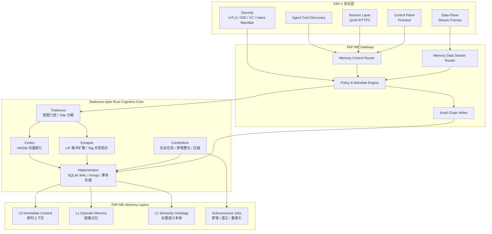
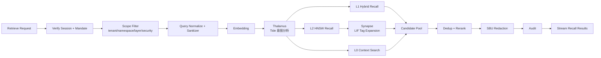
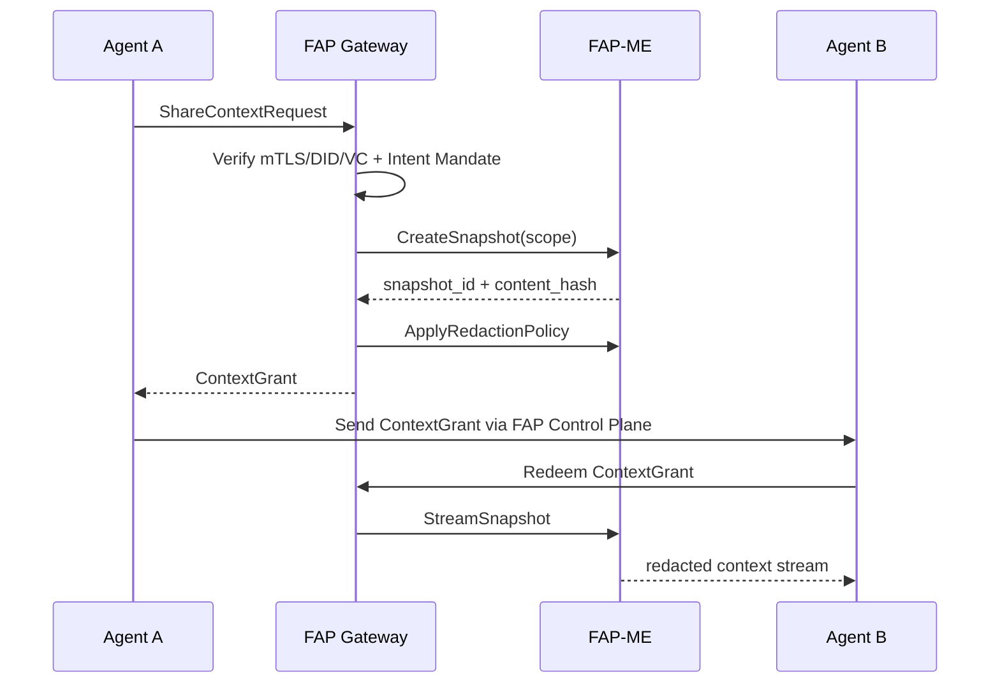
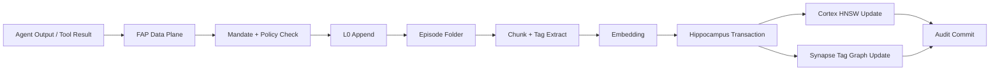
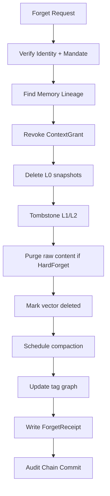
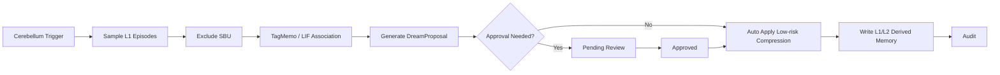

以下方案把你前面设计中的 **L0/L1/L2、上下文共享、Handoff Packet、SBU、Intent Mandate、审计链** 作为协议语义核心，再把 Seahorse 的 **Rust 认知内核、SQLite WAL、HNSW、LIF、Tag 共现拓扑、梦境整合、多语言 SDK/WASM** 作为工程实现底座。说明：本轮文件库未能直接检索到 `1-记忆系统设计初版.md` 与 `3.协议最终方案.md` 原文，因此我按你已明确列出的核心概念与前文 FAP-1 方案进行兼容设计。

# 最终架构命名：FAP-ME，FAP Memory Engine

定位：

```text
FAP-ME = 面向 FAP-1 协议的可插拔认知记忆引擎
```

它不是一个普通 RAG 服务，而是 FAP-1 的标准记忆扩展实现：

```text
FAP-1 负责：
身份、会话、授权、控制面、数据面、Agent 间通信

FAP-ME 负责：
记忆分层、写入、检索、共享、handoff、遗忘、审计、梦境整合
```

Seahorse 的 README 将其核心定位为“神经科学启发的动态记忆机制原生融入 RAG 架构”，强调 LIF 脉冲扩散、Tide 能量分解、语义引力场、Tag 共现拓扑、Rust 核心、多语言 SDK、WASM、SQLite WAL、HNSW 等路线，这些都适合作为 FAP-ME 的认知内核实现基础。

---

# 1. 总体系统架构



FAP-1 的传输层建议继续采用 QUIC/HTTP3，因为 HTTP/3 是 HTTP 语义到 QUIC 的映射，QUIC 提供流多路复用、流级流控、低延迟连接建立等能力，正好适合“控制面小消息 + 数据面大流式记忆”的分离模型。([RFC 编辑器][1])

---

# 2. 核心设计原则

## 2.1 协议层和记忆内核解耦

```text
FAP-1 Control Plane：
只传操作意图、权限、会话、索引引用、审计引用

FAP-1 Data Plane：
传上下文流、记忆块流、附件流、召回结果流

FAP-ME Core：
负责实际记忆计算、存储、索引、图扩散、版本和遗忘
```

## 2.2 最终采用四层记忆模型

在原始 L0/L1/L2 之外增加一个非对话主路径的后台层：

```text
L0：即时上下文层
L1：剧集记忆层
L2：长期语义本体层
L3/Subconscious：潜意识后台整理层
```

L3 不直接参与用户会话主路径，只做梦境整合、压缩、重索引、遗忘清扫、拓扑维护。

## 2.3 所有记忆访问必须绑定 Intent Mandate

任何 retrieve/store/share/forget/handoff 都必须经过：

```text
身份校验 → 会话校验 → Intent Mandate 校验 → 租户隔离 → SBU 策略 → 审计写入
```

组织内使用 mTLS + JWT；RFC 8705 定义了 OAuth 场景下 mutual TLS 客户端认证和证书绑定访问令牌，适合组织内强身份绑定场景。([RFC 编辑器][2])

跨组织使用 DID/VC/DPoP。DID Core 是 W3C Recommendation，DID 文档可包含加密材料、验证方法与服务端点；VC 2.0 已是 W3C Recommendation，用于表达可密码学验证、隐私友好、机器可验证的凭证；DPoP 则用于证明客户端持有私钥并约束 OAuth token 使用者。([W3C][3])

---

# 3. 记忆分层设计

## 3.1 L0：Immediate Context，即时上下文层

职责：

```text
保存当前 session / turn / tool call / streaming result / 临时推理状态。
```

特点：

| 项        | 设计                                                   |
| -------- | ---------------------------------------------------- |
| 生命周期     | 秒级到小时级                                               |
| 写入方式     | append-only                                          |
| 存储       | 内存 ring buffer + SQLite WAL                          |
| 是否进入长期记忆 | 默认不进入                                                |
| 典型内容     | 用户当前问题、工具返回、代码 diff、临时约束、handoff 现场                  |
| 协议操作     | `AppendContext`、`CreateSnapshot`、`ReadContextWindow` |
| 安全策略     | 默认私有，handoff 时必须创建 ContextGrant                      |

L0 的核心目标是：**保证 Agent 当前工作现场不会丢，但不污染长期记忆。**

## 3.2 L1：Episodic Memory，剧集记忆层

职责：

```text
把 L0 多轮上下文折叠成任务级、对话级、事件级 Episode。
```

特点：

| 项    | 设计                                                          |
| ---- | ----------------------------------------------------------- |
| 生命周期 | 天到月                                                         |
| 写入方式 | L0 fold 后提交                                                 |
| 存储   | SQLite/PostgreSQL + chunk table + HNSW vector               |
| 典型内容 | “完成了某次排障”“某个 PR 的修改过程”“某次多 Agent 协作记录”                      |
| 协议操作 | `StoreEpisode`、`FoldEpisode`、`UpdateEpisode`、`ShareEpisode` |
| 检索方式 | BM25 + Vector + Tag 过滤                                      |
| 安全策略 | namespace ACL + Intent Mandate                              |

L1 是多 Agent 协作的核心，因为 handoff 传递的通常不是完整 L0，而是：

```text
L0 当前现场 + L1 相关 Episode 摘要 + L2 关键事实引用
```

## 3.3 L2：Semantic Ontology，长期语义本体层

职责：

```text
保存长期事实、偏好、项目知识、实体关系、Tag 拓扑、抽象经验。
```

特点：

| 项    | 设计                                                           |
| ---- | ------------------------------------------------------------ |
| 生命周期 | 月到年                                                          |
| 写入方式 | L1 提炼、用户确认、策略自动合并                                            |
| 存储   | semantic facts + tag graph + vector index                    |
| 典型内容 | 用户偏好、项目架构、API 约束、团队规范、长期事实                                   |
| 协议操作 | `UpsertFact`、`MergeOntology`、`RetrieveMemory`、`ForgetMemory` |
| 检索方式 | HNSW + LIF + Tag 共现拓扑 + 重排                                   |
| 安全策略 | 强 ACL、SBU 禁止自动提升                                             |

L2 不能被低质量对话直接污染。必须经过：

```text
L1 Episode → Semantic Extractor → Confidence Scoring → Policy Check → L2 Merge
```

## 3.4 L3：Subconscious，潜意识后台层

职责：

```text
非实时记忆整理：梦境整合、压缩、去重、遗忘、重索引、拓扑修复。
```

特点：

| 项       | 设计                                                              |
| ------- | --------------------------------------------------------------- |
| 生命周期    | 后台任务                                                            |
| 是否参与主路径 | 不直接参与                                                           |
| 触发方式    | 定时、阈值、用户手动、管理员审批                                                |
| 典型任务    | DreamRun、CompressEpisode、RebuildIndex、PruneTagGraph、ForgetSweep |
| 安全策略    | SBU 默认不可进入梦境；高风险操作需审批                                           |

这部分借鉴 Seahorse 的 Cerebellum 后台任务思想，以及梦境整合、记忆压缩、拓扑维护的模式。

---

# 4. Seahorse 技术模式在 FAP-ME 中的落地

## 4.1 Seahorse 脑区模型与 FAP-ME 组件映射

| Seahorse 模块 | FAP-ME 组件           | 职责                       |
| ----------- | ------------------- | ------------------------ |
| Cortex      | VectorIndexService  | HNSW 向量检索、动态距离修正         |
| Synapse     | TagGraphService     | Tag 共现拓扑、LIF 脉冲扩散、多跳联想   |
| Thalamus    | IntentRouter        | 查询意图门控、Tide 能量分解、弱信号捕获   |
| Hippocampus | MemoryStore         | SQLite WAL、事务、版本、mmap 快照 |
| Cerebellum  | BackgroundScheduler | 梦境整合、压缩、重索引、健康分析         |

Seahorse 的架构约束强调单一职责：Cortex 不处理 Tag 拓扑，Synapse 不做向量检索，Thalamus 不存状态，Hippocampus 不做计算，Cerebellum 不阻塞主路径。这个边界非常适合插件化落地。

## 4.2 Rust Core + 多语言 SDK

最终建议：

```text
fap-me-core        Rust 核心
fap-me-server      Rust axum / tonic 服务
fap-me-python      PyO3 SDK
fap-me-node        napi-rs SDK
fap-me-wasm        wasm-bindgen SDK
fap-me-java        gRPC client
fap-me-go          gRPC client
```

接口统一通过 FAP-1 Protobuf 生成，核心计算通过 Rust 暴露。

---

# 5. 分层存储设计

## 5.1 单机/边缘模式

适合个人 Agent、本地 IDE Agent、小团队 Agent。

```text
.fap-me/
├── tenant.db                 # SQLite WAL 主库
├── tenant.db-wal
├── indexes/
│   ├── hnsw_v1.rkyv
│   ├── hnsw_v2.rkyv
│   └── tag_centroids.rkyv
├── snapshots/
│   └── session_snapshot_*.bin
├── audit/
│   └── audit_chain.log
└── objects/
    └── attachments/
```

推荐：

```text
元数据：SQLite WAL
向量索引：HNSW + mmap/rkyv
Tag 图：SQLite edge table + CSR mmap 快照
附件：本地 object store
审计：append-only hash chain
```

## 5.2 服务端/多租户模式

适合企业 Agent 平台。

```text
PostgreSQL：租户、会话、记忆元数据、版本、审计索引
Object Storage：大文本、附件、多模态对象
Vector Shards：HNSW / USearch / Qdrant adapter
Graph Store：Tag 边、实体关系、ontology edge
Redis：L0 热上下文
Kafka / NATS：后台任务、审计事件流
```

## 5.3 统一数据对象

```text
MemoryUnit
├── memory_id
├── tenant_id
├── namespace
├── layer: L0 | L1 | L2
├── visibility: private | project | team | org | foreign
├── owner_subject_did
├── owner_agent_did
├── content_ref
├── content_hash
├── tags[]
├── entities[]
├── security_labels[]
├── embedding_model
├── index_version
├── revision
├── lineage_parent_ids[]
├── retention_policy
├── created_at
├── updated_at
└── deleted_at
```

---

# 6. 检索机制设计

## 6.1 检索模式

| 模式         | 用途     | 计算成本 | 说明                            |
| ---------- | ------ | ---: | ----------------------------- |
| `basic`    | 快速回忆   |    低 | HNSW Top-K                    |
| `hybrid`   | 普通生产默认 |    中 | BM25 + HNSW + metadata filter |
| `tide`     | 复杂语义   |   中高 | Gram-Schmidt / 投影熵 / 弱信号      |
| `tagmemo`  | 联想式召回  |    高 | Tag 共现拓扑 + LIF 扩散             |
| `dream`    | 后台整理   |    高 | 更大 hop、更低阈值、更强去重              |
| `sbu_safe` | 敏感场景   |    中 | 检索后强脱敏和权限收缩                   |

## 6.2 标准检索流程



## 6.3 Seahorse-style 打分公式

```text
final_score =
  w_vector   * vector_score
+ w_keyword  * bm25_score
+ w_spike    * lif_spike_score
+ w_tag      * tag_topology_score
+ w_recency  * recency_score
+ w_trust    * source_confidence
- w_dup      * duplication_penalty
- w_sbu      * sensitivity_penalty
```

默认权重：

| 模式      | vector | keyword | spike |  tag | recency | trust |
| ------- | -----: | ------: | ----: | ---: | ------: | ----: |
| basic   |   0.85 |    0.00 |  0.00 | 0.05 |    0.05 |  0.05 |
| hybrid  |   0.55 |    0.20 |  0.00 | 0.10 |    0.10 |  0.05 |
| tagmemo |   0.40 |    0.10 |  0.20 | 0.15 |    0.10 |  0.05 |
| dream   |   0.25 |    0.05 |  0.30 | 0.20 |    0.05 |  0.15 |

---

# 7. 上下文共享机制

## 7.1 不直接共享数据库

共享必须通过 `ContextGrant`。

```text
ContextGrant
├── grant_id
├── issuer_did
├── receiver_agent_did
├── tenant_id
├── namespace
├── allowed_layers
├── allowed_ops
├── redaction_policy
├── expires_at
├── purpose
├── mandate_id
└── signature
```

## 7.2 共享流程



---

# 8. Handoff Packet 设计

## 8.1 Handoff Packet 结构

```text
HandoffPacket
├── packet_id
├── task_id
├── from_agent_did
├── to_agent_did
├── goal
├── current_state_summary
├── completed_steps[]
├── failed_attempts[]
├── open_questions[]
├── constraints[]
├── tool_state_refs[]
├── l0_snapshot_ref
├── l1_episode_refs[]
├── l2_fact_refs[]
├── context_grant
├── sbu_redaction_report
├── audit_chain_head
└── packet_signature
```

## 8.2 导入策略

接收方不能默认把 handoff 内容写入长期记忆。

| 权限                  | 行为                         |
| ------------------- | -------------------------- |
| `read_l0_snapshot`  | 只读现场，过期销毁                  |
| `import_l1_temp`    | 导入为 foreign episode，不进入 L2 |
| `append_project_l1` | 可追加项目共享剧集                  |
| `merge_l2`          | 需要高权限和高置信度                 |
| `view_sbu`          | 默认禁止，必须显式授权                |

## 8.3 Handoff 与记忆层关系

```text
Handoff = L0 现场 + L1 任务脉络 + L2 关键事实 + ContextGrant + 审计链
```

---

# 9. 安全模型

## 9.1 租户隔离

强制隔离维度：

```text
tenant_id
namespace
owner_subject_did
owner_agent_did
visibility
security_labels
mandate_scope
```

所有查询自动追加：

```sql
WHERE tenant_id = :tenant_id
  AND namespace IN (:allowed_namespaces)
  AND layer <= :max_layer
  AND visibility IN (:allowed_visibility)
  AND deleted_at IS NULL
```

## 9.2 SBU 模型

SBU 建议定义为：

```text
Sensitive Behavioral Unit
敏感行为单元：隐私、身份、凭据、敏感偏好、临时授权、高风险行为、不可传播上下文。
```

SBU 默认策略：

| 行为          | 默认策略                                |
| ----------- | ----------------------------------- |
| 写入 L0       | 允许，但标记                              |
| 提升到 L1      | 需要策略检查                              |
| 提升到 L2      | 默认禁止                                |
| 共享          | 默认禁止                                |
| handoff     | 默认摘要化                               |
| 梦境整合        | 禁止使用原文                              |
| hard forget | 必须级联删除 raw、embedding、snapshot、grant |

## 9.3 Intent Mandate

```json
{
  "mandate_id": "mandate_001",
  "issuer": "did:web:user.example",
  "subject_agent": "did:web:agent-a.example",
  "purpose": "debug_project_x",
  "allowed_ops": [
    "memory.retrieve:L1",
    "memory.retrieve:L2",
    "memory.store:L1",
    "handoff.create"
  ],
  "denied_ops": [
    "memory.export:sbu_raw",
    "memory.forget:hard"
  ],
  "scope": {
    "tenant_id": "tenant-a",
    "namespaces": ["project-x"],
    "max_layer": "L2",
    "exclude_security_labels": ["sbu", "secret"]
  },
  "expires_at": "2026-05-06T23:59:59Z",
  "proof": "JWS..."
}
```

## 9.4 审计链

每个事件写入：

```text
AuditEvent
├── event_id
├── prev_event_hash
├── event_hash
├── tenant_id
├── session_id
├── actor_did
├── operation
├── target_ref
├── mandate_id
├── content_hash
├── index_version
├── timestamp
└── signature
```

哈希：

```text
event_hash = HASH(
  prev_event_hash ||
  tenant_id ||
  session_id ||
  actor_did ||
  operation ||
  target_ref ||
  mandate_id ||
  content_hash ||
  timestamp
)
```

---

# 10. 版本控制机制

## 10.1 记忆版本

```text
MemoryVersion
├── memory_id
├── revision
├── base_revision
├── content_hash
├── embedding_model
├── embedding_version
├── index_version
├── tag_graph_version
├── ontology_version
└── lineage_parent_ids[]
```

## 10.2 写入规则

| 层级        | 版本策略                                          |
| --------- | --------------------------------------------- |
| L0        | append-only，不覆盖                               |
| L1        | optimistic locking，`base_revision` 冲突则生成 fork |
| L2        | merge policy，支持人工确认和置信度合并                     |
| Index     | 双索引切换，禁止原地覆盖                                  |
| Tag Graph | 增量更新 + 周期性全量 rebuild                          |
| Forget    | tombstone + compaction receipt                |

## 10.3 Embedding 模型升级

```text
index_v1 继续服务
index_v2 后台构建
双读对比
切流到 v2
v1 延迟下线
```

---

# 11. 插件化与可插拔接口

## 11.1 Rust trait 设计

```rust
pub trait MemoryStore {
    fn put(&self, unit: MemoryUnit) -> Result<CommitAck>;
    fn get(&self, id: MemoryId) -> Result<Option<MemoryUnit>>;
    fn scan(&self, filter: MemoryFilter) -> Result<Vec<MemoryUnit>>;
    fn tombstone(&self, id: MemoryId, mode: ForgetMode) -> Result<ForgetReceipt>;
}

pub trait VectorIndex {
    fn add(&self, id: MemoryId, vector: &[f32]) -> Result<()>;
    fn search(&self, query: &[f32], top_k: usize, filter: SearchFilter) -> Result<Vec<VectorHit>>;
    fn mark_deleted(&self, id: MemoryId) -> Result<()>;
    fn rebuild(&self, source: Box<dyn Iterator<Item = IndexedChunk>>) -> Result<IndexVersion>;
}

pub trait TagGraph {
    fn upsert_tags(&self, memory_id: MemoryId, tags: &[Tag]) -> Result<()>;
    fn expand(&self, seeds: &[Tag], params: LifParams) -> Result<SpikeTrace>;
    fn centroid(&self, tag: &Tag) -> Result<Option<Vec<f32>>>;
}

pub trait PolicyEngine {
    fn authorize(&self, ctx: AuthContext, op: MemoryOp, scope: MemoryScope) -> Result<Decision>;
    fn redact(&self, unit: MemoryUnit, ctx: AuthContext) -> Result<MemoryUnit>;
}

pub trait AuditSink {
    fn append(&self, event: AuditEvent) -> Result<AuditReceipt>;
}

pub trait DreamWorker {
    fn propose(&self, scope: MemoryScope, params: DreamParams) -> Result<DreamProposal>;
    fn apply_approved(&self, proposal_id: ProposalId) -> Result<CommitAck>;
}
```

## 11.2 插件类型

| 插件                  | 作用     | 默认实现                           |
| ------------------- | ------ | ------------------------------ |
| `EmbeddingProvider` | 生成向量   | OpenAI/local embedding adapter |
| `VectorIndex`       | 向量索引   | HNSW / USearch                 |
| `TagGraph`          | Tag 拓扑 | SQLite edge + CSR mmap         |
| `Reranker`          | 精排     | cross-encoder adapter          |
| `PolicyEngine`      | 授权与脱敏  | Cedar/OPA adapter              |
| `AuditSink`         | 审计输出   | SQLite append-only / Kafka     |
| `ObjectStore`       | 附件存储   | local fs / S3                  |
| `DreamWorker`       | 梦境整合   | rule + LLM proposal            |
| `ForgetEngine`      | 遗忘执行   | tombstone + purge + rebuild    |

---

# 12. FAP-1 Agent Card 扩展

```json
{
  "agent_id": "did:web:agent.example",
  "protocol": {
    "name": "FAP-1",
    "versions": ["1.0"],
    "transports": ["h3", "grpc-over-h3"],
    "control_encoding": ["protobuf"],
    "data_stream": ["fap-frame-stream"]
  },
  "memory": {
    "extension": "FAP-ME",
    "version": "1.0",
    "layers": ["L0", "L1", "L2", "Subconscious"],
    "ops": [
      "memory.retrieve",
      "memory.store",
      "memory.share",
      "memory.forget",
      "memory.handoff",
      "memory.audit",
      "memory.dream.propose"
    ],
    "retrieval_modes": [
      "basic",
      "hybrid",
      "tide",
      "tagmemo",
      "dream",
      "sbu_safe"
    ],
    "handoff_packet": {
      "supported": true,
      "requires_context_grant": true
    },
    "security": {
      "sbu_forget": true,
      "intent_mandate_required": true,
      "audit_chain": true
    }
  },
  "auth": {
    "intra_org": ["mtls", "jwt"],
    "cross_org": ["did", "vc", "dpop"]
  }
}
```

---

# 13. FAP 控制面 API

## 13.1 必须支持的控制消息

```text
MemoryRetrieveRequest
MemoryStoreRequest
MemoryShareRequest
MemoryForgetRequest
MemoryHandoffRequest
MemoryAuditQuery
DreamProposalRequest
IndexRebuildRequest
```

## 13.2 数据面流

```text
ContextFrameStream
MemoryChunkStream
RecallResultStream
AttachmentStream
AuditEventStream
DreamProposalStream
```

## 13.3 推荐 HTTP 映射

| 功能      | 方法   | 路径                             |
| ------- | ---- | ------------------------------ |
| 检索      | POST | `/fap/v1/memory/retrieve`      |
| 写入      | POST | `/fap/v1/memory/store`         |
| 共享      | POST | `/fap/v1/memory/share`         |
| 遗忘      | POST | `/fap/v1/memory/forget`        |
| handoff | POST | `/fap/v1/memory/handoff`       |
| 审计      | GET  | `/fap/v1/memory/audit`         |
| 梦境提案    | POST | `/fap/v1/memory/dream/propose` |
| 索引重建    | POST | `/fap/v1/memory/admin/rebuild` |

---

# 14. 关键数据流

## 14.1 写入流



## 14.2 遗忘流



## 14.3 梦境整合流



---

# 15. 分阶段实施计划

## Phase 1：协议兼容骨架，2 周

交付：

```text
1. FAP-ME Protobuf 定义
2. Agent Card memory 扩展
3. MemoryRetrieve / Store / Forget / Handoff 控制消息
4. Rust server skeleton
5. TypeScript SDK skeleton
```

验收：

```text
Agent 可通过 FAP-1 会话调用 memory.retrieve/store。
所有请求必须带 session_id、tenant_id、mandate_id。
```

## Phase 2：L0/L1 MVP，3-4 周

交付：

```text
1. L0 ring buffer + SQLite WAL
2. L1 Episode Store
3. 基础 chunking
4. embedding provider 插件
5. HNSW/USearch 基础索引
6. append-only audit
```

验收：

```text
可写入会话上下文。
可折叠成 Episode。
可检索 L1。
支持 tenant/namespace 隔离。
```

## Phase 3：Seahorse-style 检索增强，4-6 周

交付：

```text
1. Tag 提取与规范化
2. Tag 共现拓扑
3. LIF 脉冲扩散
4. Tide/Thalamus 查询分析
5. hybrid/tagmemo 检索模式
6. spike_path 可解释返回
```

验收：

```text
同一个 query 可返回 vector 命中和 spike 联想命中。
召回结果包含来源解释、hop、tag path。
高级检索超时可降级 basic。
```

## Phase 4：上下文共享与 Handoff，3 周

交付：

```text
1. ContextSnapshot
2. ContextGrant
3. HandoffPacket
4. foreign_context import
5. grant revoke
```

验收：

```text
Agent A 可安全移交任务给 Agent B。
B 只能访问 grant 允许的上下文。
grant 过期后不可读取。
```

## Phase 5：安全合规增强，4 周

交付：

```text
1. Intent Mandate verifier
2. mTLS/JWT adapter
3. DID/VC/DPoP adapter
4. SBU labeler
5. SBU redaction
6. HardForget + ForgetReceipt
7. audit hash chain
```

验收：

```text
未授权 purpose 无法读取记忆。
SBU 不进入共享和梦境。
HardForget 后 raw、embedding、snapshot、grant 被级联清理。
```

## Phase 6：梦境整合与后台维护，4-6 周

交付：

```text
1. Cerebellum scheduler
2. DreamProposal
3. Episode compression
4. tag graph pruning
5. index rebuild / repair queue
6. health metrics
```

验收：

```text
后台任务不阻塞主检索。
梦境操作默认生成 proposal，不直接改长期记忆。
高风险变更必须审批。
```

---

# 16. 最终落地目录建议

```text
fap-memory-engine/
├── proto/
│   ├── memory.proto
│   ├── handoff.proto
│   ├── mandate.proto
│   └── audit.proto
├── crates/
│   ├── fap-me-core/
│   ├── fap-me-server/
│   ├── fap-me-store-sqlite/
│   ├── fap-me-index-hnsw/
│   ├── fap-me-taggraph/
│   ├── fap-me-policy/
│   ├── fap-me-audit/
│   └── fap-me-wasm/
├── sdk/
│   ├── typescript/
│   ├── python/
│   ├── java/
│   └── go/
├── plugins/
│   ├── embedding/
│   ├── vector-index/
│   ├── reranker/
│   ├── object-store/
│   ├── policy/
│   └── dream-worker/
├── config/
│   ├── agent-card.example.json
│   ├── policy.example.cedar
│   └── fap-me.toml
└── docs/
    ├── architecture.md
    ├── protocol-compatibility.md
    ├── security-model.md
    └── deployment.md
```

---

# 17. 最终结论

最终版应采用：

```text
FAP-1 作为协议外壳：
Discovery、Session、Control Plane、Data Plane、mTLS/DID/VC、Intent Mandate

FAP-ME 作为记忆实现：
L0/L1/L2/Subconscious 分层、ContextGrant、Handoff Packet、SBU、审计链

Seahorse 作为认知内核参考：
Rust Core、SQLite WAL、HNSW、LIF、Tag 共现拓扑、Tide 分解、梦境整合、多语言 SDK、WASM
```

最小可落地版本不要一开始追求完整“类脑系统”，而应先实现：

```text
L0/L1 + HNSW + tenant isolation + Intent Mandate + audit + handoff
```

随后再逐步加入：

```text
L2 ontology → TagGraph → LIF → Dream → DID/VC 跨组织协作
```

这样既能完全兼容 `3.协议最终方案.md` 所定义的 FAP-1 协议框架，又能吸收 Seahorse 的高性能认知记忆内核优势，并保持组件插件化、可插拔、可演进。

[1]: https://www.rfc-editor.org/rfc/rfc9114.html?utm_source=chatgpt.com "RFC 9114: HTTP/3"
[2]: https://www.rfc-editor.org/rfc/rfc8705?utm_source=chatgpt.com "RFC 8705: OAuth 2.0 Mutual-TLS Client Authentication and Certificate-Bound Access Tokens"
[3]: https://www.w3.org/TR/did-core/?utm_source=chatgpt.com "Decentralized Identifiers (DIDs) v1.0"
