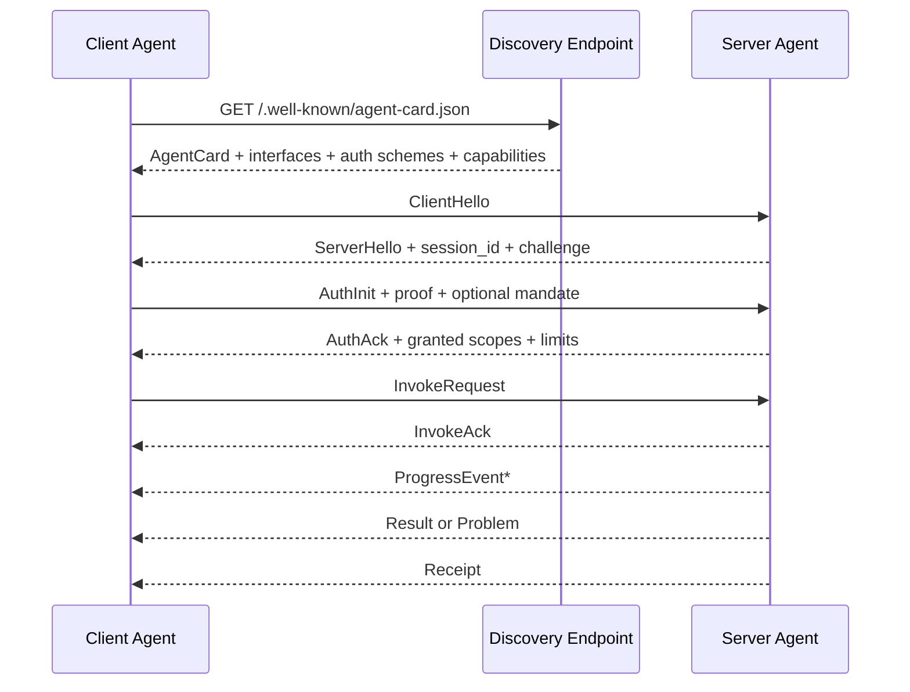

# onceMisery/future-partner 自定义 Agent 协议研究报告

## 执行摘要

通过 entity["company","GitHub","code hosting"] 连接器对 `onceMisery/future-partner` 的检索，我得到的结论很明确：这个仓库目前**更像“协议研究档案馆”而不是“协议实现仓库”**。README 直接说明“01 到 05 文档是研究方向，`future-agent协议设计.md` 是要实现的目标”；我在本次连接器检索范围内没有拿到可运行实现、测试目录、示例目录、发布说明，也没有拿到可供分析的 issues/PRs，因此本次评估的证据主体是**设计文档**而不是代码行为。fileciteturn4file0L1-L1

仓库内部并不是一份稳定收敛的单一协议，而是经历了明显的概念演进：`01.*` 侧重 ASLP 的 AI-native、潜空间、DID、CRDT/Gossip 思路；`02.*` 把它推进到 UASP，开始谈 HTTP/SSE/WebSocket 与 MCP/A2A 适配；`02-1.*` 又走向更激进的 NACP-2030，主张彻底抛弃传统 Web/HTTP 兼容；而 `future-agent协议设计.md` 与 `下一代vcp协议.md` 则重新回到更可工程化的方向，转向 Agent Card、双平面/三平面、QUIC/HTTP3、Protobuf、能力清单、流控与断点恢复。也就是说，仓库里既有**研究型未来想象**，也有**工程型收敛草案**，但二者尚未完成统一。fileciteturn16file0L1-L1 fileciteturn17file0L1-L1 fileciteturn18file0L1-L1 fileciteturn14file0L1-L1 fileciteturn15file0L1-L1

我的总体判断是：**方向先进，落地条件不足；概念丰富，规范尚未封版**。最主要的问题不是“想法不够多”，而是“规范面太大、边界不清、相互冲突、缺少可验证约束”。如果按当前仓库文档直接实现，极大概率会出现：不同文档实现出的节点彼此不兼容、认证与授权链路无法闭环、重试导致重复副作用、JSON 与二进制桥接造成字段丢失、潜空间通道无法调试或回滚。仓库里最值得保留的资产，是**能力发现、会话协商、流控恢复、命令/数据分离、可验证授权**；最应该降级或延后的是**把潜空间通信当成 V1 默认路径**。fileciteturn14file0L1-L1 fileciteturn15file0L1-L1 fileciteturn18file0L1-L1

因此，我给出的最终可落地版本不是继续扩张 ASLP/UASP/NACP 名词体系，而是收敛为一个新的、可执行的 V1：**FAP-1（Future Agent Protocol 1）**。它的核心取舍是：**发现层复用 A2A 风格 Agent Card；会话初始化借鉴 MCP 的“先协商版本与能力、后进入业务阶段”；运行时控制面与数据面默认采用 Protobuf over QUIC/HTTP3；组织内优先 mTLS/JWT，跨组织再启用 DID/VC；潜空间/语义通信仅作为实验能力，不允许成为高风险动作的唯一通道。** 这样既能接住仓库最新两份工程化文档，也能最大化继承公开标准的稳定经验。citeturn20view0turn20view1turn13search1turn13search2turn1search2turn9search0turn9search3turn18view0turn18view1turn18view2turn22view0turn22view1turn23view2

## 仓库证据与当前状态

### 证据覆盖情况

| 类目 | 本次研究结论 |
|---|---|
| README | 明确表明仓库以研究文档为主，`future-agent协议设计.md` 是目标态 |
| 设计文档 | 覆盖到 `01.*`、`02.*`、`02-1.*`、`future-agent协议设计.md`、`下一代vcp协议.md` |
| 代码实现 | 在本次连接器检索范围内，未拿到可运行协议实现入口 |
| 测试/示例 | 在本次连接器检索范围内，未拿到系统化测试与示例资产 |
| Issues / PRs | 未拿到可支撑协议演化分析的公开条目 |
| Release Notes | 未检索到可引用的发布说明 |

上表的关键依据，是 README 对仓库定位的明确描述，以及多份协议文档的并行存在。最重要的现实含义是：**这次工作必须是一份“规范收敛报告”，而不是“代码审计报告”**。fileciteturn4file0L1-L1

### 文档演进脉络

| 文档 | 主要立场 | 我对它的角色判断 |
|---|---|---|
| `01.面向未来的新一代的原生AI通信协议.md` | ASLP：强调潜空间、CRDT/Gossip、DID、AI-native | 研究出发点 |
| `02.ASLP的不足与UASP.md` | UASP：开始强调兼容 MCP/A2A、HTTP/SSE/WS 适配 | 从研究转向工程 |
| `02-1.未来通信协议设计.md` | NACP-2030：再次走向彻底抛弃传统 IT 兼容 | 研究性激进分支 |
| `future-agent协议设计.md` | UASP-NG：能力模型、Agent Card、Session、DataFrame、安全封套 | 最接近目标态 |
| `下一代vcp协议.md` | UASP-VCP NG：控制/数据/审计平面、插件清单、流控与恢复 | 最接近工程草案 |

这五份文档共同说明：仓库最终并没有收敛到“纯潜空间协议”，而是自然回到了**双轨路线**——一条是可以今天部署的 Web/QUIC/二进制工程路径，另一条是可实验的语义/潜空间未来路径。真正的落地点，应以这两条路线的“交集”而不是“最大想象值”作为 V1 的协议边界。fileciteturn16file0L1-L1 fileciteturn17file0L1-L1 fileciteturn18file0L1-L1 fileciteturn14file0L1-L1 fileciteturn15file0L1-L1

## 详细评估

### 评估矩阵

| 维度 | 仓库现状判断 | 评估 |
|---|---|---|
| 协议语法/语义 | 已形成“身份—会话—能力—数据—审计”的概念骨架，但不同文档术语与边界不完全一致 | **中等** |
| 消息格式 | 最新草案明显倾向 Protobuf + 二进制帧；早期文档又混入 JSON/潜空间/混合张量帧 | **中等偏弱** |
| 版本管理 | 有“下一代”“2030”“NG”等命名，但缺少单一、可协商、可执行的版本机制 | **弱** |
| 向后/向前兼容 | 早期文档主张抛弃兼容，后期文档主张桥接，内部自相冲突 | **弱** |
| 认证与授权 | DID/VC/Intent Mandate 方向正确，但缺少 day-1 可交付的企业内基线方案 | **中等偏弱** |
| 安全性 | 强调签名、加密、零信任，但重放防护、时钟偏差、密钥轮换、撤销与会话绑定不完整 | **弱** |
| 错误处理与重试 | 有 ACK/NACK、流控、恢复概念，但缺少规范化错误码与幂等矩阵 | **弱** |
| 可扩展性 | Manifest、能力模型、扩展点意识强 | **较强** |
| 互操作性 | 对 MCP/A2A/Agent Card 有明显吸收，但未明确映射边界 | **中等** |
| 性能与延迟 | QUIC/HTTP3 与二进制是正确方向；潜空间部分超前于工程现实 | **中等** |
| 测试策略 | 我未在仓库内拿到 conformance 测试、金样本、互操作矩阵 | **弱** |
| 部署与迁移 | 文档提到了桥接与演进，但尚未形成阶段化 rollout/rollback 手册 | **中等偏弱** |
| 示例流程 | 思路存在，规范级请求/响应样例不足 | **弱** |
| 边界条件与异常场景 | 问题意识存在，但没有完整异常规约 | **弱** |

这一矩阵背后的关键对照依据来自仓库文档本身，以及外部成熟协议的共同经验：MCP 把“初始化—版本协商—能力协商—运行—关闭”写成了严格生命周期；A2A 把 Agent Card、发现、幂等、扩展与版本写成了明确规则；HTTP/3/QUIC 把多路复用、按流控制、低时延建连和可选 DATAGRAM 放到了成熟传输层；Protobuf 则把“新增字段安全、保留删除字段编号、未知字段保留但经 JSON 会丢失”讲得非常清楚。仓库设计在大方向上与这些成熟经验同向，但**没有完成从“构想”到“规范”的最后一公里**。citeturn20view0turn20view1turn21view1turn21view2turn21view3turn1search2turn9search0turn9search3turn18view0turn18view1turn18view2turn7search0turn12view0 fileciteturn14file0L1-L1 fileciteturn15file0L1-L1

### 关键优点

仓库最有价值的部分，不是某一份文档中的具体字段，而是三条已经越来越清晰的工程判断。第一，**能力发现必须标准化**，不能再靠静态 `toolbox_map.json` 一类映射；第二，**控制面与数据面必须拆开**，否则所有消息都挤在一个 JSON 聊天流里，既不能做流控，也不能做恢复；第三，**授权必须从“身份证明”上升到“意图授权”**，也就是谁发起请求、谁批准能力、权限是否过期、预算是否耗尽，都要可验证。这里面，仓库后期文档与 A2A 的 Agent Card、MCP 的生命周期协商、W3C DID/VC 的可验证身份/授权模型是高度一致的。fileciteturn17file0L1-L1 fileciteturn14file0L1-L1 fileciteturn15file0L1-L1 citeturn20view0turn13search1turn13search2turn22view0turn22view1turn23view2

### 关键短板

仓库最大的短板也非常集中。其一，**规范对象没有唯一真源**：如果团队今天按 `future-agent协议设计.md` 做，明天又参考 `下一代vcp协议.md`，很容易在 header 长度、消息类型、平面划分、扩展字段、流控语义上发生细微但致命的互不兼容。其二，**编码策略没有“边界分工”**：Protobuf、JSON、MessagePack、潜空间负载都出现过，但没有明确哪一种是 discovery、哪一种是 session、哪一种只是调试镜像。其三，**安全模型没有分层落地**：DID/VC/Intent Mandate 很适合跨组织联邦，但若 day-1 就强制全量上车，会把大量企业内场景卡死；反过来，如果只做静态 token，又无法支撑仓库反复强调的高风险能力授权。其四，**缺乏 conformance**：没有金样本、互操作矩阵、错误注入、恢复测试，再漂亮的协议图都无法成为可部署协议。fileciteturn18file0L1-L1 fileciteturn14file0L1-L1 fileciteturn15file0L1-L1

## 问题清单

下表列出我认为最具体、最需要优先修复的问题；“复现步骤”中的大部分问题并不依赖现有代码，而是**按文档各自实现即可触发**，这恰恰说明当前问题属于“规范层风险”。fileciteturn14file0L1-L1 fileciteturn15file0L1-L1 citeturn18view0turn18view1turn18view2turn19view0turn19view2

| 问题 | 影响 | 复现步骤 | 优先级 |
|---|---|---|---|
| 架构漂移：多份文档平行前进，没有唯一规范入口 | 节点按不同文档实现后互不兼容 | 分别依据 `future-agent协议设计.md` 与 `下一代vcp协议.md` 实现同名 HELLO/SESSION 消息，检查 header/plane/type 差异 | 高 |
| 兼容性立场冲突：一部分文档要桥接 MCP/A2A，一部分文档要彻底抛弃传统兼容 | 团队无法确定 V1 边界，导致实现反复返工 | 按 `02-1.*` 做纯 AI-native 链路，再尝试接入现有 HTTP/JSON 网关，会立刻遇到发现与鉴权断层 | 高 |
| JSON 与 Protobuf 边界不清 | 新字段经 JSON 中转会被静默丢失，破坏前向兼容 | 给控制消息增加新字段，用老版本节点经 ProtoJSON 代理转发；依据 Protobuf 规则，未知字段会在 JSON 路径丢失 | 高 |
| 缺少幂等键与副作用语义 | 网络抖动重试时可能重复执行扣费、执行命令、写文件 | 客户端超时后重试同一高风险调用；如果协议只靠 `message_id` 且服务端不持久化幂等状态，就会重复落地 | 高 |
| 缺少重放防护闭环 | 攻击者可重放旧请求或旧签名 | 抓包后重放同一签名请求；若无 `nonce + created/expires + replay cache + session bind`，服务端难以阻断 | 高 |
| 授权模型过度理想化，缺少企业内低成本基线 | 内网场景落地阻力大，团队可能被迫绕过安全设计 | 在纯内网微服务调用场景强制 DID/VC 全流程，会显著增加实现与运维复杂度 | 中高 |
| 潜空间通道过早进入主设计 | 难调试、难审计、难回滚，且异构模型对齐风险高 | 在不同模型族间直接开启 latent channel，缺少对齐/回退，就会出现“可连接但不可解释”的失败 | 中高 |
| 缺少 conformance 测试、故障注入与恢复演练 | 协议上线后会在边界场景失效 | 人为制造断线、乱序、重复 ACK、部分分片丢失，看是否还能恢复会话与结果 | 高 |
| 扩展点没有治理规则 | 厂商/团队自定义字段很快把协议撕裂 | 两个团队同时定义同名扩展、不同语义，客户端无法知道该 fail-open 还是 fail-closed | 中高 |
| 审计与收据未定型 | 高风险动作难以追责与回溯 | 执行一次高风险调用后，检查是否能拿到可验证 receipt、结果摘要与授权链路 | 中 |

## 最终可落地协议规范草案

### 总体取舍

我建议把仓库中的“研究协议”与“工程协议”分层处理，形成一个可交付的 V1：

- **协议名**：FAP-1（Future Agent Protocol 1）
- **发现层**：HTTPS + JSON 的 Agent Card，路径复用 `/.well-known/agent-card.json`
- **会话层**：QUIC/HTTP3 为主；浏览器端可走 WebTransport；开发期可保留 HTTP JSON 网关
- **控制面**：Protobuf 消息
- **数据面**：Protobuf 元数据 + 分片二进制流
- **身份与授权**：组织内默认 mTLS/JWT；跨组织联邦可选 DID + Verifiable Presentation
- **实验能力**：latent/semantic channel 仅可选、默认关闭、必须可回退

这个取舍直接吸收了仓库后期文档里最成熟的部分，同时与 MCP、A2A、QUIC/HTTP3、Protobuf 的共识做法保持一致。MCP 证明了“先初始化协商再进入正常操作”的价值；A2A 证明了 Agent Card 和 well-known 发现路径的实用性；HTTP/3/QUIC 证明了流式、多路复用与低时延连接的工程可行性；Protobuf 则提供了比 JSON 更稳定的消息演进机制。fileciteturn14file0L1-L1 fileciteturn15file0L1-L1 citeturn20view0turn20view1turn13search1turn13search2turn1search2turn9search0turn9search3turn18view0turn18view1turn18view2

### 未指定项与推荐

| 仓库未明确或内部不一致项 | 备选方案 | 推荐方案 | 理由 |
|---|---|---|---|
| 发现文档路径 | 自定义 `/.well-known/fap.json`；A2A Agent Card；中心注册表 | **A2A Agent Card 为唯一公开入口** | 复用现有发现习惯，减少一份并行注册表 |
| 会话传输 | WebSocket；HTTP/2；HTTP/3/QUIC；纯 P2P | **HTTP/3/QUIC** | 流复用、流控、低时延建连更适合 agent 会话 |
| 控制消息序列化 | JSON；MessagePack；Protobuf | **Protobuf** | 类型明确、演进规则清晰、性能更好 |
| 公开调试/网关格式 | JSON；MessagePack | **JSON** | 便于 A2A/MCP/浏览器/运维 |
| 组织内身份 | 静态 API Key；JWT；mTLS | **mTLS 或 service identity + JWT** | 成本最低、现网兼容最好 |
| 跨组织身份 | OAuth2；DID/VC | **DID/VC 作为联邦模式** | 保留仓库长期愿景，但不绑死 day-1 |
| 高风险授权 | 仅凭主体身份；能力票据；Intent Mandate | **Intent Mandate** | 区分“谁是谁”与“谁被授权做什么” |
| 潜空间通道 | 默认启用；完全移除；实验能力 | **实验能力** | 现在保留研究价值，避免压垮 V1 |

上述推荐与公开标准是一致的：JSON 适合文本和发现；Protobuf 适合高频、结构化运行时消息，但不能把“原始序列化字节”当作稳定签名对象，因为官方明确说明 Protobuf 序列化**不是 canonical**，且未知字段在 JSON 路径会丢失；HTTP/3/QUIC 适合多流会话；A2A 的 Agent Card 适合发现；W3C DID/VC 适合联邦身份与可验证授权。citeturn7search0turn12view0turn18view0turn18view1turn18view2turn1search5turn1search2turn9search0turn13search1turn13search2turn22view0turn22view1turn23view2

### 技术选择对比

| 方案 | 优点 | 缺点 | 本项目建议 |
|---|---|---|---|
| JSON | 可读、浏览器原生、调试成本低、A2A/MCP 生态友好 | 体积大、类型约束弱、未知字段治理差 | **仅用于发现、网关、诊断** |
| Protobuf | 紧凑、性能好、字段号演进明确、未知字段可保留 | 需要 IDL 与代码生成；原始序列化不适合直接做 canonical 签名 | **会话控制面默认方案** |
| MessagePack | 比 JSON 小且快，动态对象友好 | 缺少像 Protobuf 那样成熟的 schema/兼容治理 | **不做 canonical 方案，可作为调试/边缘备选** |

这个比较的关键不是“纯性能谁更快”，而是**谁更适合做长期、多人协作的协议真源**。在本项目里，JSON 最适合 discovery；Protobuf 最适合 runtime；MessagePack 既没有 JSON 那样的跨生态可读性，也没有 Protobuf 那样的字段治理能力，因此不适合作为唯一正典。citeturn7search0turn12view0turn18view0turn18view1turn18view2

### 流程总览



这个流程刻意把**发现**、**会话协商**、**认证/授权**、**业务调用**、**收据审计**拆开。它吸收了 A2A 的 Agent Card 发现、MCP 的初始化与能力协商、DIDComm 的 `id/thid` 线程化思想，以及仓库后期文档中“控制/数据分离”和“可恢复会话”的工程方向。citeturn21view3turn20view0turn23view3turn23view4 fileciteturn14file0L1-L1 fileciteturn15file0L1-L1

### 公开发现文档

**公开发现文档采用 A2A 风格 Agent Card**，路径固定为 `/.well-known/agent-card.json`。FAP 不再单独造一套第二发现协议，而是在 `supportedInterfaces` 中声明 FAP 绑定。

建议最小字段如下：

| 字段 | 类型 | 必选 | 说明 |
|---|---|---|---|
| `name` | string | 是 | agent 名称 |
| `description` | string | 是 | 人类可读描述 |
| `version` | string | 是 | agent 版本 |
| `supportedInterfaces` | array | 是 | 例如 `quic+proto`、`https+json` |
| `securitySchemes` | array | 是 | `mtls`、`oauth2`、`did-vp` 等 |
| `capabilities` | object | 是 | 是否支持 `invoke`、`stream`、`resume`、`receipt`、`latent.experimental` |
| `skills` | array | 推荐 | 能力清单，映射仓库中的 capability/plugin/manifest |
| `signatures` | array | 推荐 | 对 Agent Card 的签名 |

A2A 规范已把 Agent Card 的字段、well-known 发现路径、签名与扩展版本考虑得比较成熟；直接复用，可以把仓库想要的“能力发现 + 可验证清单”落到当前生态上。citeturn13search2turn13search1turn21view0turn21view3

### 会话消息定义

FAP-1 采用**抽象消息模型 + Protobuf 绑定**。公共头如下：

| 字段 | 类型 | 必选 | 说明 |
|---|---|---|---|
| `proto_rev` | string | 是 | 文档快照版本，格式 `YYYY-MM-DD` |
| `wire_major` | uint16 | 是 | 破坏性版本号 |
| `wire_minor` | uint16 | 是 | 向前兼容版本号 |
| `message_id` | string | 是 | 全局唯一、小写 UUID 风格 |
| `thread_id` | string | 是 | 会话内线程标识；首条消息可等于 `message_id` |
| `parent_thread_id` | string | 否 | 子流程来源 |
| `session_id` | bytes | 是 | 会话标识 |
| `seq_no` | uint64 | 是 | 发送序号 |
| `ack_no` | uint64 | 否 | 最近确认序号 |
| `sender` | string | 是 | 主体标识（SPIFFE、URL、DID 均可） |
| `recipient` | string | 是 | 目标主体 |
| `sent_at_ms` | int64 | 是 | 发送时间 |
| `deadline_ms` | int64 | 否 | 失效时间 |
| `idempotency_key` | string | 对副作用操作必选 | 防重试重复执行 |
| `auth_context_id` | string | 否 | 关联认证上下文 |
| `content_type` | string | 是 | `application/protobuf` 等 |
| `payload` | bytes | 是 | 业务体 |
| `critical_ext` | repeated string | 否 | 不认识必须拒绝 |
| `meta` | map<string,string> | 否 | 诊断与非关键元数据 |

这个头模型有三个刻意设计。第一，`message_id / thread_id / parent_thread_id` 借鉴了 DIDComm 的 `id / thid / pthid`，把“消息唯一性”和“业务线程”明确分开。第二，`idempotency_key` 被提升为一等字段，而不是可有可无的元数据。第三，`critical_ext` 明确了扩展的 fail-open / fail-closed 边界。citeturn23view4turn21view1

一个可直接落地的 Protobuf 草案如下：

```proto
syntax = "proto3";
package fap.v1;

message Envelope {
  string proto_rev = 1;
  uint32 wire_major = 2;
  uint32 wire_minor = 3;

  string message_id = 4;
  string thread_id = 5;
  string parent_thread_id = 6;

  bytes session_id = 7;
  uint64 seq_no = 8;
  uint64 ack_no = 9;

  string sender = 10;
  string recipient = 11;

  int64 sent_at_ms = 12;
  int64 deadline_ms = 13;

  string idempotency_key = 14;
  string auth_context_id = 15;

  string content_type = 16;
  bytes payload = 17;

  repeated string critical_ext = 18;
  map<string, string> meta = 19;
}
```

Protobuf 作为运行时正典的前提，是严格遵守字段演进规则：**只能新增字段；删除字段必须 `reserved` 字段号与字段名；绝不能改字段号；不能把 JSON 当成会话正典通道。**citeturn18view0turn18view1turn18view2

### 核心消息类型

| 消息 | 方向 | 关键字段 | 说明 |
|---|---|---|---|
| `ClientHello` | C→S | 支持版本、绑定、能力、nonce、client_info | 初始化必须第一条 |
| `ServerHello` | S→C | 选定版本、session_id、challenge、limits | 若版本不兼容则返回 Problem |
| `AuthInit` | C→S | proof、principal、optional_mandate | 完成身份绑定 |
| `AuthAck` | S→C | granted_scopes、replay_window、resume_token | 进入业务阶段 |
| `InvokeRequest` | C→S | capability_id、input_schema_ref、args、idempotency_key | 业务调用 |
| `InvokeAck` | S→C | accepted、task_id、estimated_mode | 已入队或立即执行 |
| `ProgressEvent` | S→C | progress、stage、partial_output | 流式中间结果 |
| `Result` | S→C | status、output、output_digest | 最终结果 |
| `Problem` | 双向 | code、message、retry_class、retry_after_ms | 错误与重试建议 |
| `CancelRequest` | 双向 | task_id / thread_id | 取消 |
| `ResumeRequest` | C→S | session_id、from_seq | 断线恢复 |
| `ResumeAck` | S→C | resume_from、replayed_until | 恢复确认 |
| `Receipt` | S→C | receipt_id、request_digest、result_digest、auth_chain | 审计回执 |

### 版本策略

我建议把**规范版本**与**线缆版本**拆开：

- `proto_rev`：文档快照版本，格式 `YYYY-MM-DD`
- `wire_major`：不兼容变更
- `wire_minor`：兼容增量
- `capability version`：能力级版本，采用 URI/名称显式区分，例如 `storage.put/v1`

这样做的原因，是 MCP 的日期版本很适合规范快照与协商表达，而 Protobuf 更适合真实 wire 演进；A2A 对扩展的做法也强调“破坏性变更必须新 URI”。仓库当前把“2030 / NG / 下一代”混在一起，不利于真正的升级路径。citeturn4search0turn20view0turn21view2

兼容规则如下：

1. **同 major、minor 增长**：允许连接；未知非关键字段忽略；未知关键扩展拒绝。  
2. **major 不同**：必须拒绝直连，可通过网关桥接。  
3. **删除字段**：只允许先弃用、再保留编号与名称。  
4. **JSON discovery**：只做弱加法演进，不承载运行时强语义。  
5. **实验功能**：一律挂到 `experimental.*` 能力命名空间。  

### 认证与授权

FAP-1 采用**双模式安全模型**：

#### 组织内基线模式
- **TLS 1.3 + mTLS** 或 service mesh identity
- 可附带 OAuth2/JWT 作租户/用户上下文
- 适用于企业内微服务、边缘节点、可信网络域

#### 跨组织联邦模式
- 主体身份使用 DID
- 授权凭据使用 Verifiable Presentation / Verifiable Credential
- 高风险动作附带 **Intent Mandate**

W3C DID Core 明确把 DID 文档中的 verification methods 与 services 作为信任交互基础；VC Data Model 2.0 把 issuer/holder/verifier 角色和可验证陈述建模清楚；VC Data Integrity 1.0 则给出了签名/证明数据完整性的通用机制。因此，DID/VC 非常适合跨组织联邦，但不应该强行替代组织内更便宜的 mTLS/JWT。citeturn22view0turn23view1turn23view0turn23view2

#### Intent Mandate 最小字段

| 字段 | 类型 | 必选 | 说明 |
|---|---|---|---|
| `mandate_id` | string | 是 | 授权单号 |
| `issuer` | string | 是 | 授权签发方 |
| `subject` | string | 是 | 被授权执行主体 |
| `audience` | string | 是 | 目标服务主体 |
| `capabilities` | array<string> | 是 | 允许的能力 |
| `resource_scope` | array<string> | 否 | 资源边界 |
| `not_before_ms` | int64 | 是 | 生效时间 |
| `expires_at_ms` | int64 | 是 | 过期时间 |
| `max_uses` | uint32 | 否 | 最大调用次数 |
| `budget` | object | 否 | 额度/预算 |
| `proof_type` | string | 是 | `jws` / `vc-di` |
| `proof` | bytes/string | 是 | 签名证明 |

### 安全建议

这里最关键的建议有两条。

第一，**不要直接对原始 Protobuf 序列化字节做协议级 canonical 签名**。因为 Protobuf 官方明确说明序列化不是 canonical，不同实现和不同时刻的输出顺序都可能变化。正确做法是：对 `message_id + session_id + seq_no + sent_at + nonce + content_digest + selected_headers` 组成的 canonical signing base 签名，而不是对原始 protobuf bytes 签名。citeturn1search5turn19view0turn19view1turn19view2

第二，**把重放防护写成强制规则，而不是“可选安全增强”**。最低要求如下：

- 每条可变更状态的请求都必须带 `idempotency_key`
- 每条需签名请求都必须带 `nonce`
- 每条可授权请求都必须带 `sent_at_ms` 与 `deadline_ms`
- 服务器必须维护 replay cache
- 高风险调用必须验证 `mandate` 的时效、范围、次数/预算、受众
- 会话恢复必须绑定 `session_id` 与认证上下文

RFC 9421 已明确指出，如果签名覆盖不足或缺少 nonce，重放攻击是现实风险。citeturn19view0turn19view2

### 错误码与重试语义

| 错误码 | 名称 | 是否可重试 | 语义 |
|---|---|---|---|
| `4001` | `UNSUPPORTED_VERSION` | 否，需重协商 | 版本不兼容 |
| `4002` | `UNSUPPORTED_CAPABILITY` | 否，需改用其他能力 | 对端不支持该能力 |
| `4003` | `MALFORMED_MESSAGE` | 否 | 消息格式非法 |
| `4010` | `AUTH_REQUIRED` | 是，先认证 | 缺少认证 |
| `4011` | `AUTH_INVALID` | 是，重新认证 | 认证无效/过期 |
| `4030` | `MANDATE_DENIED` | 否，需人工或新授权 | 授权链不满足 |
| `4090` | `DUPLICATE_IDEMPOTENCY_KEY` | 否，返回旧结果 | 重试命中已执行请求 |
| `4091` | `SEQ_GAP` | 是，走恢复流程 | 序号有缺口 |
| `4092` | `STALE_SESSION` | 是，重连或恢复 | 会话失效 |
| `4290` | `BACKPRESSURE` | 是，按 `retry_after_ms` | 流控/限流 |
| `5000` | `INTERNAL_TRANSIENT` | 仅幂等请求可重试 | 短暂内部错误 |
| `5001` | `UPSTREAM_TIMEOUT` | 仅幂等请求可重试 | 上游超时 |
| `5300` | `EXPERIMENTAL_CODEC_UNAVAILABLE` | 是，回退到标准通道 | latent/实验编解码不可用 |

额外规定：

- **默认只自动重试幂等请求**
- **副作用请求必须依赖 `idempotency_key` 做安全重试**
- `Problem` 必须返回 `retry_class`：`NONE / AFTER / REAUTH / RENEGOTIATE / RESUME`
- 服务端可返回 `retry_after_ms`
- 客户端采用指数退避，并设置总超时上限

这套规则同时借鉴了 MCP 的初始化/超时/取消思想和 A2A 对幂等的明确描述。citeturn20view0turn21view1

### 向后兼容与迁移策略

FAP-1 的迁移原则是：

1. **先 discovery，后 runtime**：先把 Agent Card 发布起来，不立刻切换主链路。  
2. **先网关，后直连**：先提供 HTTP JSON 网关，再逐步让 agent 直连 QUIC/Proto。  
3. **先内部身份，后联邦身份**：先跑 mTLS/JWT，再引入 DID/VC。  
4. **先 text/binary 稳态，后 latent 实验**：潜空间能力必须受 feature flag 控制。  
5. **保持一个 major 周期的回滚窗口**：Agent Card 中并存 `https+json` 和 `quic+proto` 两种接口，出问题能退回网关。  

这也是为什么我不建议直接把仓库中的“未来态”文档当作第一版生产规范。生产协议最需要的是**收敛与回滚**，不是“概念上没有上限”。fileciteturn17file0L1-L1 fileciteturn14file0L1-L1 citeturn20view0turn21view3

### 三个典型场景示例

#### 场景一：发现与握手

```json
GET /.well-known/agent-card.json

{
  "name": "build-agent",
  "description": "Compile and test code",
  "version": "1.0.0",
  "supportedInterfaces": [
    {
      "binding": "quic+proto",
      "url": "https://agent.example.com/fap",
      "alpn": "fap/1",
      "versions": ["1.0"]
    },
    {
      "binding": "https+json",
      "url": "https://agent.example.com/fap-gateway",
      "versions": ["1.0"]
    }
  ],
  "securitySchemes": ["mtls", "oauth2", "did-vp"],
  "capabilities": {
    "invoke": true,
    "stream": true,
    "resume": true,
    "receipt": true,
    "latent.experimental": false
  }
}
```

```json
{
  "type": "ClientHello",
  "proto_rev": "2026-05-05",
  "wire_major": 1,
  "wire_minor": 0,
  "message_id": "8d5f7a6e-0d55-4e89-bb8f-0c3de53aa3c1",
  "thread_id": "8d5f7a6e-0d55-4e89-bb8f-0c3de53aa3c1",
  "supported_bindings": ["quic+proto"],
  "capabilities": ["invoke", "stream", "resume"],
  "nonce": "n-01"
}
```

#### 场景二：带授权单的高风险调用

```json
{
  "type": "InvokeRequest",
  "message_id": "7c4d7f7f-77a9-4cb8-bacd-c2d3b4df73d1",
  "thread_id": "task-build-001",
  "session_id": "base64:AbCdEf==",
  "seq_no": 12,
  "idempotency_key": "idem-build-001",
  "capability_id": "code.execute/v1",
  "auth_context_id": "auth-7788",
  "mandate_id": "mand-20260505-0001",
  "args": {
    "repo": "internal/project-x",
    "command": "npm test"
  }
}
```

```json
{
  "type": "ProgressEvent",
  "thread_id": "task-build-001",
  "stage": "test",
  "progress": 62,
  "partial_output": "124/200 tests passed"
}
```

```json
{
  "type": "Result",
  "thread_id": "task-build-001",
  "status": "succeeded",
  "output": {
    "passed": 200,
    "failed": 0
  },
  "output_digest": "sha-256:..."
}
```

#### 场景三：断线恢复与重复请求防护

```json
{
  "type": "ResumeRequest",
  "message_id": "a0db6e9d-2f0c-4203-8d72-2ff1e67aa0ca",
  "session_id": "base64:AbCdEf==",
  "from_seq": 12
}
```

```json
{
  "type": "ResumeAck",
  "session_id": "base64:AbCdEf==",
  "resume_from": 13,
  "replayed_until": 18
}
```

```json
{
  "type": "Problem",
  "code": "4090",
  "name": "DUPLICATE_IDEMPOTENCY_KEY",
  "retry_class": "NONE",
  "message": "request already executed",
  "previous_receipt_id": "rcpt-001"
}
```

这三个例子分别覆盖了**发现/协商**、**授权/流式执行**、**恢复/防重**三个最关键链路。仓库现有文档分别触及了这些主题，但还没有以规范级示例把它们连成一条闭环。fileciteturn14file0L1-L1 fileciteturn15file0L1-L1

## 实施计划与测试用例

### 分阶段实施计划

| 阶段 | 交付物 | 预计时间 |
|---|---|---|
| 设计封版 | ADR、协议词汇表、状态机、`agent-card.json` schema、`.proto` 文件、错误码表 | 4–5 个工作日 |
| 基础实现 | discovery endpoint、握手协商、会话管理、Envelope 编解码 | 6–8 个工作日 |
| 安全与授权 | mTLS/JWT 支持、Mandate 校验、重放缓存、收据签发 | 6–8 个工作日 |
| 运行时能力 | Invoke/Progress/Result/Cancel/Resume、流控与分片 | 7–10 个工作日 |
| 网关与兼容 | `https+json` 网关、A2A Agent Card 映射、内部 capability registry | 5–7 个工作日 |
| 测试与压测 | conformance fixtures、互操作测试、故障注入、性能基线 | 7–8 个工作日 |
| 灰度部署 | canary、观测、回滚演练、文档培训 | 4–5 个工作日 |

如果配置是 **2 名后端 + 1 名 SDK/客户端 + 0.5 名 QA/SRE**，比较现实的总工期是 **6–8 周**；如果只有 1 名工程师，则更接近 **10–12 周**。由于仓库目前缺少现成实现，真正耗时的不是编码器，而是**规范收敛、互操作测试和安全闭环**。fileciteturn4file0L1-L1

### 回滚方案

回滚必须在设计时就写进去，而不是上线后补：

1. Agent Card 同时保留 `quic+proto` 与 `https+json`。  
2. 任何实验能力（尤其 latent）必须可从配置下线。  
3. 所有副作用请求都以 `idempotency_key` 和 `receipt` 为准，避免回滚期间重复执行。  
4. `wire_major=1` 的旧节点至少保留一个发布周期。  
5. 灰度时先只开放低风险能力；高风险能力最后切。  

### 落地伪代码

```python
def handle_invoke(req):
    verify_session(req.session_id)
    verify_clock(req.sent_at_ms, req.deadline_ms)
    verify_auth_context(req.auth_context_id)

    if replay_cache.seen(req.sender, req.message_id, req.nonce):
        return problem("4090", "duplicate replay")

    if req.idempotency_key and receipts.exists(req.idempotency_key):
        return previous_result(req.idempotency_key)

    mandate = load_mandate(req.mandate_id)
    verify_scope(mandate, req.capability_id, req.sender, req.recipient)
    verify_budget_and_ttl(mandate)

    flow.acquire(req.recipient, estimated_cost(req))
    result = dispatch(req.capability_id, req.args)

    receipt = sign_receipt(req, result)
    receipts.save(req.idempotency_key, result, receipt)
    replay_cache.put(req.sender, req.message_id, req.nonce)

    return result, receipt
```

这段伪代码体现的是 FAP-1 的落地原则：**先验证会话、时间、身份、幂等、授权，再执行副作用；执行后必须产出收据。**citeturn19view0turn19view2turn23view2

### 测试用例清单

| 类别 | 关键用例 |
|---|---|
| 握手与协商 | 版本匹配；版本不匹配降级；能力协商失败；初始化乱序 |
| 编解码 | Protobuf 新增字段；删除字段保留编号；未知关键扩展拒绝；未知非关键扩展忽略 |
| JSON 网关 | Agent Card 兼容；Proto→JSON→Proto 不得作为正典路径；字段丢失检测 |
| 认证与授权 | mTLS 成功/失败；JWT 过期；Mandate 过期；超范围能力调用 |
| 重放防护 | 同一 `nonce` 重放；同一签名重放；同一 `message_id` 重放 |
| 幂等与重试 | 客户端超时后重试；服务端已执行但响应丢失；重复取消 |
| 流控与恢复 | `4290` 限流；分片乱序；断线恢复；恢复后重复帧去重 |
| 结果与收据 | receipt 签名验证；结果摘要校验；旧收据重查 |
| 网关互操作 | `https+json` 与 `quic+proto` 结果一致；A2A card 到 FAP capability 映射 |
| 安全边界 | 未签名 Agent Card；篡改输出摘要；篡改授权链；时钟偏差超阈值 |
| 性能 | 1KB/64KB/1MB 负载延迟；100/1000 并发会话；流式结果首字节时间 |
| 异常场景 | 服务器重启；持久化故障；上游超时；取消与完成竞争 |

这些测试里，**重放、幂等、恢复、字段演进**是必须优先做自动化的四组；没有这四组，协议不能算进入可上线状态。citeturn18view0turn18view1turn18view2turn19view0turn19view2turn20view0turn21view1

## 开放问题与参考来源

### 开放问题与局限

本次评估有三个必须明确说明的限制。第一，仓库目前在我可访问的范围内仍以文档为主，因此对“实现质量”的判断本质上是**规范成熟度判断**，不是运行时代码质量判断。第二，仓库中的多份文档显然存在并行草案关系，但缺少单独的变更记录来确认哪一份是最终真源。第三，潜空间/语义通信在仓库里是高频主题，但我没有在仓库中拿到足以支撑生产化的对齐测试、故障回退与互操作证据，因此我将其降级为实验能力，而非否定其长期价值。fileciteturn4file0L1-L1 fileciteturn18file0L1-L1

### 参考来源

1. 仓库 README：仓库定位与文档结构。fileciteturn4file0L1-L1  
2. `01.面向未来的新一代的原生AI通信协议.md`：ASLP 研究脉络。fileciteturn16file0L1-L1  
3. `02.ASLP的不足与UASP.md`：UASP 混合架构与 MCP/A2A 适配思路。fileciteturn17file0L1-L1  
4. `02-1.未来通信协议设计.md`：NACP-2030 的激进分支。fileciteturn18file0L1-L1  
5. `future-agent协议设计.md`：最接近目标态的工程草案。fileciteturn14file0L1-L1  
6. `下一代vcp协议.md`：平行工程草案与控制/数据/审计平面设计。fileciteturn15file0L1-L1  
7. MCP 官方规范与生命周期文档：版本协商、能力协商、初始化顺序、超时与取消。citeturn20view0turn20view1  
8. A2A 官方规范与发现文档：Agent Card、well-known 发现、幂等、扩展版本治理。citeturn13search1turn13search2turn21view0turn21view1turn21view2turn21view3  
9. entity["organization","IETF","internet standards body"] RFC 9000 / RFC 9114 / RFC 9221：QUIC、HTTP/3 与 DATAGRAM。citeturn1search2turn9search0turn9search3  
10. Protobuf 官方文档：字段演进、未知字段、JSON 丢字段、非 canonical 序列化。citeturn18view0turn18view1turn18view2turn1search5  
11. entity["organization","W3C","web standards body"] DID Core、VC Data Model 2.0、VC Data Integrity 1.0：身份、授权和证明模型。citeturn22view0turn22view1turn23view1turn23view0turn23view2  
12. DIDComm v2：线程标识与传输无关安全封套的启发。citeturn23view3turn23view4  
13. RFC 9421：HTTP Message Signatures 的签名覆盖与重放防护要点。citeturn19view0turn19view1turn19view2